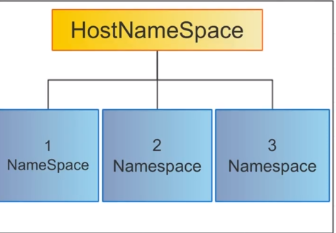
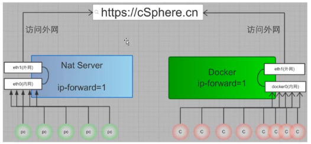
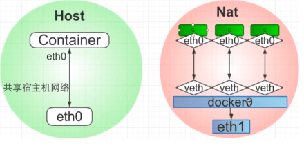
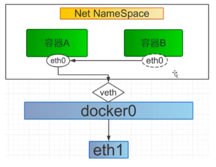
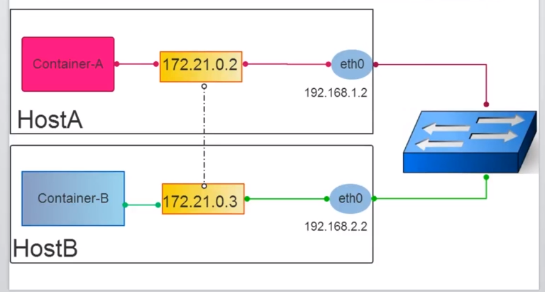

# Docker网络管理

**NameSpace**

* `pid-namespace` 组件，将不同容器的进程通过pid-namespace进行隔离
* `ipc-namespace` 组件，使容器之间的进程资源相互不可见
* `mount-namespace` 组件，将一个进程放到一个目录下去执行
* `uts-namespace` 使得其拥有独立的hostname
* `user-namespace` 使容器对宿主机的映射
* `net-namespace` 网络隔离

## net-namspace



当创建容器时，docker主程序将会为容器创建`net-namespace`

## 网络模式

* Nat(Network Address Translation) 网路地址转换(iptables-nat)
* Host
* other container
* none
* overlay

### Nat

* `iptables -t nat -L -n` 查看net表中的规则 

  ```
  Chain PREROUTING (policy ACCEPT)
  target     prot opt source               destination         
  DOCKER     all  --  0.0.0.0/0            0.0.0.0/0            ADDRTYPE match dst-type LOCAL

  Chain INPUT (policy ACCEPT)
  target     prot opt source               destination         

  Chain OUTPUT (policy ACCEPT)
  target     prot opt source               destination         
  DOCKER     all  --  0.0.0.0/0           !127.0.0.0/8          ADDRTYPE match dst-type LOCAL

  Chain POSTROUTING (policy ACCEPT)
  target     prot opt source               destination         
  MASQUERADE  all  --  172.17.0.0/16        0.0.0.0/0 # docker0 的IP

  Chain DOCKER (2 references) # 此时没有任何规则
  target     prot opt source               destination         
  RETURN     all  --  0.0.0.0/0            0.0.0.0/0  
  ```

* nat模式的形式

  ​

  

  

* 特点

  1. 网络资源隔离
  2. 无需手动配置，创建容器即拥有
  3. 可以访问外网
  4. 但外网无法直接访问容器的`IP`
  5. 性能低(`iptables`本身的原因)
  6. 端口管理麻烦

* 外界访问容器使用`DNAT规则`, 容器访问外部使用`SNAT规则`

* 测试使用

  * `docker run -it --name csphere-nat busybox sh` 前台启动 容器并进入终端
  * `ifconfig` 查看网络
  * `route -n` 查看路由表
  * `wget baidu.com` 
  * `ctr+p+q` 退出容器

* 查看`iptables`变化

  ```
  Chain PREROUTING (policy ACCEPT)
  target     prot opt source               destination         
  DOCKER     all  --  0.0.0.0/0            0.0.0.0/0            ADDRTYPE match dst-type LOCAL

  Chain INPUT (policy ACCEPT)
  target     prot opt source               destination         

  Chain OUTPUT (policy ACCEPT)
  target     prot opt source               destination         
  DOCKER     all  --  0.0.0.0/0           !127.0.0.0/8          ADDRTYPE match dst-type LOCAL

  Chain POSTROUTING (policy ACCEPT)
  target     prot opt source               destination         
  MASQUERADE  all  --  172.17.0.0/16        0.0.0.0/0           

  Chain DOCKER (2 references)
  target     prot opt source               destination         
  RETURN     all  --  0.0.0.0/0            0.0.0.0/0
  ```

* 没有启用端口映射，就不会有规则生成

* `docker run -it -p 2222:22 --name csphere-nat2 busybox sh`容器的22端空和宿主机的2222端口做映射

* `iptables -t nat -L -n` 此时存在新规则

### Host

不经过Docker-0直接映射到宿主机的网卡，

* 特点
  * 共享宿主机的网络
  * 网络性能无衰减
  * 排查网络故障简单
  * 网络环境会无隔离
  * 网络资源无法统计
  * 端口不易管理
* 运用场景
* 测试使用
  * `docker run -it --name csphere-host --net=host busybox sh` 启动host模式的docker的容器
  * `ifconfig` 和宿主机的一样

### other container

多个容器共享一个`net Namespace`



容器的ip和mac地址完全一模一样，常用于容器之间网络访问异常频繁的情况

* 与宿主机网络空间隔离
* 容器之间共享网络空间
* 适合容器间的网络通信频繁
* 测试使用
  * `docker run -it --name csphere busybox sh` 
  * `ifconfig`
  * `docker run -it --name csphere-con --net=container:csphere busybox sh` 使用cspere的网络来创建容器
  * `ifconfig`

### none

无网络配置，可以自行配置，

实际使用

* `docker run -it --name csphere-none --net=none busybox sh`
* `ifconfig`

### overlay



* `docker rm -f $(docker ps -a -q)` 删除所有容器
* 跨主机通信
* 无需做端口管理
* 无序担心IP冲突

### 实践

* ​

##跨主机通信