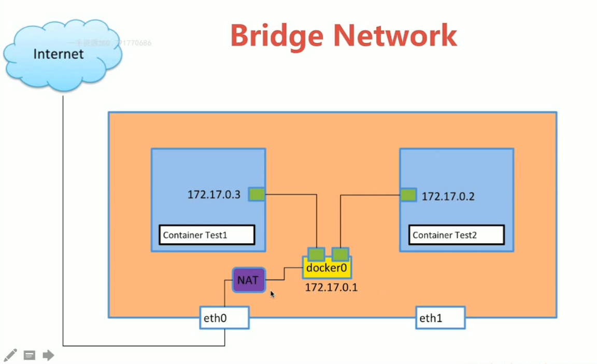

# 系统学docker

## Docker环境的各种搭建方法

### mac 系统上的安装

### windows 上安转

* `VirtualBox` 安装
* `Vagrant` 安装
  * 创建一个文件夹
  * `vagrant init centos/7` 创建初始化文件`vagrantfile`
  * `more vagrantfile` 查看这个文件
  * `vagrant up` 创建虚拟机
  * `vagrant ssh` 连接进虚拟机
  * `exit` 退出虚拟机
  * `vagrant status` 当前运行虚拟机的状态
  * `vagrant halt` 停止运行中的机器
  * `vagrant destroy` 删除掉机器

### Docker Machine 

* `docker-machine version` 查看版本
* `docker-machine create demo`创建一个安装好docker 的虚拟机
* `docker-machine ls` 列出创建好docker虚拟机
* `docker-machine ssh demo` 进入到docker虚拟机中
* `docker-machine stop demo1` 停掉一台docker虚拟机

### Docker Machine 在阿里云上创建机器

* [在阿里云上使用docker machine ](https://docs.docker.com/machine/get-started-cloud/#3rd-party-driver-plugins)

## Docker的镜像和容器

* `docker version` 查看客户端和服务端的版本
* `ps -ef | grep docker` 查看进程

### 底层技术支持

* `NameSpace` 做隔离`pid`、`net`、`ipc`、`mnt`、`uts`
* `Control groups` 资源限制
* `Union file systems` Container 和images的分层

### Docker Images

```
FROM ubuntu:14.04
LABEL maintainer="xinbingliang"
RUN apt-get update && apt-get install -y redis-server 
EXPOSE 6379
ENTRYPOINT ["/usr/bin/redis-server"]
```

* `docker build -t xin/redis:v0.0.1 .`
* `docker pull ubuntu:14.04`

### 创建Base Image

* `sudo groupadd docker`
* `sudo gpasswd -a xin docker`
* `service docker restart`
* 重新登录shell
* `docker pull hello-world`
* `docker run hello-world`
* `docker history acca11` 查看docker的分层
* `docker run -it centos` 交互式运行，退出容器结束运行
* `docker ps -a` 查看容器
* `docker rm xxxx` 删除一个容器
* `docker image rm 67759` 删除镜像
* `docker rmi f2a91` 简写的删除镜像
* `docker container ls -aq` 列出所以id
* `docker rm $(docker container ls -aq)` 清除掉所有的镜像
* `docker rm $(docker container ls -f "status = exited" -q)`

### 将容器提交成镜像

* `docker commit` 把容器变成镜像（不提倡）

  * `docker run -it centos` 交互环境下运行容器
  * `yum install -y vim` 安装一个vim
  * `exit`
  * `docker commit 0176c467244c xin/centos_vim:0.01` 形成新的images
  * `docker history 5e933ef9bb07` 查看层

* `docker build `

  ```
  FROM centos

  RUN yum install -y vim
  ```

  * `docker build -t xin/centos_vim:v0.0.1 .` 构建

### Dockerfile 语法

````dockerfile
FROM  scratch # 制作base image,从头开始
FROM centos # 制作base image
From ubuntu:14.04

LABEL maintainer="xinneirong@gmail.com" # 定义信息，类是注释
LABEL version="1.0"
LABEL description="This is description"

RUN yum update && yum install -y vim python-dev
RUN apt-get update && apt-get install -y perl pwgen --bo-install-recommends && rm -rf /var/lib/apt/lists/8 # 注意清理cache, 尽量写成一行
RUN /bin/bash -c 'source $HOME/.bashrc;echo $HOME'

WORKDIR /root # 切换目录使用workdir,使用绝对目录

WORKDIR /test # 如果没有会自动创建test目录
WORKDIR demo
RUN pwd # 输出结果为/test/demo

ADD hell0 / 
ADD test.tar.ge / # 将其添加到根目录并且解压

WORKDIR /root 
ADD hello test/ # /root/test/hello

WORKDIR /root 
COPY hello test/ # /root/test/hello # 添加远程文件需要使用curl或wget

ENV MYSQL_VERSION 5.6 # 设置常量
RUN apt-get install -y mysql-server = "${MYSQL_VERSION}" && rm -rf /var/lib/apt/list/* # 引用

VOLUME and EXPOSE 
CMD and ENTRYPOINT 
````

* [docker-library](https://github.com/docker-library)

### CMD and ENTRYPOINT 

* RUN：执行命令并创建新的Image Layer

* CMD：设置容器启动后默认执行的命令和参数

  * 如果docker run指定了其他命令，CMD命令会被忽略
  * 如果定义了多个CMD，只有最后一个被执行

* ENTRYPOINT：设置容器启动时运行的命令

  * 让容器以应用程序或服务的形式运行

  * 不会被忽略，一定会执行

  * 最佳实践：写一个shell脚本作为entrypoint

    ````
    COPY docker-entrypoint.sh  /usr/local/bin
    ENTRYPOINT ["docker-entrypoint.sh"]

    EXPOSE 27017
    CMD ["mongod"]
    ````

#### Shell格式

```
RUN apt-get install -y vim
CMD echo "hello docker"
ENTRYPOINT echo "hello docker"
```

#### Exec 格式

````
RUN [ "apt-get", "install", "-y", "vim" ]
CMD [ "/bin/echo", "hello docker" ]
ENTRYPOINT [ "/bin/echo", "hello docker" ]
````

### Docker File 实践

#### 创建Flask项目

````dockerfile
FROM python:2.7
LABEL maintainer="xinneirong<xinneirong@gmail.com>"
RUN pip install flask
COPY app.py /app/ # COPY app.py /app 将app.py复制为app文件了，而不是目录
WORKDIR /app
EXPOSE 5000
CMD ["python", "app.py"]
````

```python
from flask import Flask
app = Flask(__name__)
@app.route('/')
def hello():
    return "hello docker"
if __name__ == '__main__':
    app.run(host="0.0.0.0", port=5000)
```

* `docker build -t 192.168.113.131:5000/flask:v0.0.1 .` 构建镜像
* `docker run -it 8f687f19c0cf /bin/bash` 进入出错中间层查看问题根源
* `docker run -d 8f687f19c0cf` 后台运行运行创建好的镜像

#### 创建压力测试工具

1. `docker run -it ubuntu` 
2. `apt-get update && apt-get install -y stress` 
3. `which stress`
4. `stress --vm 1 --verbose `
5. `stress --vm 1 --vm-bytes 500000M --verbose`

* `mkdir stress` 创建目录

* 创建Dockerfile

  ````dockerfile
  FROM ubuntu
  RUN apt-get update && apt-get install -y stress
  ENTRYPOINT ["/usr/bin/stress"]
  CMD [] # 用于接收上一命令的参数
  ````

*  `docker build -t xinneirong/ubuntu_stress:v0.0.01 .` 构建镜像

* `docker run -it xinneirong/ubuntu_stress:v0.0.01 --vm 1 --verbose`

### 镜像发布

* `docker login` 登录到docker hub
* `docker push xinneirong/centos:v0.0.1`  向仓库中push镜像，名称和自己仓库名要相同

#### registry

* `docker run -d -p 5000:5000 --restart always --name registry registry:2` 服务机器获得registry并安装

* `telnet 192.168.113.131 5000`  客户机测试registry 运行状况

* `docker build -t 192.168.113.131:5000/hello-world .` 创建一个新的镜像

* `vim /etc/docker/daemon.json` 客户机向配置中加入配置

  ```
  {
    "registry-mirrors": ["https://x2fvikf9.mirror.aliyuncs.com"],
    "insecure-registries": ["192.168.113.131:5000"]
  }
  ```

* `vim /lib/systemd/system/docker.service` 客户机配置文件

  ```
  EnvironmentFile=-/etc/docker/daemon.json
  ```

* `service docker restart` 重启docker服务

* `192.168.113.131:5000/v2/_catalog` 浏览器访问，查看镜像

* `docker push 192.168.113.131:5000/hello-world` 向registry中push一个镜像

* `docker pull  192.168.113.131:5000/hello-world` pull回来

### 容器的操作

* `docker exec -it 608598711df8 /bin/bash ` 交互式进入容器
* `docker exec -it 608598711df8 ip a` 打印运行中容器的IP地址
* `docker stop 608598711df8` 停止容器
* `docker rm $(docker ps -aq)` 删除所有容器
* `docker run -d --name=demo 8f687f19c0cf` 指定容器名
* `docker start demo` 启动容器
* `docker inspect 2225810169b9` 显示容器的信息
* `docker logs 2225810169b9` 显示容器的日志

### 容器资源的限制

* `docker run --memory=200M xinneirong/ubuntu_stress:v0.0.01 --vm 1 --verbose` 对内存的限制为`200M`，启动一个进程，verbose输出信息
  * `--memory string ` 只设置memory不设置swap，那么swap和memory，总共为2倍
  * `--memory-swap string`
* `docker run --memory=200M xinneirong/ubuntu_stress:v0.0.01 --vm 1 --vm-bytes 500M --verbose` 容器启动时有`400M`内存，但进程需要`500M`内存
* `docker run --cpu-shares=10 --name=test1 xinneirong/ubuntu_stress:v0.0.01 --cpu 1 --verbose`说明`--cpu-shares`限定容器CPU使用权重，多容器相对权重的比

## Docker的网络

### 单机网络

#### 网络命名空间

- `docker run -d --name test1 busybox  /bin/sh -c "while true; do sleep 3600; done"` 一个一直运行的容器
- `docker exec -it 09cc8779fd67 /bin/sh` 进入容器
- `ip a` 查看网络，且容器网络之间可以相互访问
- `ip netns list` 目前本机有的网络命名空间
- `ip netns delete test1` 删除`test1`网络命名空间
- `ip netns add test1` 创建一个网络命名空间
- `ip netns add test1`
- `ip netns exec test1 ip a` 在test1中执行命令
- `ip netns exec test1 ip link` 
- `ip netns exec test1 ip link set dev lo up` 将lo网络up起来
- `ip link add veth-test1 type veth peer name veth-test2` 创建两个`Veth`
- `ip link set veth-test1 netns test1` 将`veth-test1`添加到`test1`中
- `ip netns exec test1 ip link` 查看
- `ip link` 本地ip link变少
- `ip link set veth-test2 netns test2` 将`veth-test2`添加到`test2`中
- `ip netns exec test1 ip addr add 192.168.33.1/24 dev veth-test1` 分配IP
- `ip netns exec test2 ip addr add 192.168.33.2/24 dev veth-test2`
- `ip netns exec test1 ip link set dev veth-test1 up`拉起网络
- `ip netns exec test2 ip link set dev veth-test2 up`
- `ip netns exec test1 ip a` 查看ip
- `ip netns exec test1 ping 192.168.33.2` ping网络

#### Docker Bridge0

* `docker network ls` 当前机器上的网络
* `docker network  inspect 294d9c80b28f` 查看网络信息，随机数为网络编号
* `brctl show` 



##### 容器之间的Link（很少使用）

* `docker run -d --name test1 busybox /bin/sh -c "while true; do sleep 3600; done"` 创建容器`test1`
* `docker run -d --name test2 --link test1 busybox /bin/sh -c "while true; do sleep 3600; done"` 创建test2并连接
* `docker exec -it test2 /bin/sh`
* `ping test1` 去ping另外的容器，但test1不能ping通test2

##### 自定义bridge

* `docker network create -d bridge xin-bridge` 创建一个网络
* `docker network ls` 查看所有网络
* `brctl show` 查看所有bridge
* `docker run -d --name test3 --network xin-bridge busybox /bin/sh -c "while true; do sleep 3600; done"` 创建容器并连接到自己定义的bridge
* `docker network connect xin-bridge test1` 将以前已经创建好的容器连接到自定义的网络上，并保留原来的连接，此时连接到自己创建的网络上时，容器可以相互ping通
* `docker network inspect 8db5dbb30299` 查看网络连接状况

##### 端口映射问题

* ` docker run --name web -d -p 80:80 nginx` 启动一个nginx服务，并将容器端口映射到本机端口

#### Host Network

端口冲突问题

* `docker run -d --name test1 --network host busybox /bin/sh -c "while true; do sleep 3600; done"`
* `docker network inspect host` 
* `docker exec -it test1 /bin/sh`
* `ip a` 同宿主机网络

#### None Network

一个网络孤立的

* `docker run -d --name test1 --network none busybox /bin/sh -c "while true; do sleep 3600; done"`

### 多机网络(Overlay Network)

#### 多容器复杂应用部署

````python
# app.py
from flask import Flask
from redis import Redis
import os
import socket

app = Flask(__name__)
redis = Redis(host=os.environ.get('REDIS_HOST', '127.0.0.1'), port=6379)


@app.route('/')
def hello():
    redis.incr('hits')
    return 'Hello Container World! I have been seen %s times and my hostname is %s.\n' % (redis.get('hits'),socket.gethostname())


if __name__ == "__main__":
    app.run(host="0.0.0.0", port=5000, debug=True)
````

```dockerfile
# Dockerfile
FROM python:2.7
LABEL maintaner="Peng Xiao xiaoquwl@gmail.com"
COPY . /app
WORKDIR /app
RUN pip install flask redis
EXPOSE 5000
CMD [ "python", "app.py" ]
```

* `docker run -d --name redis redis` 启动一个redis容器，该容器并不提供给外部访问，所以不指定端口
* `docker build -t xin/flask-redis .` 创建一个flask镜像
* `docker run -d --link redis --name flask-redis -p 5000:5000 -e REDIS_HOST=redis xin/flask-redis` 该变量将注入到flask运行环境变量中
* `curl 127.0.0.1:5000` 测试访问

#### overlay和etcd(分布式存储)

* ​

## Docker的持久化存储和数据共享

### Data Volume(数据源产生类型容器)

* `VOLUME /var/lib/mysql` 在`Dockerfile`中指定在容器中的存储位置
* `docker logs mysql1` 查看容器创建过程中的日志输出
* `docker run -d --name mysql1 -e MYSQL_ALLOW_EMPTY_PASSWD=true  mysql` 创建mysql容器且没有密码
* `docker volume ls` 查看volume
* `docker volume inspect xxxxx` 查看volume的信息
* 即便删除容器volume依然存在
* `docker volume rm xxxx` 删除一个volume
* `docker run -d -v mysql:/var/lib/mysql --name mysql1 -e MYSQL_ALLOW_EMPTY_PASSWORD=true  mysql` 将宿主机上的volume命名为mysql

### bind Mounting

指定容器和本地目录之间的关系，保持代码同步

* `docker run -v /home/aaaa:/root/aaa`
* `docker build -t xinneirong/nginx:v0.0.1 .` 构建一个镜像
* `docker run -d -p 8080:80 --name web  xinneirong/nginx:v0.0.1`构建一个容器
* `docker run -d -p 8081:80 --name web2 -v $(pwd):/usr/share/nginx/html  xinneirong/nginx:v0.0.1`当前目录文件的修改会引起容器文件的修改

## Docker Compose多容器的部署

### 基础

* `docker-compose.yml` 默认名称
* `Services`等于一个容器

````
services:
	db: # services的名称
		image: postgres:9.4 # 镜像来源
		Volumes:
			- "db-data:/var/lib/postgresql/data"
		networks:
			- back-tier
````

````
servers:
	worker:
		build: ./worker # 镜像通过Dockerfile构建
		links:
			- db
			- redis
		networks:
			- back-tier
````

* `Networks`
* `Volumes`

```yaml
version: '2' # 版本

services:

  wordpress: # 名称
    image: wordpress
    ports:
      - 8080:80
    environment: # -e
      WORDPRESS_DB_HOST: mysql
      WORDPRESS_DB_PASSWORD: root
    networks: # 连接的网络
      - my-bridge

  mysql:
    image: mysql
    environment:
      MYSQL_ROOT_PASSWORD: root
      MYSQL_DATABASE: wordpress
    volumes: 
      - mysql-data:/var/lib/mysql
    networks:
      - my-bridge

volumes:
  mysql-data:

networks:
  my-bridge:
    driver: bridge
```

### 使用

* `apt-get install docker-compose` 安装
* `docker-compose  -f docker-compose.yml up -d` 开始构建并在后台运行
* `docker-compose ps` 打印运行中的容器
* `docker-compose stop` 停止容器
* `docker-compose start` 重新运行容器
* `docker-compose down` 停止创建的容器并删除
* `docker-compose images` 列出镜像
* `docker-compose exec mysql /bin/bash` 进入一个容器

```dockerfile
version: "3"

services:

  redis:
    image: redis

  web:
    build: # 构建
      context: .
      dockerfile: Dockerfile
    ports:
      - 8080:5000 # 平行扩展时这里会报错
    environment:
      REDIS_HOST: redis
```

### 水平扩展和负载均衡

* `docker-compose  -f docker-compose.yml  up -d` 删除端口绑定后，运行一服务
* `docker-compose up --scale web=3 -d` 运行三个容器
* happroxy
* `docker-compose build` 优先构建

## Docker Swarm 

### 简介

* `Manager` 集群的大脑，至少两个，
* `Worker` 干活的
* `service` 一种服务的说法
* `replicsa` 等于容器

### 三节点集群创建

* 在`node1`中，先创建Manager节点，并指定Manager的地址`192.168.232.137`

  ```shell
  root@ubuntu:~# docker swarm init --advertise-addr=192.168.232.137
  Swarm initialized: current node (a7ej6807cefwetyn3dlbcqv9p) is now a manager.

  To add a worker to this swarm, run the following command:

      docker swarm join --token SWMTKN-1-4kwsqeko40ngrxkveorr4jt66y5dar2u9jhg3tzfjogi9l0f9p-4mq483mtm8aobk8oir1dpsvel 192.168.232.137:2377

  To add a manager to this swarm, run 'docker swarm join-token manager' and follow the instructions.
  ```

* `docker swarm join --token SWMTKN-1-4kwsqeko40ngrxkveorr4jt66y5dar2u9jhg3tzfjogi9l0f9p-4mq483mtm8aobk8oir1dpsvel 192.168.232.137:2377` 在`node2`、`node3`中执行，加入到其中

* `docker node ls` 显示在集群中的节点

### service的创建和水平维护

* `docker service create --name demo busybox sh -c "while true; do sleep 3600;done"` 在Manager上运行
* `docker service ls` 查看service
* `docker service ps demo` 查看
* `docker service scale demo=5` 水平扩展成5个
* `docker service ps demo` 
* `docker rm -f cc5e85ed2284` 强制删除后会重新拉起
* `docker service rm demo` 删除service
* `docker service ps demo`

### Wordpress 部署

* `docker network create -d overlay demo`用于解决service之间的通信，在Manager上
* `docker network ls` 查看创建的网络
* ` docker service create --name mysql --env MYSQL_ROOT_PASSWORD=root --env=MYSQL_DATABASE=wordpress --network demo --mount type=volume,source=mysql-data,destination=/var/lib/mysql mysql` 创建一个mysql的service其中mout 相当于-v
* `docker service ls`
* `docker service ps mysql`
* `docker service create --name wordpress -p 80:80 --network demo --env WORDPRESS_DB_PASSWORD=root --env WORDPRESS_DB_HOST=mysql wordpress` 创建另外一个service
* 使用任意节点的地址都能访问

### 网络发现详解

* `docker network create -d overlay demo` 创建一个网络
* `docker service create --name whoami -p 8000:8000 --network demo -d jwilder/whoami`
* `docker service ps whoami`
* `docker service create --name client -d --network demo busybox sh -c "while true; do sleep 3600;done"`
* `docker service ls`
* `docker exec -it f9f8 sh` 进入到`busybox`容器中
* `ping whoami` 去`busybox`中ping另外一个service


## DevOps

## Kubernetes


## 容器的运维和监控


## Docker + DevOps实战

