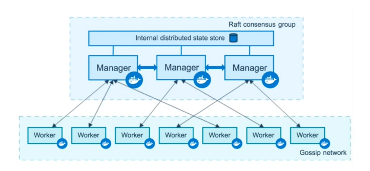

# 容器编排Docker Swarm

## 容器编排Swarm介绍




## 创建一个三节点的swarm集群

* `docker swarm init --advertise-addr=192.168.232.145` 在`node1`(Manager)上运行，成为Manager，会告诉其他机器如何运行命令
* `docker swarm join --token SWMTKN-1-11xo5ouv5wxvje7tkwmnqatykjkjoxllkxv0jxq41r4aya4jug-cb5juetk13ep66rohk5pnaabj 192.168.232.145:2377` 在work1节点上运行，加入进来
* `docker node ls` 显示swarm中的节点

## Service的创建维护和水平扩展

* `docker service create`
* `docker service create --name demo busybox /bin/sh -c "while true; do sleep 3600;done"` 
* `docker service ps demo`  查看容器运行情况
* `docker service ls` 列出服务
* `docker service scale demo=5` 水平扩展
* `docker service ls` 列出服务
* `docker rm -f 838ba377c564 `  删除其中一个
* `docker service ps demo`  查看容器运行情况
* `docker service rm demo` 删除服务

## 在swarm集群里通过service部署wordpress

**创建overlay**

* `docker network create -d overlay demo` 创建一个叫demo的overlay网络
* ` docker network ls` 其他机器上看不到创建的网络

**创建mysql service**

* `docker service create --name mysql --env MYSQL_ROOT_PASSWORD=root --env MYSQL_DATABASE=wordpress --network demo --mount type=volume,source=mysql-data,destination=/var/lib/mysql mysql` 
* `docker service ls` 
* `docker service ps ls`

**创建wordpress serbice**

* `docker service create --name wordpress -p 8088:80 --network demo --env WORDPRESS_DB_PASSWORD=root --env WORDPRESS_DB_HOST=mysql wordpress` 创建另外一个service
* 使用任意节点的地址都能访问
* 当服务被分配时，网络也被分配

## 集群服务间通信之Routing Mesh

- `docker network create -d overlay demo` 创建一个网络
- `docker service create --name whoami -p 8000:8000 --network demo -d jwilder/whoami`
- `docker service ps whoami`
- `docker service create --name client -d --network demo busybox sh -c "while true; do sleep 3600;done"`
- `docker service ls`
- `docker exec -it f9f8 sh` 进入到`busybox`容器中
- `ping whoami` 去`busybox`中ping另外一个service
- `docker service scale whoami=2`  扩展
- `docker service ls`
- `ping whoami` 去`busybox`中ping另外一个service
- 实际上使用的虚拟IP
- `nslookup www.baidu.com` 用于查询DNS


>* Internal ：Container和Container之间的访问通过overlay网络（通过VIP虚拟IP）
>* Ingress：如果服务有绑定接口，则此服务可以通过任意Swarm节点的相应接口访问

## Routing Mesh之Ingress负载均衡

* 外部访问的负载均衡
* 服务端口被暴露到各个swarm节点
* 内部通过IPVS进行负载均衡


## Docker Stack部署Wordpress

#### compose-file重点增加[deploy](https://docs.docker.com/compose/compose-file/#deploy)

```
version: '3'
services:
  redis:
    image: redis:alpine
    deploy:
      replicas: 6 
      update_config:
        parallelism: 2
        delay: 10s
      restart_policy:
        condition: on-failure
```

- ENDPOINT_MODE 指明模式，虚拟IP或DNSRR

  ```
  version: "3.3"

  services:
    wordpress:
      image: wordpress
      ports:
        - "8080:80"
      networks:
        - overlay
      deploy:
        mode: replicated
        replicas: 2
        endpoint_mode: vip # 指定模式,vip使用虚拟IP并自动负载均衡；dnsrr对每个service的IP
  ```

- LABELS

  ```
  version: "3"
  services:
    web:
      image: web
      deploy:
        labels:
          com.example.description: "This label will appear on the web service" # 帮助描述的信息
  ```

- MODE

  ```
  version: '3'
  services:
    worker:
      image: dockersamples/examplevotingapp_worker
      deploy:
        mode: global # global不能进行横向扩展, replicated支持横向扩展（默认）
  ```

- PLACEMENT 

  ```
  version: '3.3'
  services:
    db:
      image: postgres
      deploy:
        placement: # 设置服务的限制条件
          constraints:
            - node.role == manager # 部署在manager上
            - engine.labels.operatingsystem == ubuntu 14.04
          preferences:
            - spread: node.labels.zone
  ```

- REPLICAS

  ```
  version: '3'
  services:
    worker:
      image: dockersamples/examplevotingapp_worker
      networks:
        - frontend
        - backend
      deploy:
        mode: replicated
        replicas: 6 # 初始化时部署指定数量service
  ```

- RESOURCES

  ```
  version: '3'
  services:
    redis:
      image: redis:alpine
      deploy:
        resources: # 做资源的限制
          limits: # 资源限制
            cpus: '0.50'
            memory: 50M
          reservations: # 资源保留
            cpus: '0.25'
            memory: 20M
  ```

- RESTART_POLICY

  ```
  version: "3"
  services:
    redis:
      image: redis:alpine
      deploy:
        restart_policy: # 重新启动的条件
          condition: on-failure
          delay: 5s # 延迟
          max_attempts: 3 # 最大重试次数
          window: 120s
  ```

- UPDATE_CONFIG 更新的约束

  ```
  version: '3.4'
  services:
    vote:
      image: dockersamples/examplevotingapp_vote:before
      depends_on:
        - redis
      deploy:
        replicas: 2
        update_config: # service更新的原则
          parallelism: 2 # 同时更新service数量
          delay: 10s # 每次更新间隔
          order: stop-first 
  ```

````yaml
version: '3'

services:

  web:
    image: wordpress
    ports:
      - 8080:80
    environment:
      WORDPRESS_DB_HOST: mysql
      WORDPRESS_DB_PASSWORD: root
    networks:
      - my-network
    depends_on:
      - mysql
    deploy:
      mode: replicated
      replicas: 3 # 一开始就运行三个
      restart_policy: # 出错后重启，重启方式
        condition: on-failure
        delay: 5s
        max_attempts: 3
      update_config:  # 更新时的配置
        parallelism: 1
        delay: 10s

  mysql:
    image: mysql
    environment:
      MYSQL_ROOT_PASSWORD: root
      MYSQL_DATABASE: wordpress
    volumes:
      - mysql-data:/var/lib/mysql
    networks:
      - my-network
    deploy:
      mode: global # 不允许扩展
      placement:
        constraints:
          - node.role == manager # 部署到manager上

volumes:
  mysql-data:

networks:
  my-network:
    driver: overlay # 并非单机上所以修改
````

- `docker stack deploy wordpress --compose-file=docker-compose.yml`
- `docker stack ls` 列举出stack
- `docker stack ps wordpress` 查看stack的细节
- `docker stack services wordpress` 查看service的状况
- `docker stack rm wordpress` 停止stack

## 作业解答之部署投票应用

```yaml
version: "3"
services:

  redis:
    image: redis:alpine
    ports:
      - "6379"
    networks:
      - frontend
    deploy:
      replicas: 2
      update_config:
        parallelism: 2
        delay: 10s
      restart_policy:
        condition: on-failure # 有失败就重启

  db:
    image: postgres:9.4
    volumes:
      - db-data:/var/lib/postgresql/data
    networks:
      - backend
    deploy:
      placement:
        constraints: [node.role == manager]

  vote:
    image: dockersamples/examplevotingapp_vote:before
    ports:
      - 5000:80
    networks:
      - frontend
    depends_on:
      - redis
    deploy:
      replicas: 2
      update_config:
        parallelism: 2
      restart_policy:
        condition: on-failure

  result:
    image: dockersamples/examplevotingapp_result:before
    ports:
      - 5001:80
    networks:
      - backend
    depends_on:
      - db
    deploy:
      replicas: 1
      update_config:
        parallelism: 2
        delay: 10s
      restart_policy:
        condition: on-failure

  worker:
    image: dockersamples/examplevotingapp_worker
    networks:
      - frontend
      - backend
    deploy:
      mode: replicated
      replicas: 1
      labels: [APP=VOTING]
      restart_policy:
        condition: on-failure
        delay: 10s
        max_attempts: 3
        window: 120s
      placement:
        constraints: [node.role == manager]

  visualizer: # 可视化工具
    image: dockersamples/visualizer:stable
    ports:
      - "8080:8080"
    stop_grace_period: 1m30s
    volumes:
      - "/var/run/docker.sock:/var/run/docker.sock"
    deploy:
      placement:
        constraints: [node.role == manager]

networks: # 设置网络
  frontend:
  backend:

volumes:
  db-data:
```

* `docker service scale example_vote=3`

## Docker Secret管理和使用

* 用户名密码
* SSH KEY
* TLS认证
* 任何其他人不想看到的数据
* 存储在Swarm Manager节点的Raft database中
* Secret 可以assign给一个service，这个service就能看到这个secret
* 在container中Secret看起来像文件，但实际存在内存中


* `vim password`

  ```
  dmin123
  ```

* `docker secret create my-pw ./password` 创建secret 

* 删除密码文件

* `docker secret ls` 查看secret

* `echo "adminadmin" | docker secret create my-pw2 -` 另外一种创建新形式

* `docker secret rm my-pw2` 删除一个

* `docker service create --name client --secret my-pw busybox sh -c "while true; do sleep 3600; done"`

* ` docker  exec -it 00da3093051b sh`

* `cd /run/secrets`

* ` docker service create --name db --secret my-pw -e MYSQL_ROOT_PASSWORD_FILE=/run/secrets/my-pw mysql` 使用

## Docker Secret在Stack中的使用

```yaml
version: '3'

services:

  web:
    image: wordpress
    ports:
      - 8080:80
    secrets: # 指定使用的secret
      - my-pw
    environment:
      WORDPRESS_DB_HOST: mysql
      WORDPRESS_DB_PASSWORD_FILE: /run/secrets/my-pw # 指定密码
    networks:
      - my-network
    depends_on:
      - mysql
    deploy:
      mode: replicated
      replicas: 3
      restart_policy:
        condition: on-failure
        delay: 5s
        max_attempts: 3
      update_config:
        parallelism: 1
        delay: 10s

  mysql:
    image: mysql
    secrets:
      - my-pw
    environment:
      MYSQL_ROOT_PASSWORD_FILE: /run/secrets/my-pw
      MYSQL_DATABASE: wordpress
    volumes:
      - mysql-data:/var/lib/mysql
    networks:
      - my-network
    deploy:
      mode: global
      placement:
        constraints:
          - node.role == manager

volumes:
  mysql-data:

networks:
  my-network:
    driver: overlay

# secrets:
#   my-pw:
#    file: ./password
```

## Service更新

* `docker network create -d overlay demo` 创建demo网络
* `docker service create --name web --publish 8080:5000 --network demo xiaopeng163/python-flask-demo:1.0`
* `docker service ps web` 
* `docker service scale web=2` 扩展
* `curl 127.0.0.1:8080`
* `sh -c "while true; do curl 127.0.0.1:8080 && sleep 1.5"` 其中一个节点进行
* `docker service update --image xiaopeng163/python-flask-demo:2.0 web` 更新镜像
* `docker service ps web` 
* `docker service update --publish-rm 8080:5000 --publish-add 8088:5000 web` 端口更新
* Stack 直接重新生成

