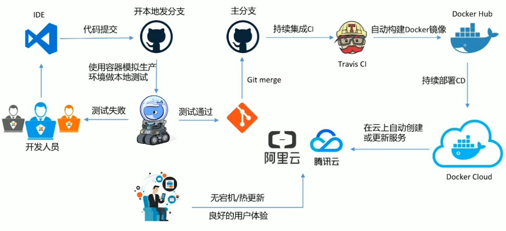

# DevOps初体验

## Docker Cloud简介 

* 提供容器的管理，编排，部署的托管服务
* 关联云服务商、添加节点作为Docker Host、创建服务service、创建stack、image管理
* standard模式：一个Node就是一个Docker Host
* Swarm模式：多个Node组成的Swarm Cluster

## Docker Cloud之自动build Docker image 

## Docker Cloud之持续集成和持续部署 

## Docker企业版的在线免费体验 

## Docker企业版本地安装之UCP 

## Docker企业版本地安装之DTR 

## Docker企业版UCP的基本使用演示 

## 体验阿里云的容器服务 

## 在阿里云上安装Docker企业版

## Docker企业版DTR的基本使用演示 

