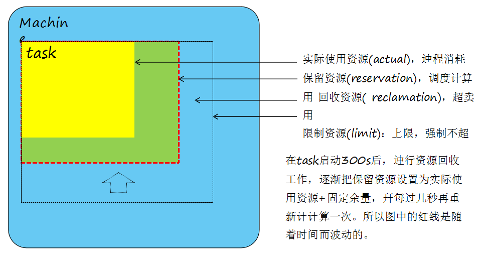
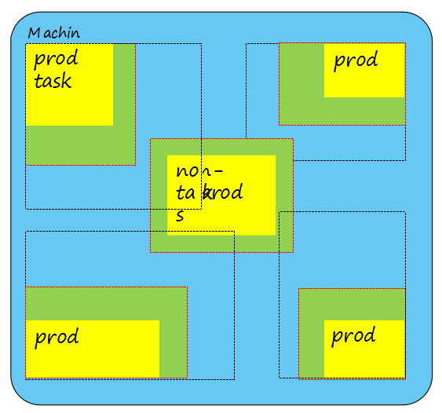
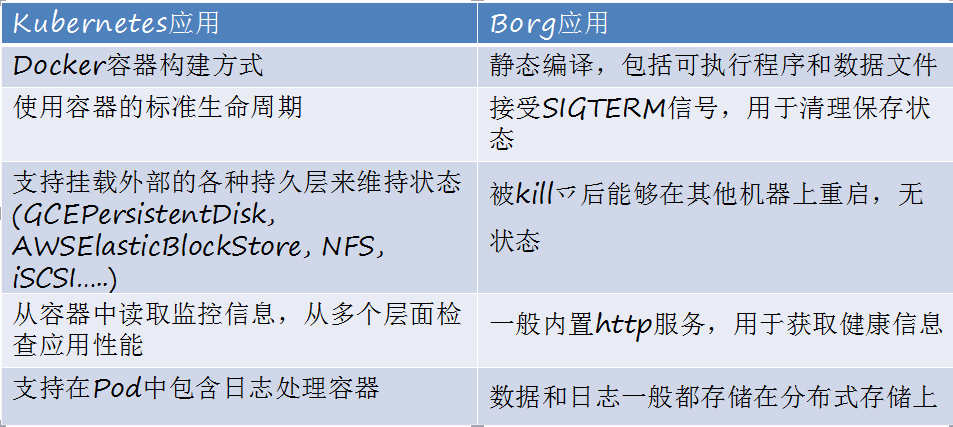
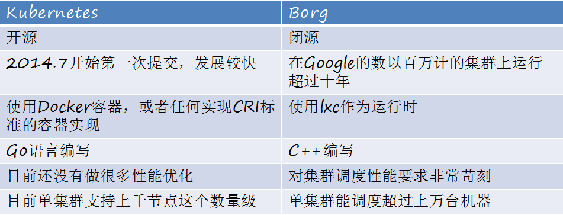
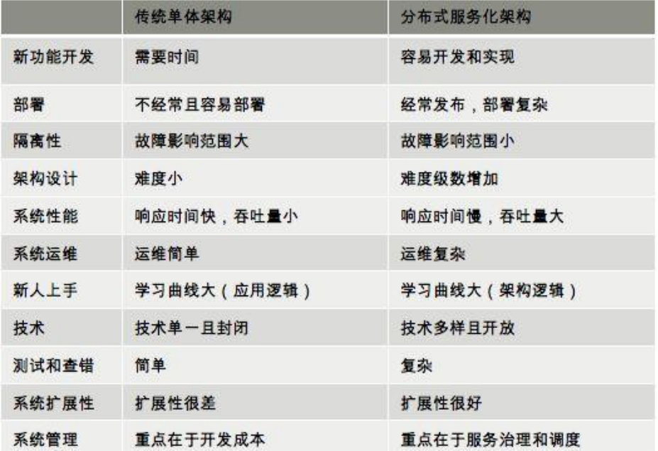
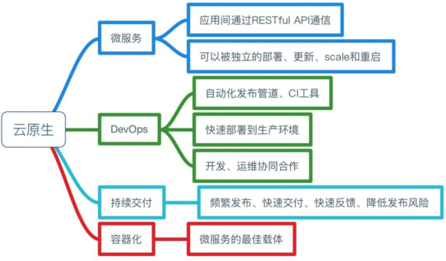

# 从Borg到Kubernetes

## 课程整体大纲

* `Kubernetes`基本架构和设计
* `Kubernetes` 使用和运维
* 开发入门

## 容器的起源和历史

###历史

* 最开始目的：控制进程间的资源隔离
* Docker解决App运行环境的整体打包问题，确立分层镜像格式
* K8s/Mesos应用生命周期的管理框架，使应用的分布式更加容易，资源分配更加灵活，管理方式更加便捷

### 容器是什么

* 虚拟机是操作系统级别隔离，容器是进程级别的隔离

## Borg在Google的发明和使用

### Borg（5000~10000个机器）架构和工作流

- 用户使用Borgcfg或者Web UI提交一个跑应用的需求，如运行1000个副本的web服务
- Borgmaster接受这个请求，放入队列
- Scheduler扫描队列，查看这个应用的资源请求，在集群中寻找匹配的机器
- Borgmaster通知Borglet，在响应机器上启动

### 调度策略之资源计算

### 对负载分类

#### Prod task

- 永不停止，面向用户(Gmail, redis,)
- 单请求响应几微秒到几百毫秒
- 短期性能波动敏感

#### non-prod task

- 批处理任务，不面向用户
- 运行几秒到几天
- 短期性能波动不敏感

### 不同负载的调度策略

- 使用限制资源计算Prod task的可用性
- prod task可以抢占non-prod task的资源，从而导致non-prod task 被杀死而重调度
- prod task不能互相抢占资源而 驱逐对方

#### 效果

- 即使Borgmaster戒Borglet挂了，task继续运行
- 99.99%可用性
- 10k 机器/Cell
- 10k task/分钟
- 99% UI < 1s
- 95% borglet poll < 10s

#### 优化指标和经验

- 压缩率，给定一个负载，部署 到可以运行这个负载的最小Cell 里面去
- prod和non-prod task混合运 行，会降低3%-20%的CPU速 度，但会节省20%-50%的机器
- task请求的资源粒度小(0.001  核,byte计数内存)能提升压缩率

### 效果

- 隐藏资源管理和故障处理细节，使用户可以 专注于应用开发
- 本身提供高可靠性和高可用性的操作，幵支 持应用程序做到高可靠高可用
- 在数以万计的机器上高资源利用率运行

## Kubernetes简单介绍

#### 流程

* 用户通过kubectl提交需要运行的docker container(pod)

* api server把请求存储在etcd  里面

* scheduler扫描，分配机器

* kubelet找到自己需要跑的container，在本机上运行

  ******

* 用户提交ReplicaSet描述，  replication controller监视集 群中的容器数量幵保持数量

* 用户提交service描述文件，由  kube proxy负责具体的工作流 量转发

#### 区别

## 云原生应用、微服务、PaaS、DevOps、Serverless等相关概念关系

#### 单体和分布

#### 云原生应用的理念

#### Devops

一种运维生命周期，DEV/OPS，使用开发方式进行运行维护

#### serverless

以函数为单元运行在分布式集群上

