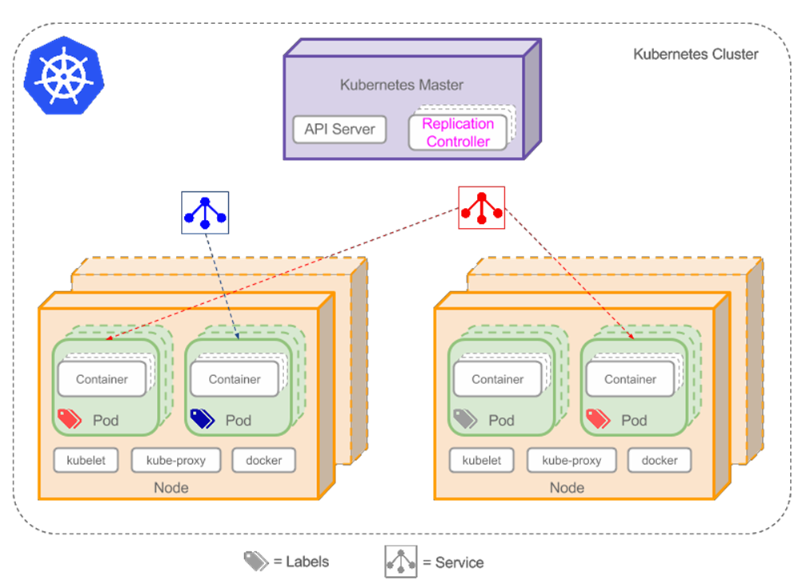
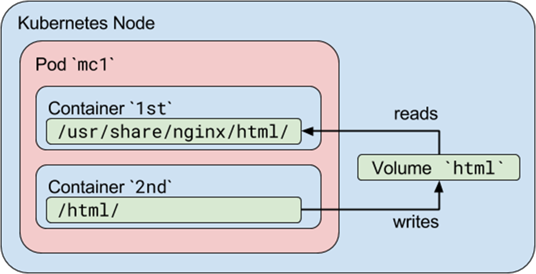
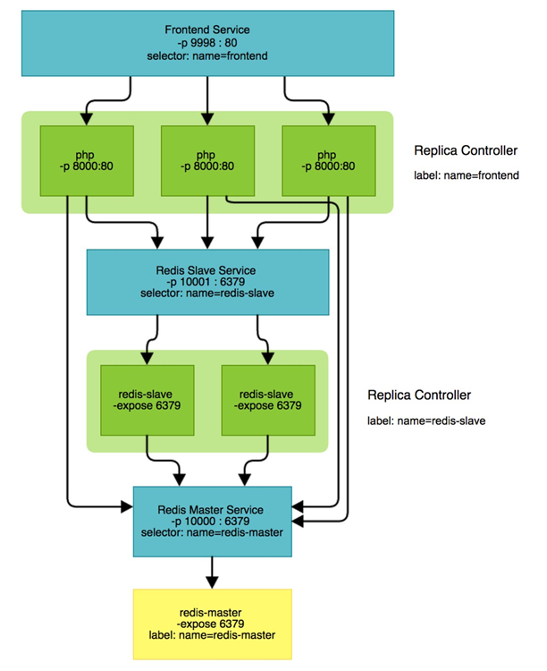
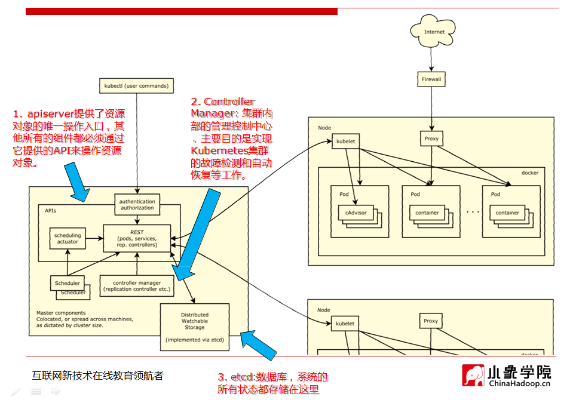
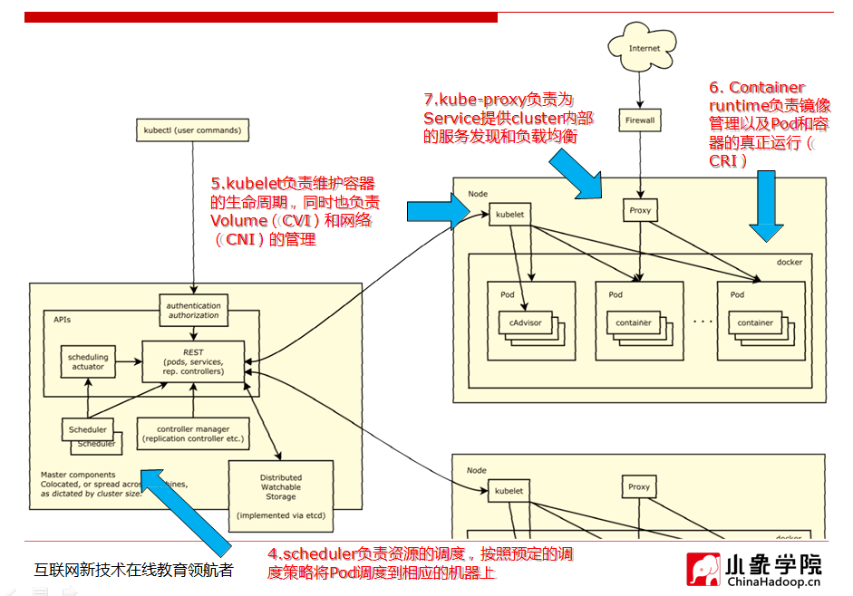
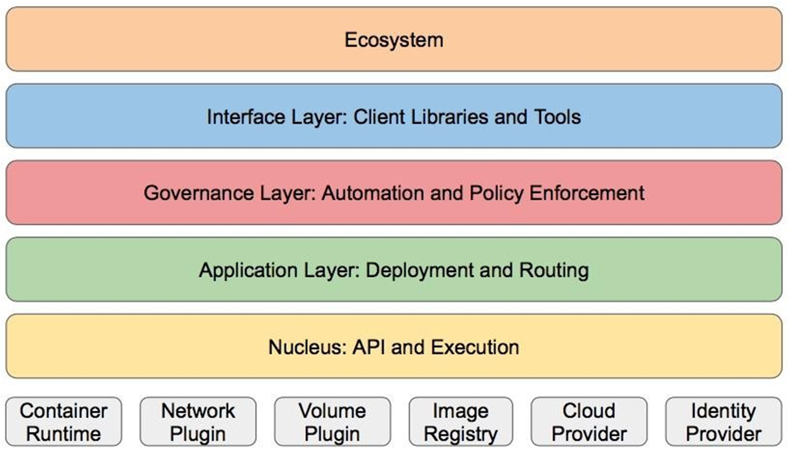

## 目录

* minikube的使用
* k8s提供的抽象
* k8s架构简介
* k8s架构设计优缺点分析
* 运行第一个应用

## minikube的使用

### 安装

1. 安装docker
2. 从github上下载minikube二进制
3. 墙内安装kubectl
4. 启动minikube，绕过gcr.io下无法下载镜像的问题

**直接使用官方方式安装**

https://github.com/kubernetes/minikube/blob/master/docs/vmdriver-none.md

```shell
#curl -Lo minikube https://storage.googleapis.com/minikube/releases/latest/minikube-linux-amd64 && chmod +x minikube
#curl -Lo kubectl https://storage.googleapis.com/kubernetes-release/release/$(curl -s https://storage.googleapis.com/kubernetes-release/release/stable.txt)/bin/linux/amd64/kubectl && chmod +x kubectl

curl -Lo http://pn955ssao.bkt.clouddn.com/minikube-linux-amd64 && mv minikube-linux-amd64  minikube && chmod +x minikube
curl -Lo kubectl http://pn955ssao.bkt.clouddn.com/kubectl && chmod +x kubectl

rm -rf $HOME/.kube
rm -rf $HOME/.kube/config

export MINIKUBE_WANTUPDATENOTIFICATION=false
export MINIKUBE_WANTREPORTERRORPROMPT=false
export MINIKUBE_HOME=$HOME
export CHANGE_MINIKUBE_NONE_USER=true
mkdir $HOME/.kube || true
touch $HOME/.kube/config

export KUBECONFIG=$HOME/.kube/config
sudo -E ./minikube start --vm-driver=none # 不启动虚拟机运行环境，原本这样做的目的是防止对当前环境的污染

# this for loop waits until kubectl can access the api server that Minikube has created
for i in {1..150}; do # timeout for 5 minutes
   ./kubectl get po &> /dev/null
   if [ $? -ne 1 ]; then
      break
  fi
  sleep 2
done

# kubectl commands are now able to interact with Minikube cluster
```

* 将当前安装目录下的文件移动到`/usr/local/bin`下
* `ps -ef | grep localkube` 最后运行的是`loaclkube`
* `kubectl get pod`
* `/var/lib/localkube/` 日志位置
* 当遇到第一个程序都运行不起来就是被墙的原因
  * 直接通过`docker pull kubernetes/pause`
  * `docker tag f9d5 gcr.io/google_containers/pause-amd64:3.0` 打一个tag

[minikube](https://github.com/kubernetes/minikube)

### 过程

**pod创建过程**

* `kubectl` 发起`create pod`
* `apiserver` 接受pod创建请求`yaml`
* apiserver --> etcd ,相当域在数据库中插入数据
* scheduler --watch ->apiserver 一种通知机制
  * pod.spec.Node == null
  * 调度计算
  * pod.spec.Node = nodeA (updateA)
* kubelet --watch-->apiserver
  * 调用docker api 
  * 创建container

### replicaSet创建过程

- `kubectl` 发起`replicaSet`
- `apiserver` 接受`replicaSet`创建请求`yaml`
- apiserver --> etcd ,相当域在数据库中插入数据
- Controller Manger.ReplicaSetController
  - watch 新的replicaSet
  - 往apiserver发起请求，创建3个pod
- scheduler --watch ->apiserver 一种通知机制
  - pod.spec.Node == null
  - 调度计算
  - pod1.spec.Node = nodeA (updateA)
  - pod2.spec.Node = nodeB (updateB)
  - pod3.spec.Node = nodeA (updateA)
- nodeA kubelet -- watch->apiserver
  - 创建docker api 
  - 创建pod1/pod3的container
- nodeB kubelet -- watch->apiserver
  - 创建docker api 
  - 创建pod2的container

## k8s提供的抽象

###总览



* container 容器
* Pod 容器组，对k8s来说的最小管理单元，是容器服务的集合
* Replicaset 复本集合
* Service 服务
* Label 标签
* Node 节点

### Pod



Pod是在Kubernetes集群中运行部署应用或服务的最小单元，它是可以支持多容器的。Pod的设计理念是支持多个容器在一个Pod中共享网络地址和文件系统，可以通过进程间通信和文件共享这种简单高效的方式组合完成服务。Pod对多容器的支持是K8最基础的设计理念。比如你运行一个操作系统发行版的软件仓库，一个Nginx容器用来发布软件，另一个容器专门用来从源仓库做同步，这两个容器的镜像不太可能是一个团队开发的，但是他们一块儿工作才能提供一个微服务；这种情况下，不同的团队各自开发构建自己的容器镜像，在部署的时候组合 成一个微服务对外提供服务。

Pod是Kubernetes集群中所有业务类型的基础，可以看作运行在K8集群中的小机器人，不同类型的业务就需要不 同类型的小机器人去执行。目前Kubernetes中的业务主要可以分为长期伺服型（long-running）、批处理型（  batch）、节点后台支撑型（node-daemon）和有状态应用型（stateful application）；分别对应的控制器为Deployment、Job、DaemonSet和PetSet。

###副本集

Replica Set：Kubernetes集群中保证Pod高可用的API对象。 通过监控运行中的Pod来保证集群中运行指
定数目的Pod副本。指定的数目可以是多个也可以是1个；少于指定数目，RS  就会启动运行新的Pod副本
；多于指定数目，RS就会杀死多 余的Pod副本。即使在指定数目为1的情况下，通过RS运行Pod也比直接
运行Pod更明智，因为RS也可以发挥它高可用 的能力，保证永远有1个Pod在运行。RS适用于长期伺服型
的 业务类型，比如提供高可用的Web服务。

### 服务



RS只是保证了支撑服务的微服务Pod的 数量，但是没有解决如何访问这些服务 的问题。一个Pod只是一
个运行服务的 实例，随时可能在一个节点上停止，在 另一个节点以一个新的IP启动一个新的Pod，因此
不能以确定的IP和端口号提 供服务。要稳定地提供服务需要服务发 现和负载均衡能力。服务发现完成
的工 作，是针对客户端访问的服务，找到对 应的的后端服务实例。在K8集群中，  客户端需要访问的
服务就是Service对象。每个Service会对应一个集群内部有效 的虚拟IP，集群内部通过虚拟IP访问一 
个服务

### 对象

```
apiVersion: apps/v1beta1  
kind: Replicaset 
metadata:
	name: nginx-deployment  
spec:
	replicas: 3  
	template:  
		metadata:
			labels:
				app: nginx
		spec:  
			containers:
			- name: nginx  
				image: nginx:1.7.9
				ports:
				- containerPort: 80
status:		
```

1. Metadata:标识API对象，每个对象都至少有3个元数 据：namespace，name和uid；除此以外还有各种
  各样的 标签labels用来标识和匹配不同的对象，例如用户可以 用标签env来标识区分不同的服务部署环
  境，分别用env=dev、env=testing、env=production来标识开发、 测试、生产的不同服务
2. Spec: 描述了用户期望Kubernetes集群中 的分布式系统达到的理想状态（Desired  State），例如
  用户可以通过复制控制器 Replication Controller设置期望的Pod副本 数为3
3. Status:系统实际当前达到的状态（Status），例如系统当前实际的Pod副本数为2；那么复制 控制器
  当前的程序逻辑就是自动启动新的Pod， 争取达到副本数为3

| 类别   | 名称                                       |
| :--- | :--------------------------------------- |
| 资源对象 | Pod、ReplicaSet、ReplicationController、Deployment  、StatefulSet、DaemonSet、Job、CronJob、  HorizontalPodAutoscaling |
| 配置对象 | Node、Namespace、Service、Secret、ConfigMap、  Ingress、Label、ThirdPartyResource、 ServiceAccount |
| 存储对象 | Volume、Persistent Volume                 |
| 策略对象 | SecurityContext、ResourceQuota、LimitRange |

## k8s架构简介

###架构






### 分层架构



### 分层架构

* 核心层：Kubernetes最核心的功能，对外提供API构建高层的应用，对内提供 插件式应用执行环境
* 应用层：部署（无状态应用、有状态应用、批处理任务、集群应用等）和路由（服务发现、DNS解析等）
* 管理层：系统度量（如基础设施、容器和网络的度量），自动化（如自动扩 展、动态Provision等）以及策略管理（RBAC、Quota、PSP、NetworkPolicy 等）
* 接口层：kubectl命令行工具、客户端SDK以及集群联邦
* 生态系统：在接口层之上的庞大容器集群管理调度的生态系统，可以划分为 两个范畴
  * Kubernetes外部：日志、监控、配置管理、CI、CD、Workflow、FaaS、OTS应用、ChatOps等
  * Kubernetes内部：CRI、CNI、CVI、镜像仓库、Cloud Provider、集群自身的配置 和管理等

## k8s架构设计优缺点分析

### 优点

* 容错性：保证Kubernetes系统稳定性和安全性的基础
* 易扩展性：保证Kubernetes对变更友好，可以快速迭代增 加新功能的基础。
  * API分版本，API可自由扩展(CRD)
  * 插件化，调度器，容器运行时，存储均可扩展
* 声明式（Declarative）的而不是命令式（Imperative）：  声明式操作在分布式系统中的好处是稳定，不怕丢操作 或运行多次，例如设置副本数为3的操作运行多次也还是 一个结果，而给副本数加1的操作就不是声明式的，运行 多次结果就错了。

### 缺点

* 配置中心化：所有状态都保存在中心的etcd上，而非分布式存储，性能有一定制约，牺牲性能换取可靠性
* 单体调度：调度一致性好而吞吐低

## 运行第一个应用

* `kubectl get pod --all-namespaces` 查看所有pod
* `docker pull nginx` 
* `kubectl run hello-minikube --image=nginx --port=80 ` 启动资源对象
* `kubectl get deployment` 查看资源对象
  * `kubectl get deployment -o wide` 查看更多信息
* `kubectl get rs` 查看rs
* `docker inspect 83aea34a289c` 查看容器信息
* `kubectl describe pod` 查看pod信息
  * `172.17.0.2`找到端口是可以访问的
* `kubectl get pod`
* `kubectl expose deployment hello-minikube --type=NodePort ` 将应用暴露出来
* `kubectl get services` 查看服务
* `kubectl get services hello-minikube -o yaml` 

```
客户端  ->  nodePort 32767 ->  kube-proxy  -> pod 80
```

* `curl 192.168.126.128:32767` 从当前宿主机ip访问
* `kubectl get pod` 查看pod
* `kubectl delete pod hello-minikube-779cc85c98-9jx5n ` 删除pod
* `kubectl get rs` 查看rs
* `kubectl get pod` 查看pod

