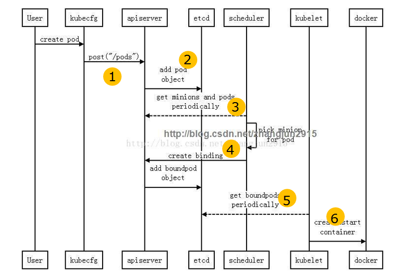
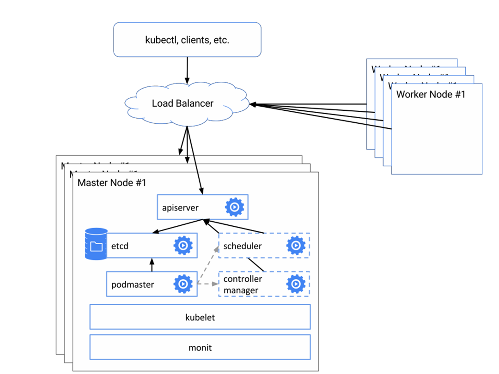

# Kubernetes集群搭建及基本操作

## 业界几种搭建k8s集群的方法介绍及对比

|                                          | 安装前准备           | 适用范围及特点                       | 高可用       | 安装复杂度 |
| ---------------------------------------- | --------------- | ----------------------------- | --------- | ----- |
| [kubeadm](https://kubernetes.io/docs/setup/independent/create-cluster-kubeadm/) | kubectl/kubelet | 不对接节点，自己准备 节点环境，容易被集成 到其他工具链中 | HA(aplha) | 高     |
| [kops](https://github.com/kubernetes/kops) | kubectl         | 对接AWS/GCE/Vmware 帮助你管理虚机      | ， HA      | 中     |
| [minikube](https://github.com/kubernetes/minikube/releases) | kubectl         | 单机对接VM                        | 无         | 低     |
| [rancher](https://www.cnrancher.com/rancher-k8s-accelerate-installation-document/) | rancher         | 墙内加速，跨云能力                     | 不清楚       | 中     |
| [手工安](https://jimmysong.io/kubernetes-handbook/practice/install-kubernetes-on-centos.html)[装](https://jimmysong.io/kubernetes-handbook/practice/install-kubernetes-on-centos.html) | 11+组件           | 任意集群                          | HA        | 疯狂    |

## 当我们谈论创建pod时，我们在谈论什么



1. kubectl提交创建请求，可以通过API Server的Restful API，也可以使用kubectl命令行工具。支持的数据类型包括JSON和YAML。
2. kube-apiserver处理用户请求，存储Pod数据到etcd。
3. kube-scheduler通过API Server查看未绑定的Pod。尝试为Pod分配主机。
   * 过滤主机 (调度预选)：调度器用一组规则过滤掉不符合要求的主机。比如Pod指定了所需要的资源量，
     那 么可用资源比Pod需要的资源量少的主机会被过滤掉。
   * 主机打分(调度优选)：对第一步筛选出的符合要求的主机进行打分，在主机打分阶段，调度器会考虑一
     些 整体优化策略，比如把容一个Replication Controller的副本分布到不同的主机上，使用最低负载的
     主机等。
4. kube-scheduler选择主机：选择打分最高的主机，进行binding操作，这个操作本质是 通过kube-apisever修改Pod的字段，结果存储到etcd中。
5. kubelet根据调度结果执行Pod创建操作： 绑定成功后，pod.spec.nodeName有值了。运 行在每个工作节点上的kubelet也会定期与etcd同步pod信息（属于自己这个node的）
6. docker接受到kubelet下发的命令，启动相应容器，至此，一个Pod启动完毕

* `kubectl describe pod` 
* `kubectl get pod -o yaml`
* `kubectl get pod` 以监控方式打印信息

## 社区的集群高可用方案介绍



* [Establishing a ](https://kubernetes.io/docs/admin/high-availability/)[redundant, ](https://kubernetes.io/docs/admin/high-availability/)[reliable ](https://kubernetes.io/docs/admin/high-availability/)[data ](https://kubernetes.io/docs/admin/high-availability/)[storage](https://kubernetes.io/docs/admin/high-availability/)[ ](https://kubernetes.io/docs/admin/high-availability/)[layer](https://kubernetes.io/docs/admin/high-availability/)
  * [Clustering](https://kubernetes.io/docs/admin/high-availability/)[ ](https://kubernetes.io/docs/admin/high-availability/)[etcd](https://kubernetes.io/docs/admin/high-availability/)
    * [Validating](https://kubernetes.io/docs/admin/high-availability/)[your](https://kubernetes.io/docs/admin/high-availability/)[ ](https://kubernetes.io/docs/admin/high-availability/)[cluster](https://kubernetes.io/docs/admin/high-availability/)
  * [Even more reliable](https://kubernetes.io/docs/admin/high-availability/)[ ](https://kubernetes.io/docs/admin/high-availability/)[storage](https://kubernetes.io/docs/admin/high-availability/)
* [Replicated ](https://kubernetes.io/docs/admin/high-availability/)[API](https://kubernetes.io/docs/admin/high-availability/)[ ](https://kubernetes.io/docs/admin/high-availability/)[Servers](https://kubernetes.io/docs/admin/high-availability/)
  * [Installing ](https://kubernetes.io/docs/admin/high-availability/)[configuration](https://kubernetes.io/docs/admin/high-availability/)[ ](https://kubernetes.io/docs/admin/high-availability/)[files](https://kubernetes.io/docs/admin/high-availability/)
  * [Starting the API](https://kubernetes.io/docs/admin/high-availability/)[ ](https://kubernetes.io/docs/admin/high-availability/)[Server](https://kubernetes.io/docs/admin/high-availability/)
  * [Load](https://kubernetes.io/docs/admin/high-availability/)[ ](https://kubernetes.io/docs/admin/high-availability/)[balancing](https://kubernetes.io/docs/admin/high-availability/)
  * [Endpoint](https://kubernetes.io/docs/admin/high-availability/)[ ](https://kubernetes.io/docs/admin/high-availability/)[reconciler](https://kubernetes.io/docs/admin/high-availability/)
* [Master elected](https://kubernetes.io/docs/admin/high-availability/)[ ](https://kubernetes.io/docs/admin/high-availability/)[components](https://kubernetes.io/docs/admin/high-availability/)
  * [Installing ](https://kubernetes.io/docs/admin/high-availability/)[configuration](https://kubernetes.io/docs/admin/high-availability/)[ ](https://kubernetes.io/docs/admin/high-availability/)[files](https://kubernetes.io/docs/admin/high-availability/)

## 实践：kubectl操作指南

### 设置补全

* `$ source <(kubectl completion bash)`bash下自动补全

  ```
  kubectl completion bash >> .bashrc
  kubectl completion bash >> .profile
  ```

* `$ source <(kubectl completion zsh)` zsh下自动补全

### kubectl上下文和配置

* `$ kubectl config view ` 显示合并后的 kubeconfig 配置

  ```
  apiVersion: v1
  clusters:
  - cluster:
      certificate-authority: /root/.minikube/ca.crt 
      server: https://192.168.126.128:8443 # 服务端信息
    name: minikube
  contexts: 
  - context:
      cluster: minikube
      user: minikube
    name: minikube
  current-context: minikube # 当前的
  kind: Config
  preferences: {}
  users: # 用户信息
  - name: minikube
    user:
      client-certificate: /root/.minikube/client.crt 
      client-key: /root/.minikube/client.key
  ```

* `kubectl config current-context` 显示当前的上下文

* `kubectl config use-context my-cluster-n`设置默认上下文为 my-cluster-  name

* `$ kubectl config set-context gce --user=cluster-admin --namespace=foo \ && kubectl config use-context gce` 使用指定的用户名和 namespace 设置上下文

* `kubectl config current-context –h ` 帮助及例子

### 资源查看命令

* ` kubectl get services` 列出所有 namespace 中的所有 service
* `kubectl get pods --all-namespaces` 列出所有 namespace 中的所有 pod
* `kubectl get pods -o wide` 列出所有 pod 并显示详细信息
* `kubectl get deployment my-dep` 列出指定 deployment
* `kubectl  get pods --include-uninitialized`列出该 namespace 中的所有 pod 包 括未初始化的
* `kubectl describe nodes my-node`  使用详细输出来描述命令
* `kubectl describe pods my-pod` 
* `kubectl get services --sort-by=.metadata.name ` 
* `kubectl get pods --sort-by='.status.containerStatuses[0].restartCount'` 根据重启次数排序列出 pod
* `kubectl get pods --selector=app=cassandra rc -o  jsonpath='{.items[*].metadata.labels.version}'` 获取所有具有 app=cassandra 的 pod 中的 version 标签
* `kubectl get nodes -o  jsonpath='{.items[*].status.addresses[?(@.type=="ExternalIP")].address}'` 获取所有节点的 ExternalIP

###  kubectl编辑资源

* ` kubectl edit svc/docker-registry`  编辑名为 docker-registry 的 service
	 `KUBE_EDITOR="nano"  kubectl edit svc/docker-registry	`使用其它编辑器

### kubectl Scale 资源

* `kubectl scale --replicas=3 rs/foo`  扩容到3个
* `kubectl scale --replicas=3 -f foo.yaml` 
* `kubectl scale --current-replicas=2 --replicas=3 deployment/mysql`  
* `kubectl scale --replicas=5 rc/foo  rc/bar rc/baz` 
* `kubectl get deployment` 查看
* `kubectl delete deployment nginx-deployment` 删除操作

### 与pod交互

* `kubectl logs my-pod` dump 输出 pod 的日志（stdout）
* `kubectl logs my-pod -c my-container` dump 输出 pod 中容器的日志（stdout，pod 中有多个容器的情况下使用）
* `kubectl logs -f my-pod`流式输出 pod 中容器的日志（stdout）
* ` kubectl logs -f my-pod -c my-container` 流式输出 pod 中容器的日志（stdout，pod中有多个容器的情况下使用)
* `kubectl run -i --tty busybox --image=busybox -- sh` # 交互式 shell 的方式运行 pod
* `kubectl attach my-pod -i` 连接到运行中的容器
* `kubectl port-forward my-pod 5000:6000` 转发 pod 中的 6000 端口到本地的 5000端口
* `kubectl exec my-pod -- ls /` 在已存在的容器中执行命令（只有一个容器的情况下）
* `kubectl exec my-pod -c my-container -- ls /` 在已存在的容器中执行命令（pod 中有多个容器的情况下）
* ` kubectl top pod POD_NAME --containers` 显示指定 pod 和容器的指标度量

### 节点和集群交互

* `kubectl cordon my-node` 标记 my-node 丌可调度
* `kubectl drain my-node` 清空 my-node 以待维护
* `kubectl uncordon my-node` 标记 my-node 可调度
* `kubectl top node my-node` 显示 my-node 的指标度量
* `kubectl cluster-info` 显示 master 和服务的地址
* `kubectl cluster-info dump` 将当前集群状态输出到 stdout
* `kubectl  cluster-info dump --output-directory=/path/to/cluster-state` 将当前集群状态输出 到 /path/to/cluster-state
* `kubectl taint nodes foo dedicated=special-user:NoSchedule`如果该键和影响的污点（taint）已存在，则使用指定的值替换

 


`pip install kube-shell `


命名空间包括如下：

- 主机名
- 进程ID（PID）
- 文件系统
- 网络接口
- 进程间通信（IPC）