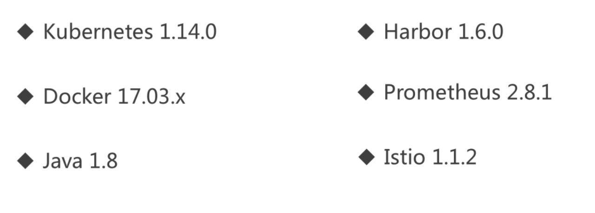

# kubernetes快速入门

## kubernetes的认证与授权

### 认证

1. 客户端证书认证（TLS双向认证）
2. Bearer Token
3. ServiceAccount：用于容器和其他内部交互

### 授权

1. ABAC
2. WebHook
3. RBAC

## 集群搭建方案对比

### 社区方案

* 杂乱
* 不可靠
* 升级困难

### kubeadm

* 优雅

* 简单

* 支持高可用

* 升级方便

  ​

* 不易维护

* 文档简陋

### Binary

* 易于维护
* 灵活
* 升级方便

* 没有文档
* 安装复杂