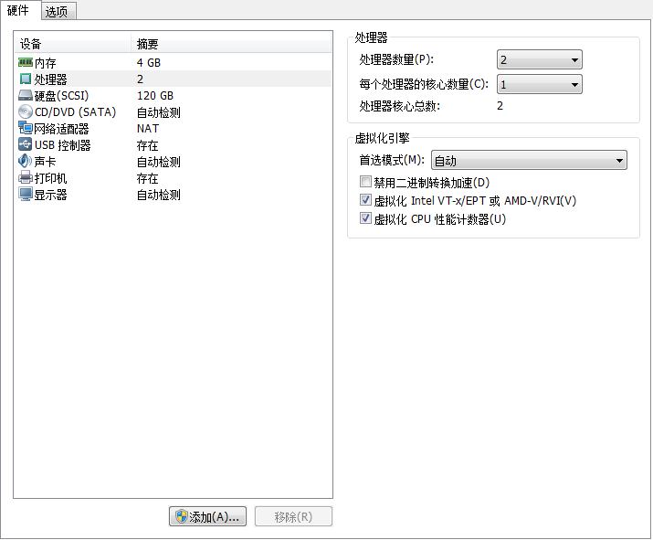

# 不翻墙安转minikube

### 前提

1. 已经安装`ubuntu18.04`的裸机或者虚拟机
2. 虚拟机或裸机要支持虚拟化，VM虚拟机开启虚拟化方式

### 安装virtualbox

*  到官网下载最新版:https://www.virtualbox.org/wiki/Linux_Downloads，选择ubuntu 18.04版本
*  `sudo dpkg -i virtualbox-6.0_6.0.4-128413~Ubuntu~bionic_amd64` 安装很可能失败，因为缺少依赖
*  `apt-get -f install` 自动解决依赖
*  `sudo dpkg -i virtualbox-6.0_6.0.4-128413~Ubuntu~bionic_amd64` 再执行一遍

### 安装kubectl

* `sudo snap install kubectl --classic` 安装kubectl
* `kubectl version` 查看版本

### 安装docker

* `apt-get install -y docker.io`

### 安装minikube（使用阿里云上的）

* `curl -Lo minikube http://kubernetes.oss-cn-hangzhou.aliyuncs.com/minikube/releases/v0.30.0/minikube-linux-amd64 && chmod +x minikube && sudo mv minikube /usr/local/bin/`

### 启动

* `minikube start --registry-mirror=https://registry.docker-cn.com --kubernetes-version v1.13.4 --v=7` 启动等着完成，注意这里版本是前面kubectl版本

