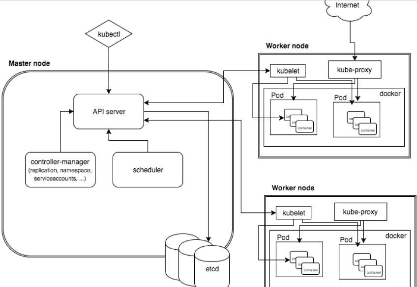

# 概述和架构

## 概述

* 使用k8s进行容器化应用的部署；
* 便于应用的扩展和一些列操作；
* 让部署容器应用更加简洁和高效；

## 特性

1. 自动装箱
2. 自我修复(自愈能力)
3. 水平扩展 
4. 服务发现
5. 滚动更新
6. 版本回退
7. 密钥和配置管理
8. 存储编排
9. 批处理

## 架构与组件

### 节点

* Master node 主控制节点

  * API Server

    集群的统一入口，之后交给ETCD进行存贮

  * Controller Manager

    处理集群中常规的后台任务，一个资源对应一个控制器

  * Scheduler

    进行节点调度，选择node节点应用部署

  * etcd

    用于集群中的数据存储

* work node 工作节点

  * kubelet

    主节点派到node节点的代表，管理本机容器

  * kube-proxy

    网络代理，如负载均衡操作

## 概念

* Pod

  1. 最小的部署单元
  2. 一组容器的集合
  3. 彼此间共享网络
  4. 生命周期是短暂的

* controller

  创建和运维pod

  1. 确保预期的pod剧本数量
  2. 无状态部署
     * 无特定网络或存储的条件
  3. 有状态部署
     * 有特定网络或存储的条件
  4. 确保所有node运行同一个pod
  5. 一次性任务和定时任务

* service

  定义一组pod的访问规则

  ​