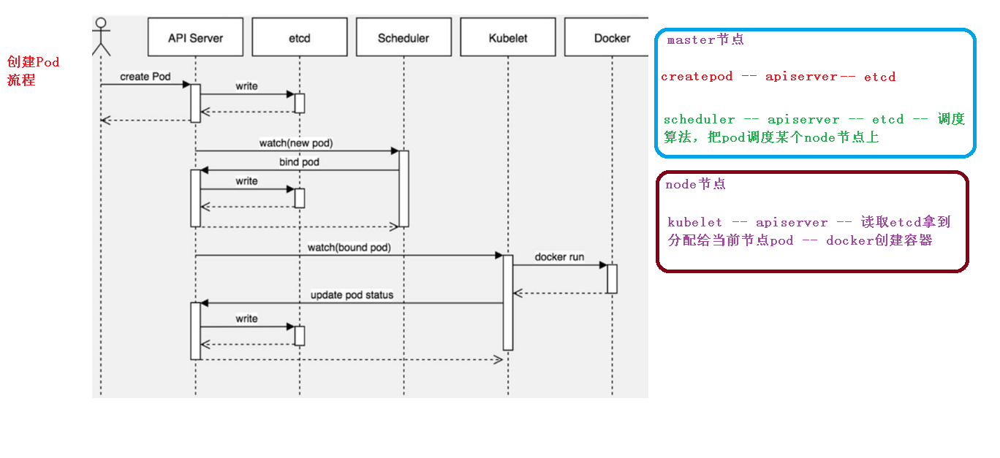

# 核心技术-POD

## kubectl

1. kubectl 概述

   kubectl 是 Kubernetes 集群的命令行工具，通过 kubectl 能够对集群本身进行管理，并能 

   够在集群上进行容器化应用的安装部署。

2. kubectl 命令的语法

   `````
   kubectl [command] [TYPE] [NAME] [flags]
   `````

   * `command`：指定要对资源执行的操作，例如 create、get、describe 和 delete

   * `TYPE`：指定资源类型，资源类型是大小写敏感的，开发者能够以单数、复数和缩略的 

     形式。例如：

     ````
     kubectl get pod pod1
     kubectl get pods pod1
     kubectl gtt po pod1
     ````

   * `NAME`：指定资源的名称，名称也大小写敏感的。如果省略名称，则会显示所有的资源

     ````
     kubectl get pods
     ````

   * flags：指定可选的参数。例如，可用-s 或者–server 参数指定 Kubernetes API server 的地址和端口。

   `````
   kubectl get nodes
   kubectl get nodes k8s-master
   `````

3. kubectl 子命令使用分类

   * 基础命令

     

   * 部署和集群管理命令

     

   * 故障和调试命令

     

   * 其他命令

     

## kubernetes 集群 YAML 文件详解

一般生成，而不是编写

1. YAML 基本语法

   * 使用空格做为缩进
   * 缩进的空格数目不重要，只要相同层级的元素左侧对齐即可
   * 低版本缩进时不允许使用 Tab 键，只允许使用空格
   * 使用#标识注释，从这个字符一直到行尾，都会被解释器忽略
   * `---` 表示一个新的 yaml文件开始

   

2. 组成部分

   * 控制器定义
   * 被控制对象

3. 快速编写

   * `kubectl create`生成yaml文件( 测试环境，资源并未真正部署)

     ````
     kubectl create deployment web --image=nginx -o yaml --dry-run > my.yaml
     ````

   * `kubectl get`从部署环境中取出yaml文件（运行环境）

     ````
     kubectl get deploy nginx -o=yaml --export > my1.yaml
     ````

## kubernetes 核心技术-Pod

1. 概述

   Pod 是 k8s 系统中可以创建和管理的最小单元，是资源对象模型中由用户创建或部署的最小资源对象模型，也是在 k8s 上运行容器化应用的资源对象，其他的资源对象都是用来支撑或者扩展 Pod 对象功能的，比如控制器对象是用来管控 Pod 对象的，Service 或者Ingress 资源对象是用来暴露 Pod 引用对象的，PersistentVolume 资源对象是用来为 Pod 提供存储等等，k8s 不会直接处理容器，而是 Pod，Pod 是由一个或多个 container 组成。

   Pod 是 Kubernetes 的最重要概念，每一个 Pod 都有一个特殊的被称为”根容器“的 Pause 容器。Pause 容器对应的镜 像属于 Kubernetes 平台的一部分，除了 Pause 容器，每个 Pod 还包含一个或多个紧密相关的用户业务容器。

   * 最小部署单元
   * 一个pod包含多个容器（一组容器的集合）
   * 一个pod中的容器共享网络命名空间
   * pod是短暂存在的

   

   

2. pod存在意义

   * 创建容器使用的docker，一个docker对应一个容器，一个容器有进程，一个容器一个应用程序；
   * pod多进程设计，运行多个应用程序，一个pod有多个容器，一个容器运行一个应用程序；
   * pod存在为了亲密性应用而产生；
     * 两个及多个应用存在交互
     * 网络之间的调用
     * 两个应用之间频繁调用

3. 实现机制

   1. 共享网络
   2. 共享存储

4. pod镜像拉取策略

   ````
   spec:
   	containers:
   	- name: nginx
   		image: nginx:1.14
   		imagePullPolicy: Always
   ````

   * IfNotPresent：默认值，镜像在宿主机上不存在时才拉取
   * Always：每次创建Pod都重新拉取镜像
   * Never：Pod永远不主动拉取镜像

5. pod资源限制

   ```
   spec:
   	containers:
   	- name: nginx
   		image: mysql
   		env:
   		- name: MYSQL_ROOT_PASSWORD
   			value: "password"
   		
   		resources:
   			requests: # 调度大小
   				memory: "64Mi"
   				cpu: "250m" # 0.25
   			
   			limits: # 最大占用不超过
   				memory: "128Mi"
   				cpu: "500m"
   ```

6. pod重启策略

   ````
   spec:
   	containers:
   	- name: busybox
   		image: busybox:1.28.4
   		args:
   		- /bin/sh
   		- -c
   		- sleep 36000
       restartPolicy: Never
   ````

   * `Always` 当容器终止退出后，总是重启容器，默认策略
   * `OnFailure` 当容器异常退出（退出状态码非0）时，才重启容器
   * `Never` 终止退出，不重启容器

7. 健康检查

    

   * `livenessProbe`(存活检查)：如果检查失败，将杀死容器，根据Pod的restart
   * `readinessProbe`(就绪检查)：如果检查失败，kubernetes会把Pod从Server endpoints中剔除

   支持三种检查方法：

   * `httpGet`：发送HTTP请求，返回200-400范围状态码为成功
   * `exec`：执行shell命令返回状态码为0是成功
   * `tcpSocket`：发起TCP Socket建立成功

## pod调度策略

1. 创建pod流程

   

2. 资源限制和节点选择器

   影响调度的属性

   

   * pod 资源限制对pod调度产生影响，根据request找到足够node节点进行调度
   * 节点选择标签影响Pod调度
     * ` kubectl label node k8s-node1 env_role=dv`节点创建标签
     * `kubectl get nodes k8s-node1 --show-labels`

3. 节点亲和性

   

4. 污点及污点容忍

   

   * ` kubectl describe node k8s-master | grep Taint`查看节点污点情况
     * `NoSchedule` 一定不被调度
     * `PreferNoSchedule` 尽量不被调度
     * `NoExecute` 不会调度，并且会驱逐Node已有Pod
   * `kubectl taint node k8s-node1 env_role=yes:PreferNoSchedule` 设置污点
   * `kubectl taint node k8s-node1 env_role=yes:PreferNoSchedule-` 删除污点