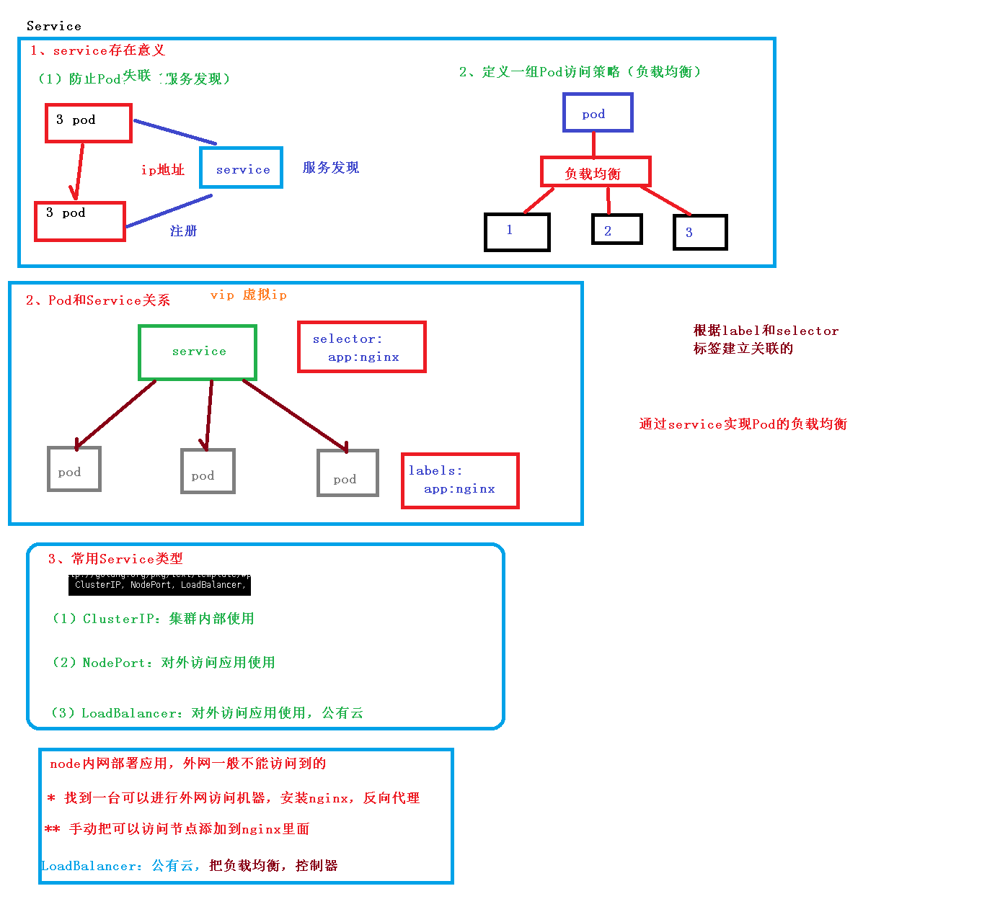

# 核心技术-Service



##概念

* 定义一组pod的访问规则

## 存在的意义

1. 防止pod失联（服务发现）
2. 定义一组Pod访问策略（负载均衡）

## Pod和service之间的关系

* 根据label和selector标签建议关联的
* 通过service实现pod的负载均衡

## 三种service类型

* `ClusterIP`
  * 用于集群中内部访问
* `NodePort`
  * 用于对外暴露使用
* `LoadBalancer`
  * 对外访问应用使用，适用公有云操作

### 三种类型实验

* `kubectl apply -f web.yaml` 创建应用
* `kubectl get pods` 
* `kubectl get svc` 
* `kubectl expose deployment web --port=80 --target-port=80 --dry-run -o yaml > service1.yaml`

````yaml
apiVersion: v1
kind: Service
metadata:
  creationTimestamp: null
  labels:
    app: web
  name: web
spec:
  ports:
  - port: 80
    protocol: TCP
    targetPort: 80
  selector:
    app: web
   type: NodePort   # 注意这个
status:
  loadBalancer: {}
````


