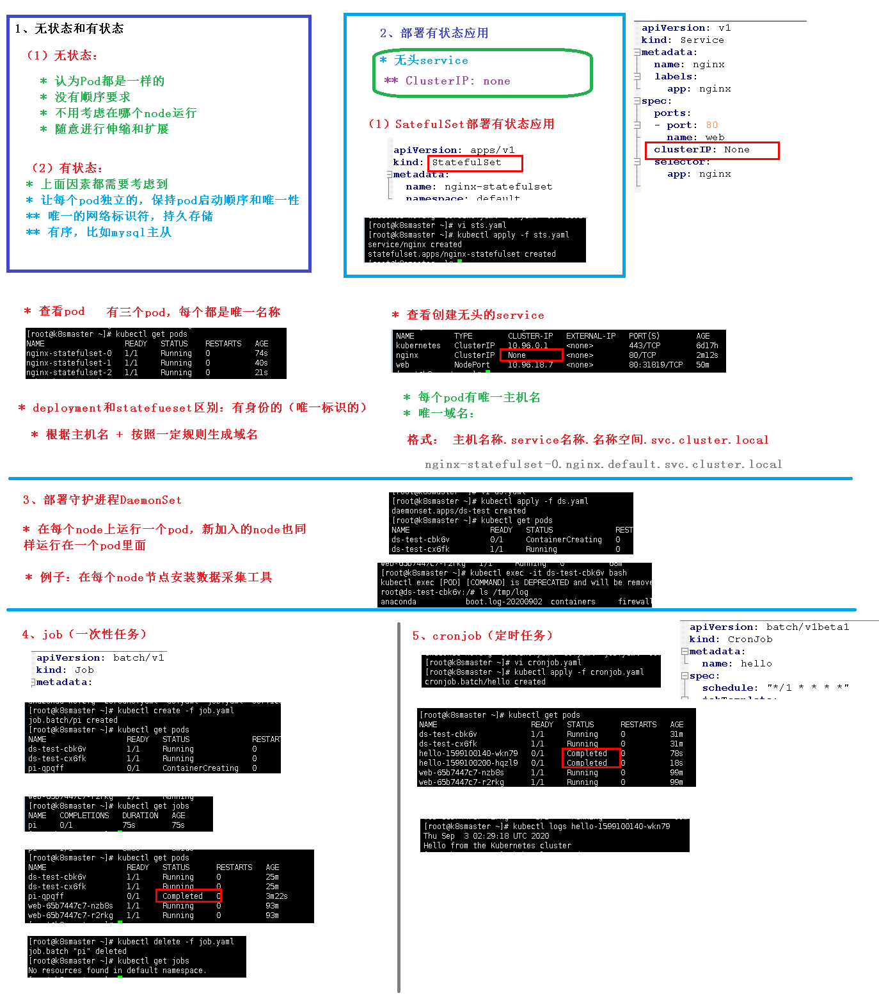

# 核心技术-部署

## 无状态和有状态



### 无状态

* Pod都是一样的
* 没有顺序的要求
* 不考虑运行的node位置
* 随意进行伸缩扩展

### 有状态

* 以上因素均需要考虑到
* 让每个pod独立，保持pod启动顺序和唯一性
* 唯一网络标识符，持久存储
* 有序，例如mysql主从

### 部署

#### 无头service

* `ClusterIP` 为none

#### 操作

1. `SatefulSet` 部署有状态应用

   `````yaml
   apiVersion: v1
   kind: Service
   metadata:
     name: nginx
     labels:
       app: nginx
   spec:
     ports:
     - port: 80
       name: web
     clusterIP: None  # 无头service标识
     selector:
       app: nginx

   ---

   apiVersion: apps/v1
   kind: StatefulSet  # 表示有状态应用
   metadata:
     name: nginx-statefulset
     namespace: default
   spec:
     serviceName: nginx
     replicas: 3
     selector:
       matchLabels:
         app: nginx
     template:
       metadata:
         labels:
           app: nginx
       spec:
         containers:
         - name: nginx
           image: nginx:latest
           ports:
           - containerPort: 80
   `````

   *  `clusterIP`: None 无头service标识
   * `kind: StatefulSet`  # 表示有状态应用

   `kubectl apply -f sts.yaml`

2. 查看

   * `kubectl get pods` 均使用唯一名称，每个都是唯一的
   * `kubectl get svc` IP为None

### 唯一约定

`deployment`和`SatefulSet`区别：有身份的（唯一标识的）

* 根据主机名+按照一定规则生成域名组成的

  * 每个pod有唯一的主机名

  * 唯一的域名

  * 格式：主机名称.server名称.名称空间.svc.cluster.local

    `````
    nginx-statefulset-0.nginx.default.svc.cluster.local
    `````

## 守护进程（DaemonSet）

* 所有的node运行同一个pod，新加入的node也同样运行在一个pod里面
  * 例子：在每个node节点上行安装数据采集工具

`````yaml
apiVersion: apps/v1
kind: DaemonSet
metadata:
  name: ds-test 
  labels:
    app: filebeat
spec:
  selector:
    matchLabels:
      app: filebeat
  template:
    metadata:
      labels:
        app: filebeat
    spec:
      containers:
      - name: logs
        image: nginx
        ports:
        - containerPort: 80
        volumeMounts:
        - name: varlog
          mountPath: /tmp/log
      volumes:
      - name: varlog
        hostPath:
          path: /var/log
`````

* ` kubectl delete statefulset --all`
* `kubectl delete svc nginx`
* `kubectl apply -f ds.yaml` 执行
* `kubectl exec -it ds-test-w6gsk /bin/bash` 进入

## 一次性任务和定时任务

### 一次性任务（Job）

````yaml
apiVersion: batch/v1
kind: Job # 注意
metadata:
  name: pi
spec:
  template:
    spec:
      containers:
      - name: pi
        image: perl
        command: ["perl",  "-Mbignum=bpi", "-wle", "print bpi(2000)"]
      restartPolicy: Never
  backoffLimit: 4
````

* `kubectl create -f job.yaml `
* `kubectl get jobs` 查看
* `kubectl logs pi-b49fj` 日志查看
* ` kubectl delete -f job.yaml`删除

### 定时任务（cronjob）

````yaml
apiVersion: batch/v1beta1
kind: CronJob
metadata:
  name: hello
spec:
  schedule: "*/1 * * * *"
  jobTemplate:
    spec:
      template:
        spec:
          containers:
          - name: hello
            image: busybox
            args:
            - /bin/sh
            - -c
            - date; echo Hello from the Kubernetes cluster
          restartPolicy: OnFailure
````

* `kubectl apply -f cronjob.yaml`
* `kubectl logs hello-1603783260-pqsfv`

