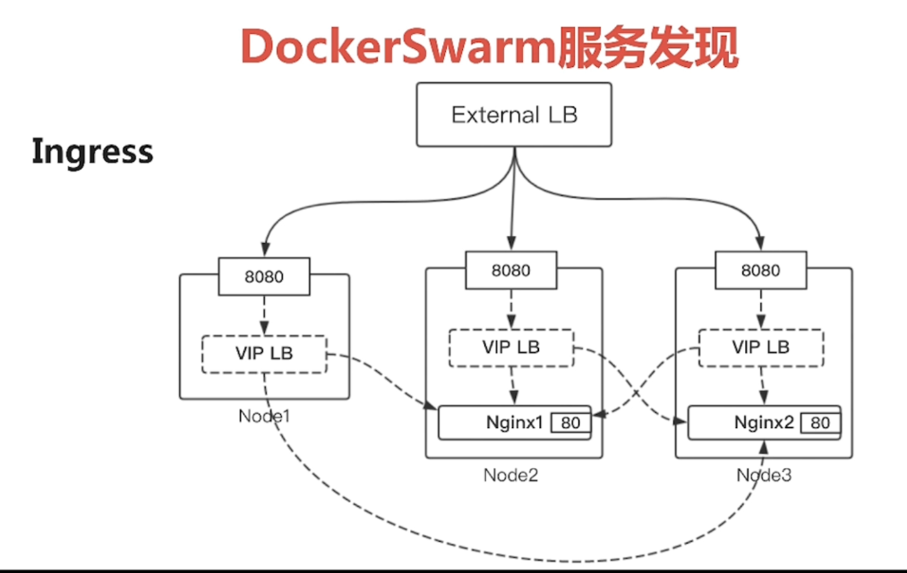
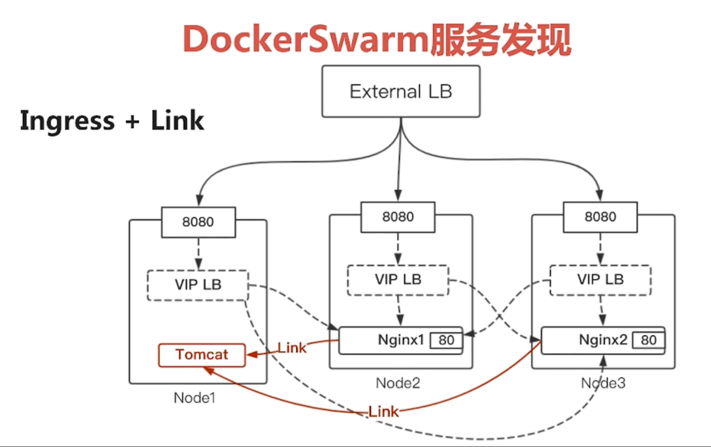

# DockerSwarm

## 服务发现的三种形式

1. Ingress

   

2. Ingress + link

   

3. 自定义网络

   * `docker network create --driver=overlay --attachable mynet` 创建自定义网络
   * `dockerservice create -p 80:80 --network=mynet --name nginx nginx` 在网络中的均可通过名字访问

* 服务更新 `docker service update`
* 服务扩缩容 `docker service scale`

## 搭建

```
m1 192.168.232.203
w1 192.168.232.204
w2 192.168.232.205
```

* `docker swarm init --advertise-addr 192.168.232.203` 主节点

* `docker swarm join --token SWMTKN-1-3d72quifcfnmev2r0bx6amrb4je6t4cd5kns60r62k2qq795ku-dxthga2ggguq6tlw4xftny9a6 192.168.232.203:2377` 加入节点

* `docker network ls`

  ````
  NETWORK ID          NAME                DRIVER              SCOPE
  .....
  a9e660937d94        docker_gwbridge     bridge              local
  ......
  spvol4nzmn4d        ingress             overlay             swarm
  ......
  ````

* `docker node ls` 查看节点数量

* `docker node promote w1  ` 将工作节点提升为主节点

* `docker service create --name test1 alpine ping www.baidu.com` 运行一个服务

* `docker service ls` 查看

* `docker service inspect test1` 查看服务详情

* `docker service logs test1` 查看服务日志

* `docker service create --name mynginx --detach=false  nginx` 创建服务并显示过程

* `docker service update --publish-add 8080:80 --detach=false mynginx` 端口绑定

* `netstat -na|grep LISTEN` 打印端口监听

* `docker service scale mynginx=3` 节点扩展

* `docker service ps mynginx` 显示服务对应的容器信息

* `docker service rm test1` 停掉服务

### 创建自定义的网络

* `docker network create -d overlay xin-overlay` 创建一个网络
* `docker service create --network xin-overlay --name xin-nginx -p 8080:80 --detach=false nginx` 创建服务
* `docker service create --network xin-overlay --name alpine --detach=false alpine ping www.baidu.com`
* `docker service ls `

服务之间可使用名称相互访问

### dnsrr

只能是容器间范围，使用名称，不能对外提供端口服务

* `docker service create --name nginx-b --endpoint-mode dnsrr --detach=false -p 8081 nginx` 

此时在xin-nginx的容器不能ping通此服务

* `docker service update --network-add xin-overlay --detach=false nginx-b`

此时可以访问

## service 分组

````
version: "3.4"
services:
    alpine:
        image: alpine
        command:
            - "ping"
            - "www.baidu.com"
        networks:
            - "xin-overlay"
        deploy:
            replicas: 2
            restart_policy:
                condition: on-failure
            resources:
                limits:
                    cpus: "0.1"
                    memory: 50M
        depends_on: # 定义依赖关系
            - xinnginx
    xinnginx:
        image: nginx
        networks:
            - "xin-overlay"
        ports:
            - "8085:80"

networks:
    xin-overlay:
        external: true
````

* `docker stack deploy -c service.yml test`
* `docker stack ls`查看组
* `docker stack services test` 显示服务
* `docker service ls` 显示服务
* `docker service ps test_alpine` 显示

`````
deploy:
  endpoint_mode: dnsrr
  replicas: 2
  restart_policy:
`````

* `docker stack deploy -c service.yml test`
* `docker service inspect test_alpine`


## 解散集群

* `docker node demote w1` 
* `docker swarm leave` 节点离开集群
* `docker node rm w9swzz1c7n0j8ch1ajioopy0k` 删除节点
* `docker swarm leave --force` 主节点离开


