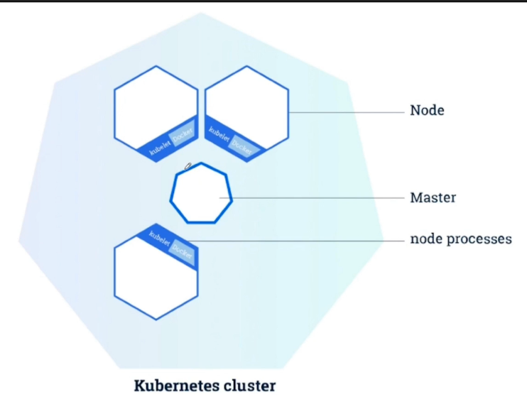
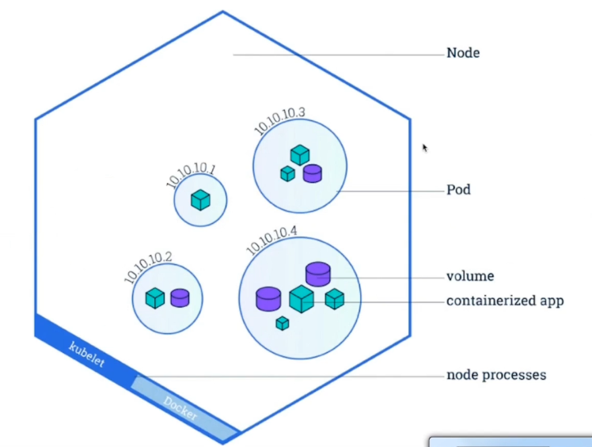
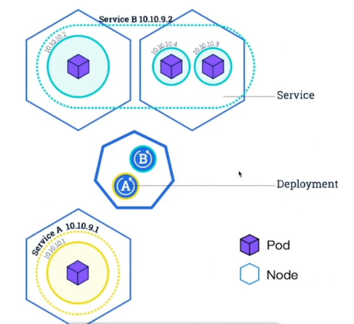
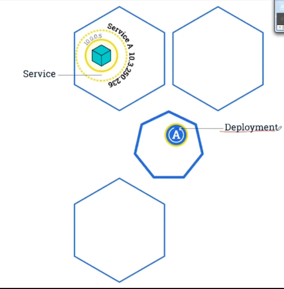
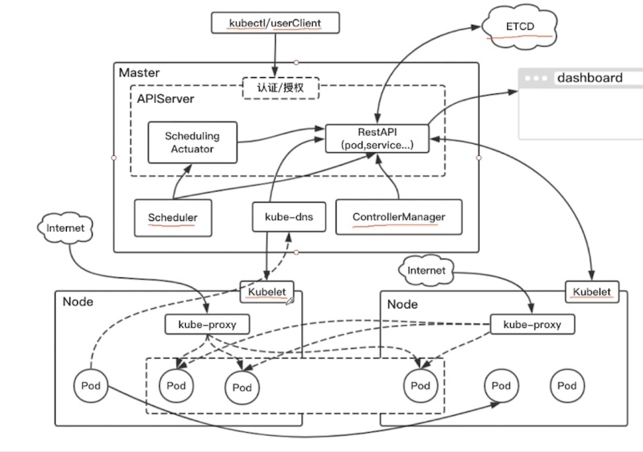
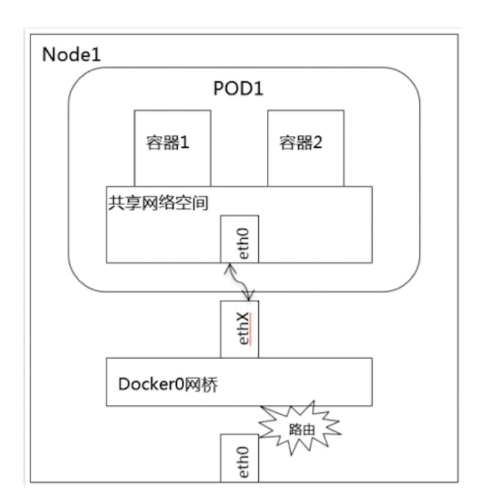
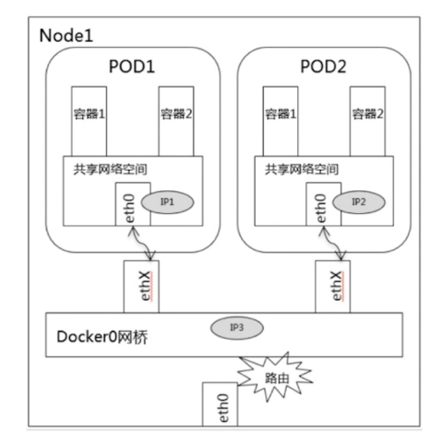
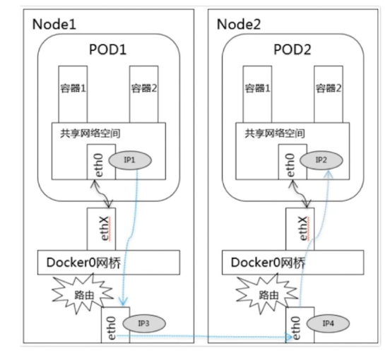

# kubernetes

## 简介



* kubelet 管理该节点上的服务，调度pod
* pod 含多个容器的一组，独立ip



* 在一个pod中很多资源可共享，运行多个容器

  

* service也有独立ip，可对外负载均衡，是虚拟化的

* service对pod的管理通过label

  

* 扩容针对pod，滚动更新



## 网络







## 安装

|  名称  |       ip        |
| :--: | :-------------: |
| sm1  | 192.168.232.206 |
| sw1  | 192.168.232.207 |
| sw2  | 192.168.232.208 |

### 接受所有ip的数据包转发

````
$ vi /lib/systemd/system/docker.service
   
#找到ExecStart=xxx，在这行上面加入一行，内容如下：(k8s的网络需要)
ExecStartPost=/sbin/iptables -I FORWARD -s 0.0.0.0/0 -j ACCEPT
````

## 将命令导入

````
# vim /etc/profile
export PATH=/root/k8s/bin:$PATH
````

### 重启docker

`````
$ systemctl daemon-reload
$ service docker restart
`````

### 系统设置（所有节点）

#### 关闭、禁用防火墙(让所有机器之间都可以通过任意端口建立连接)

```
$ ufw disable
#查看状态
$ ufw status
```

#### 设置系统参数 - 允许路由转发，不对bridge的数据进行处理

```
#写入配置文件
$ cat <<EOF > /etc/sysctl.d/k8s.conf
net.ipv4.ip_forward = 1
net.bridge.bridge-nf-call-ip6tables = 1
net.bridge.bridge-nf-call-iptables = 1
EOF
 
#生效配置文件
$ sysctl -p /etc/sysctl.d/k8s.conf
```

#### 配置host文件

```
#配置host，使每个Node都可以通过名字解析到ip地址
$ vi /etc/hosts
#加入如下片段(ip地址和servername替换成自己的)
192.168.232.206 sm1
192.168.232.207 sw1
```

### 准备二进制文件（所有节点）

kubernetes的安装有几种方式，不管是kube-admin还是社区贡献的部署方案都离不开这几种方式：

- **使用现成的二进制文件**

> 直接从官方或其他第三方下载，就是kubernetes各个组件的可执行文件。拿来就可以直接运行了。不管是centos，ubuntu还是其他的linux发行版本，只要gcc编译环境没有太大的区别就可以直接运行的。使用较新的系统一般不会有什么跨平台的问题。

- **使用源码编译安装**

> 编译结果也是各个组件的二进制文件，所以如果能直接下载到需要的二进制文件基本没有什么编译的必要性了。

- **使用镜像的方式运行**

> 同样一个功能使用二进制文件提供的服务，也可以选择使用镜像的方式。就像nginx，像mysql，我们可以使用安装版，搞一个可执行文件运行起来，也可以使用它们的镜像运行起来，提供同样的服务。kubernetes也是一样的道理，二进制文件提供的服务镜像也一样可以提供。

从上面的三种方式中其实使用镜像是比较优雅的方案，容器的好处自然不用多说。但从初学者的角度来说容器的方案会显得有些复杂，不那么纯粹，会有很多容器的配置文件以及关于类似二进制文件提供的服务如何在容器中提供的问题，容易跑偏。 所以我们这里使用二进制的方式来部署。二进制文件已经这里备好，大家可以打包下载，把下载好的文件放到每个节点上，放在哪个目录随你喜欢，**放好后最好设置一下环境变量$PATH**，方便后面可以直接使用命令。(科学上网的同学也可以自己去官网找找)
[下载地址（kubernetes 1.9.0版本）](https://pan.baidu.com/s/1bMnqWY)

### 准备配置文件（所有节点）

上一步我们下载了kubernetes各个组件的二进制文件，这些可执行文件的运行也是需要添加很多参数的，包括有的还会依赖一些配置文件。现在我们就把运行它们需要的参数和配置文件都准备好。

#### 下载配置文件

```
#到home目录下载项目
$ cd
$ git clone https://github.com/liuyi01/kubernetes-starter.git
#看看git内容
$ cd ~/kubernetes-starter && ls
```

#### 文件说明

- **gen-config.sh**

> shell脚本，用来根据每个同学自己的集群环境(ip，hostname等)，根据下面的模板，生成适合大家各自环境的配置文件。生成的文件会放到target文件夹下。

- **kubernetes-simple**

> 简易版kubernetes配置模板（剥离了认证授权）。 适合刚接触kubernetes的同学，首先会让大家在和kubernetes初次见面不会印象太差（太复杂啦~~），再有就是让大家更容易抓住kubernetes的核心部分，把注意力集中到核心组件及组件的联系，从整体上把握kubernetes的运行机制。

- **kubernetes-with-ca**

> 在simple基础上增加认证授权部分。大家可以自行对比生成的配置文件，看看跟simple版的差异，更容易理解认证授权的（认证授权也是kubernetes学习曲线较高的重要原因）

- **service-config**

> 这个先不用关注，它是我们曾经开发的那些微服务配置。 等我们熟悉了kubernetes后，实践用的，通过这些配置，把我们的微服务都运行到kubernetes集群中。

#### 生成配置

``````shell
# vim config.properties

#kubernetes二进制文件目录,eg: /home/michael/bin
BIN_PATH=/root/k8s/bin

#当前节点ip, eg: 192.168.1.102
NODE_IP=192.168.232.206

#etcd服务集群列表, eg: http://192.168.1.102:2379
#如果已有etcd集群可以填写现有的。没有的话填写：http://${MASTER_IP}:2379 （MASTER_IP自行替换成自己的主节点ip）
##如果用了证书，就要填写https://${MASTER_IP}:2379 （MASTER_IP自行替换成自己的主节点ip）
ETCD_ENDPOINTS=http://192.168.232.207:2379

#kubernetes主节点ip地址, eg: 192.168.1.102
MASTER_IP=192.168.232.206
``````

这里会根据大家各自的环境生成kubernetes部署过程需要的配置文件。 在每个节点上都生成一遍，把所有配置都生成好，后面会根据节点类型去使用相关的配置。

```shell
#cd到之前下载的git代码目录
$ cd ~/kubernetes-starter
#编辑属性配置（根据文件注释中的说明填写好每个key-value）
$ vi config.properties
#生成配置文件，确保执行过程没有异常信息
$ ./gen-config.sh simple
#查看生成的配置文件，确保脚本执行成功
$ find target/ -type f
target/all-node/kube-calico.service
target/master-node/kube-controller-manager.service
target/master-node/kube-apiserver.service
target/master-node/etcd.service
target/master-node/kube-scheduler.service
target/worker-node/kube-proxy.kubeconfig
target/worker-node/kubelet.service
target/worker-node/10-calico.conf
target/worker-node/kubelet.kubeconfig
target/worker-node/kube-proxy.service
target/services/kube-dns.yaml
```

> **执行gen-config.sh常见问题：**
>
> 1. gen-config.sh: 3: gen-config.sh: Syntax error: "(" unexpected
>
> - bash版本过低，运行：bash -version查看版本，如果小于4需要升级
> - 不要使用 sh gen-config.sh的方式运行（sh和bash可能不一样哦）
>
> 1. config.properties文件填写错误，需要重新生成 再执行一次./gen-config.sh simple即可，不需要手动删除target

## 基础集群部署

## 部署

### 简介

  kubernetes需要存储很多东西，像它本身的节点信息，组件信息，还有通过kubernetes运行的pod，deployment，service等等。都需要持久化。etcd就是它的数据中心。生产环境中为了保证数据中心的高可用和数据的一致性，一般会部署最少三个节点。我们这里以学习为主就只在主节点部署一个实例。

> 如果你的环境已经有了etcd服务(不管是单点还是集群)，可以忽略这一步。前提是你在生成配置的时候填写了自己的etcd endpoint哦~

### 部署（在sw1）

**etcd的二进制文件和服务的配置我们都已经准备好，现在的目的就是把它做成系统服务并启动。**

```shell
#把服务配置文件copy到系统服务目录
$ cp ~/kubernetes-starter/target/master-node/etcd.service /lib/systemd/system/
#enable服务
$ systemctl enable etcd.service
#创建工作目录(保存数据的地方)
$ mkdir -p /var/lib/etcd
# 启动服务
$ service etcd start
# 查看服务日志，看是否有错误信息，确保服务正常
$ journalctl -f -u etcd.service
```

* 查看监听的信息：`netstat -ntlp`


## API Server（主节点）

kube-apiserver是Kubernetes最重要的核心组件之一，主要提供以下的功能

- 提供集群管理的REST API接口，包括认证授权（我们现在没有用到）数据校验以及集群状态变更等
- 提供其他模块之间的数据交互和通信的枢纽（其他模块通过API Server查询或修改数据，只有API Server才直接操作etcd）

> 生产环境为了保证apiserver的高可用一般会部署2+个节点，在上层做一个lb做负载均衡，比如haproxy。由于单节点和多节点在apiserver这一层说来没什么区别，所以我们学习部署一个节点就足够啦

### 部署

APIServer的部署方式也是通过系统服务。

`````
cp target/master-node/kube-apiserver.service /lib/systemd/system/
systemctl enable kube-apiserver.service
service kube-apiserver start
journalctl -f -u kube-apiserver
`````

* `netstat -ntlp`查看监听端口

* 查看配置

  `````
  [Unit]
  Description=Kubernetes API Server
  ...
  [Service]
  #可执行文件的位置
  ExecStart=/home/michael/bin/kube-apiserver \
  #非安全端口(8080)绑定的监听地址 这里表示监听所有地址
  --insecure-bind-address=0.0.0.0 \
  #不使用https
  --kubelet-https=false \
  #kubernetes集群的虚拟ip的地址范围
  --service-cluster-ip-range=10.68.0.0/16 \
  #service的nodeport的端口范围限制
  --service-node-port-range=20000-40000 \
  #很多地方都需要和etcd打交道，也是唯一可以直接操作etcd的模块
  --etcd-servers=http://192.168.1.102:2379 \
  `````

### 部署ControllerManager（主节点）

Controller Manager由kube-controller-manager和cloud-controller-manager组成，是Kubernetes的大脑，它通过apiserver监控整个集群的状态，并确保集群处于预期的工作状态。 kube-controller-manager由一系列的控制器组成，像Replication Controller控制副本，Node Controller节点控制，Deployment Controller管理deployment等等 cloud-controller-manager在Kubernetes启用Cloud Provider的时候才需要，用来配合云服务提供商的控制

> controller-manager、scheduler和apiserver 三者的功能紧密相关，一般运行在同一个机器上，我们可以把它们当做一个整体来看，所以保证了apiserver的高可用即是保证了三个模块的高可用。也可以同时启动多个controller-manager进程，但只有一个会被选举为leader提供服务。

 通过系统服务方式部署

````
cp target/master-node/kube-controller-manager.service /lib/systemd/system/
systemctl enable kube-controller-manager.service
service kube-controller-manager start
journalctl -f -u kube-controller-manager
````

### 配置说明

```
[Unit]
Description=Kubernetes Controller Manager
...
[Service]
ExecStart=/home/michael/bin/kube-controller-manager \
#对外服务的监听地址，这里表示只有本机的程序可以访问它
--address=127.0.0.1 \
#apiserver的url
--master=http://127.0.0.1:8080 \
#服务虚拟ip范围，同apiserver的配置
--service-cluster-ip-range=10.68.0.0/16 \
#pod的ip地址范围
--cluster-cidr=172.20.0.0/16 \
#下面两个表示不使用证书，用空值覆盖默认值
--cluster-signing-cert-file= \
--cluster-signing-key-file= \
...
```

### 部署Scheduler（主节点）

kube-scheduler负责分配调度Pod到集群内的节点上，它监听kube-apiserver，查询还未分配Node的Pod，然后根据调度策略为这些Pod分配节点。我们前面讲到的kubernetes的各种调度策略就是它实现的。

通过系统服务方式部署

````
$ cp target/master-node/kube-scheduler.service /lib/systemd/system/
$ systemctl enable kube-scheduler.service
$ service kube-scheduler start
$ journalctl -f -u kube-scheduler
````

#### 重点配置说明

> [Unit]
> Description=Kubernetes Scheduler
> ...
> [Service]
> ExecStart=/home/michael/bin/kube-scheduler \
> \#对外服务的监听地址，这里表示只有本机的程序可以访问它
> --address=127.0.0.1 \
> \#apiserver的url
> --master=[http://127.0.0.1:8080](http://127.0.0.1:8080/) \
> ...

### 部署CalicoNode（所有节点）

Calico实现了CNI接口，是kubernetes网络方案的一种选择，它一个纯三层的数据中心网络方案（不需要Overlay），并且与OpenStack、Kubernetes、AWS、GCE等IaaS和容器平台都有良好的集成。 Calico在每一个计算节点利用Linux Kernel实现了一个高效的vRouter来负责数据转发，而每个vRouter通过BGP协议负责把自己上运行的workload的路由信息像整个Calico网络内传播——小规模部署可以直接互联，大规模下可通过指定的BGP route reflector来完成。 这样保证最终所有的workload之间的数据流量都是通过IP路由的方式完成互联的。

#### 部署

**calico是通过系统服务+docker方式完成的**

```
$ cp target/all-node/kube-calico.service /lib/systemd/system/
$ systemctl enable kube-calico.service
$ service kube-calico start
$ journalctl -f -u kube-calico
```

#### calico可用性验证

**查看容器运行情况**

```
$ docker ps
CONTAINER ID   IMAGE                COMMAND        CREATED ...
4d371b58928b   calico/node:v2.6.2   "start_runit"  3 hours ago...
```

**查看节点运行情况**

```
$ calicoctl node status
Calico process is running.
IPv4 BGP status
+---------------+-------------------+-------+----------+-------------+
| PEER ADDRESS  |     PEER TYPE     | STATE |  SINCE   |    INFO     |
+---------------+-------------------+-------+----------+-------------+
| 192.168.1.103 | node-to-node mesh | up    | 13:13:13 | Established |
+---------------+-------------------+-------+----------+-------------+
IPv6 BGP status
No IPv6 peers found.
```

**查看端口BGP 协议是通过TCP 连接来建立邻居的，因此可以用netstat 命令验证 BGP Peer**

```
$ netstat -natp|grep ESTABLISHED|grep 179
tcp        0      0 192.168.1.102:60959     192.168.1.103:179       ESTABLISHED 29680/bird
```

**查看集群ippool情况**

```
$ calicoctl get ipPool -o yaml
- apiVersion: v1
  kind: ipPool
  metadata:
    cidr: 172.20.0.0/16
  spec:
    nat-outgoing: true
```

#### 重点配置说明

`````
[Unit]
Description=calico node
...
[Service]
#以docker方式运行
ExecStart=/usr/bin/docker run --net=host --privileged --name=calico-node \
#指定etcd endpoints（这里主要负责网络元数据一致性，确保Calico网络状态的准确性）
-e ETCD_ENDPOINTS=http://192.168.1.102:2379 \
#网络地址范围（同上面ControllerManager）
-e CALICO_IPV4POOL_CIDR=172.20.0.0/16 \
#镜像名，为了加快大家的下载速度，镜像都放到了阿里云上
registry.cn-hangzhou.aliyuncs.com/imooc/calico-node:v2.6.2
`````

## 配置kubectl命令（任意节点）

#### 简介

kubectl是Kubernetes的命令行工具，是Kubernetes用户和管理员必备的管理工具。 kubectl提供了大量的子命令，方便管理Kubernetes集群中的各种功能。

#### 初始化

使用kubectl的第一步是配置Kubernetes集群以及认证方式，包括：

- cluster信息：api-server地址
- 用户信息：用户名、密码或密钥
- Context：cluster、用户信息以及Namespace的组合

我们这没有安全相关的东西，只需要设置好api-server和上下文就好啦：

```
#指定apiserver地址（ip替换为你自己的api-server地址）
kubectl config set-cluster kubernetes  --server=http://192.168.1.102:8080
#指定设置上下文，指定cluster
kubectl config set-context kubernetes --cluster=kubernetes
#选择默认的上下文
kubectl config use-context kubernetes
```

> 通过上面的设置最终目的是生成了一个配置文件：~/.kube/config，当然你也可以手写或复制一个文件放在那，就不需要上面的命令了。

## 配置kubelet（工作节点）

#### 简介

每个工作节点上都运行一个kubelet服务进程，默认监听10250端口，接收并执行master发来的指令，管理Pod及Pod中的容器。每个kubelet进程会在API Server上注册节点自身信息，定期向master节点汇报节点的资源使用情况，并通过cAdvisor监控节点和容器的资源。

#### 部署

**通过系统服务方式部署，但步骤会多一些，具体如下：**

```
#确保相关目录存在
$ mkdir -p /var/lib/kubelet
$ mkdir -p /etc/kubernetes
$ mkdir -p /etc/cni/net.d

#复制kubelet服务配置文件
$ cp target/worker-node/kubelet.service /lib/systemd/system/
#复制kubelet依赖的配置文件
$ cp target/worker-node/kubelet.kubeconfig /etc/kubernetes/
#复制kubelet用到的cni插件配置文件
$ cp target/worker-node/10-calico.conf /etc/cni/net.d/

$ systemctl enable kubelet.service
$ service kubelet start
$ journalctl -f -u kubelet
```

#### 重点配置说明

**kubelet.service**

```
[Unit]
Description=Kubernetes Kubelet
[Service]
#kubelet工作目录，存储当前节点容器，pod等信息
WorkingDirectory=/var/lib/kubelet
ExecStart=/home/michael/bin/kubelet \
#对外服务的监听地址
--address=192.168.1.103 \
#指定基础容器的镜像，负责创建Pod 内部共享的网络、文件系统等，这个基础容器非常重要：K8S每一个运行的 POD里面必然包含这个基础容器，如果它没有运行起来那么你的POD 肯定创建不了
--pod-infra-container-image=registry.cn-hangzhou.aliyuncs.com/imooc/pause-amd64:3.0 \
#访问集群方式的配置，如api-server地址等
--kubeconfig=/etc/kubernetes/kubelet.kubeconfig \
#声明cni网络插件
--network-plugin=cni \
#cni网络配置目录，kubelet会读取该目录下得网络配置
--cni-conf-dir=/etc/cni/net.d \
#指定 kubedns 的 Service IP(可以先分配，后续创建 kubedns 服务时指定该 IP)，--cluster-domain 指定域名后缀，这两个参数同时指定后才会生效
--cluster-dns=10.68.0.2 \
...
```

**kubelet.kubeconfig**
kubelet依赖的一个配置，格式看也是我们后面经常遇到的yaml格式，描述了kubelet访问apiserver的方式

> apiVersion: v1
> clusters:
> \- cluster:
> \#跳过tls，即是kubernetes的认证
> insecure-skip-tls-verify: true
> \#api-server地址
> server: [http://192.168.1.102:8080](http://192.168.1.102:8080/)
> ...

**10-calico.conf**
calico作为kubernets的CNI插件的配置

```
{  
  "name": "calico-k8s-network",  
  "cniVersion": "0.1.0",  
  "type": "calico",  
    <!--etcd的url-->
    "ed_endpoints": "http://192.168.1.102:2379",  
    "logevel": "info",  
    "ipam": {  
        "type": "calico-ipam"  
   },  
    "kubernetes": {  
        <!--api-server的url-->
        "k8s_api_root": "http://192.168.1.102:8080"  
    }  
}  
```

* 测试：kubectl get nodes

## 小试牛刀

* `kubectl version` 版本信息
* `kubectl get nodes` 获取节点信息
* `kubectl run kubernetes-bootcamp --image=jocatalin/kubernetes-bootcamp:v1 --port=80890` 创建
* `kubectl get deployments` 
* `kubectl get pods`
* `kubectl get pods -o wide`
* `kubectl delete deployments kubernetes-bootcamp` 删除
* `kubectl describe pods kubernetes-bootcamp-6c6c658c8b-4hsc7` 显示详细信息
* ` kubectl scale deploy kubernetes-bootcamp --replicas=4` 扩容
* `kubectl  set image deploy kubernetes-bootcamp kubernetes-bootcamp=jocatalin/kubernetes-bootcamp:v2` 更新镜像
* `kubectl rollout status deploy kubernetes-bootcamp` 更新状态
* `kubectl rollout undo deploy kubernetes-bootcamp` 回滚操作

## 使用配置文件

### pod

````yaml
apiVersion: v1
kind: Pod
metadata:
  name: nginx
spec:
  containers:
    - name: nginx
      image: nginx:1.7.9
      ports:
        - containerPort: 80
````

* `kubectl create -f nginx-pod.yaml`

### deployment

````
apiVersion: apps/v1beta1
kind: Deployment
metadata:
  name: nginx-deployment
spec:
  replicas: 2
  template:
    metadata:
      labels:
        app: nginx
    spec:
      containers:
        - name: nginx
          image: nginx:1.7.9
          ports:
            - containerPort: 80
````

* ` kubectl create -f nginx-deployment.yaml`

## 为集群增加service功能 - kube-proxy（工作节点）

#### 简介

每台工作节点上都应该运行一个kube-proxy服务，它监听API server中service和endpoint的变化情况，并通过iptables等来为服务配置负载均衡，是让我们的服务在集群外可以被访问到的重要方式。

#### 部署

**通过系统服务方式部署：**

```
#确保工作目录存在
$ mkdir -p /var/lib/kube-proxy
#复制kube-proxy服务配置文件
$ cp target/worker-node/kube-proxy.service /lib/systemd/system/
#复制kube-proxy依赖的配置文件
$ mkdir /etc/kubernetes/
$ cp target/worker-node/kube-proxy.kubeconfig /etc/kubernetes/

$ systemctl enable kube-proxy.service
$ service kube-proxy start
$ journalctl -f -u kube-proxy
```

* `kubectl get services` 会出现一个服务

* ` kubectl describe service kubernetes`

  ````
  Name:              kubernetes
  Namespace:         default
  Labels:            component=apiserver
                     provider=kubernetes
  Annotations:       <none>
  Selector:          <none>
  Type:              ClusterIP
  IP:                10.68.0.1
  Port:              https  443/TCP
  TargetPort:        6443/TCP
  Endpoints:         192.168.232.206:6443
  Session Affinity:  ClientIP
  Events:            <none>
  ````

* `kubectl get deploy`

* `kubectl expose deploy nginx-deployment --type="NodePort" --target-port=80 --port=8080` 80容器提供服务的端口，

* `kubectl get services`

  ````
  root@sm1:~/k8s/kubernetes-starter# kubectl get services
  NAME               TYPE        CLUSTER-IP      EXTERNAL-IP   PORT(S)          AGE
  kubernetes         ClusterIP   10.68.0.1       <none>        443/TCP          1h
  nginx-deployment   NodePort    10.68.126.245   <none>        8080:34021/TCP   58s
  ````

  8080在虚拟IP上使用的端口，可使用10.68.126.245:8080访问，使用宿主机ip:34021访问

* netstat -ntlp|grep 34021`

* 将随机端口固定下来

  ````
  apiVersion: v1
  kind: Service
  metadata:
    name: nginx-service
  spec:
    ports:
    - port: 8080
      targetPort: 80
      nodePort: 20000
    selector:
      app: nginx
    type: NodePort
  ````

  * `kubectl create -f nginx-service.yaml`
  * `kubectl get svc`

#### 重点配置说明

**kube-proxy.service**

**kube-proxy.kubeconfig** 配置了kube-proxy如何访问api-server，内容与kubelet雷同，不再赘述。

#### 操练service

刚才我们在基础集群上演示了pod，deployments。下面就在刚才的基础上增加点service元素。具体内容见[《Docker+k8s微服务容器化实践》](https://coding.imooc.com/class/198.html)。

## 为集群增加dns功能 - kube-dns（app）

#### 简介

kube-dns为Kubernetes集群提供命名服务，主要用来解析集群服务名和Pod的hostname。目的是让pod可以通过名字访问到集群内服务。它通过添加A记录的方式实现名字和service的解析。普通的service会解析到service-ip。headless service会解析到pod列表。

#### 部署

**通过kubernetes应用的方式部署** kube-dns.yaml文件基本与官方一致（除了镜像名不同外）。 里面配置了多个组件，之间使用”---“分隔

```
#到kubernetes-starter目录执行命令
$ kubectl create -f target/services/kube-dns.yaml
```

#### 重点配置说明

请直接参考配置文件中的注释。

#### 通过dns访问服务

这了主要演示增加kube-dns后，通过名字访问服务的原理和具体过程。演示启动dns服务和未启动dns服务的通过名字访问情况差别。 具体内容请看[《Docker+k8s微服务容器化实践》](https://coding.imooc.com/class/198.html)吧~