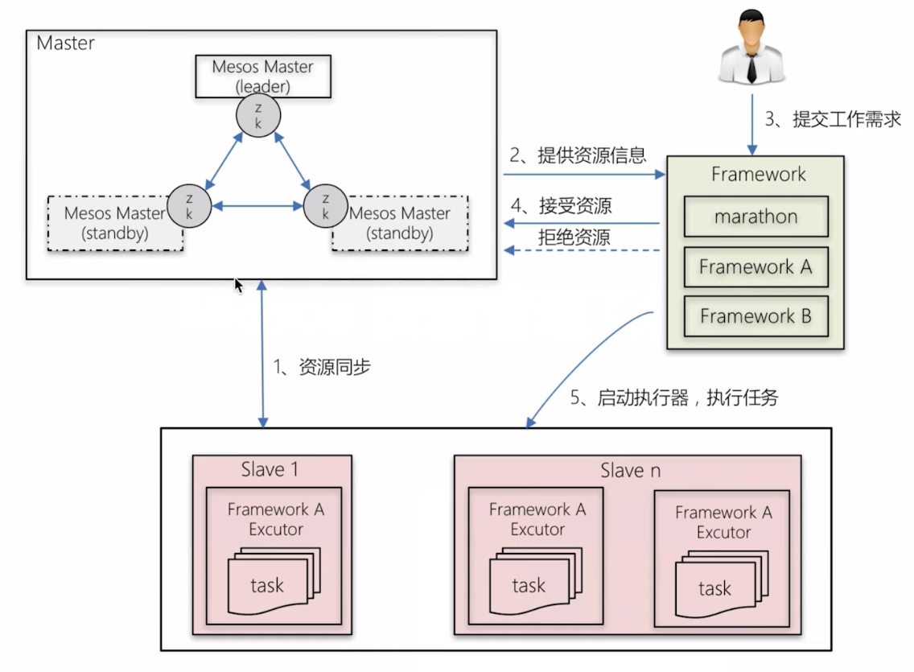

# mesos

## zookeeper

 分布式协调服务

### 安装

使用五台机器作为master集群

1.   安装java

2. 下载安装包[链接](http://mirrors.hust.edu.cn/apache/zookeeper/)

3. 安装包解压到`/app/`

4. `ln -s zookeeper-3.4.10/ zookeeper`

5. `mkdir -p /var/zookeeper/data`

6. `echo "1" >> /var/zookeeper/data/myid` 写入编号，每台机器都要

7. `cp zoo_sample.cfg zoo.cfg`

8. `vim zoo.cfg`

   ````
   dataDir=/var/zookeeper/data
   # 添加
   server.1=192.168.113.160:2888:3888
   server.2=192.168.113.161:2888:3888
   server.3=192.168.113.162:2888:3888
   server.4=192.168.113.163:2888:3888
   server.5=192.168.113.164:2888:3888
   ````

9. `./bin/zkServer.sh status` 查看状态和使用的配置文件

10. `./bin/zkServer.sh start` 将节点启动

11. `echo stat | nc localhost 2181`测试状态


## Mesos

* 总控节点：负责管理framework和slave，并将在slave上的资源分配给各个framework，并管理着任务的生命周期
* 计算节点：执行framework发送过来的任务
* 调度器：负责和mesos-master进行通信获取资源，并协调slave上的执行器工作
* 执行器：安装在mesos-slave上，用于启动计算框架中的task，执行具体任务



[frameworks](http://mesos.apache.org/documentation/latest/frameworks/)

### 安装

[安装文档](http://mesos.apache.org/documentation/latest/building/)

* `` 将编译好的包整体打包
* `scp mesos.tar.gz root@192.168.232.192:/app/`
* 配置
  * 执行命令时使用--option_name=value来传递配置选项
  * 通过设定环境变量MESOSOPTION_NAME（变量名都以MESOS开头）执行时会先读取环境变量，然后才看命令行参数
* [Master配置项](http://mesos.apache.org/documentation/latest/configuration/master-and-agent/)
  * `--ip=VALUE` 监听的IP地址
  * `--port=VALUE` 监听的端口
  * `--log_dir=VALUE` 输出日志文件的位置
  * `--logging_level=VALUE` 输出日志的起始级别，包括INFO、WARNING、ERROR

|          配置项           |                    说明                    |
| :--------------------: | :--------------------------------------: |
|       --ip=VALUE       |                 监听的IP地址                  |
|      --port=VALUE      |                   监听端口                   |
|    --log_dir=VALUE     |                输出日志文件的位置                 |
| --logging_level=VALUE  |      输出日志的起始级别，包括INFO、WARNING、ERROR      |
|     --quorum=VALUE     | 必须选项，使用replicated-Log的注册表时，复制的个数。此值需要设置master总数一半以上 |
|    --work_dir=VALUE    |                必须选项，工作目录                 |
|       --zk=VALUE       |  必须选项，Zookeeper的URL地址（用于在masters中做领导选举）  |
|     --master=VALUE     |            Slave必选项，Master地址             |
|    --work_dir=VALUE    |              Slave必选项，工作目录               |
| --containerizers=VALUE | 由逗号分割的容器化实现方式列表，可选项为mesos，external，and docker |

* `mkdir -p /var/log/mesos` 创建日志目录
* `mkdir -p /var/lib/mesos`
* `ufw disable`
* `./build/bin/mesos-master.sh --zk=zk://192.168.232.191:2181/mesos,192.168.232.192:2181/mesos,192.168.232.193:2181/mesos --port=5050 --log_dir=/var/log/mesos --cluster=test-cluster --quorum=2 --work_dir=/var/lib/mesos --ip=`


### 运行slave节点

````
mkdir -p /var/lib/mesos/agent
mkdir -p /var/log/mesos/agent
./mesos-agent.sh --work_dir=/var/lib/mesos/agent --master=zk://192.168.232.191:2181/mesos,192.168.232.192:2181/mesos,192.168.232.193:2181/mesos --log_dir=/var/log/mesos/agent --logging_level=ERROR --containerizers=docker,mesos
````


