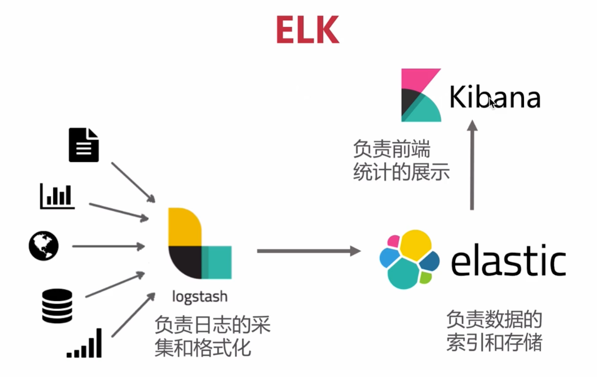
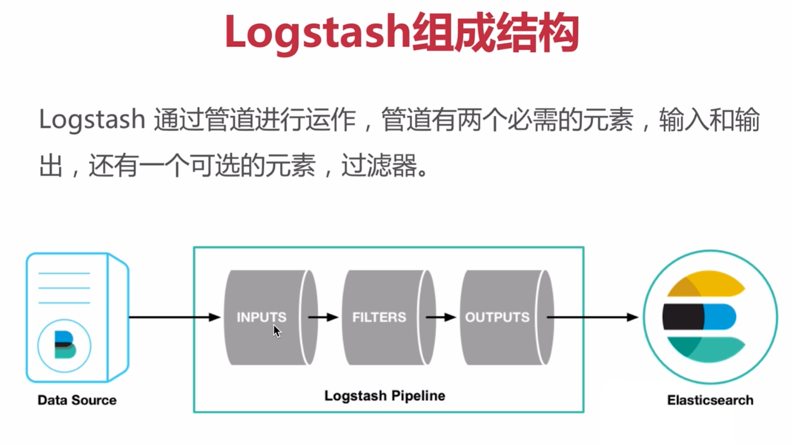

# 集中日志管理



* `logstash` 日志收集器，对日志进行采集和格式化
* `elastic` 负责数据的索引和存储
* `kibana` 负责前端统计的展示平台

## logstash 安装使用

日志收集器，对日志进行采集和格式化



### 安装

````
wget https://artifacts.elastic.co/downloads/logstash/logstash-7.3.2.tar.gz
tar -xvf logstash-7.3.2.tar.gz
cd ./logstash/config
vim logstash.conf
````

`````
input {
    stdin{

    }
}

output {
    stdout {
        codec => rubydebug{}
    }
}
`````

````
./bin/logstash -f ../config/logstash.conf 
````

````
hello
````

##  input配置

### stdin 从标准输入中读取

`````
input { # 输入配置
    stdin{
        type => "system"  # type是为了将日志分组
    }
}

filter { # 过滤器

}

output { # 输出
    stdout {
        codec => rubydebug{}
    }
}
`````

### 从文件读取

````
input { # 输入配置
    stdin{
        type => "system"  # type是为了将日志分组
    }

    file{ # 从文件中收集
        path => "/var/log/mesos/xxxx.info"
    }
}
````

`````
input { # 输入配置
    stdin{
        type => "system"  # type是为了将日志分组
    }

    file{ # 从文件中收集
        path => "/var/log/mesos/xxxx.info"
        start_position => "beginning" # 指定文件收集时候的开始位置
    }
}
`````

* 可以对文件使用通配符

### 从TCP

其他应用将日志进行tcp发送

`````
input { # 输入配置
    stdin{
        type => "system"  # type是为了将日志分组
    }

    file{ # 从文件中收集
        path => "/var/log/mesos/xxxx.info"
        start_position => "beginning" # 指定文件收集时候的开始位置
    }

    tcp{ # 从tcp中收集
        port => 123456
        codec => json # 指编码方式
    }
}
`````

* 可以使用python-logstash


##  过滤器配置

```
2018-05-022-16:03:04|192.168.9.61|117.135.212.53|http://www.imooc.com/user|Mozilla/5.0 (iPhone; CPU iPhone OS 8_2 like Mac OS X) AppleWebKit/600.1.4 (KHTML, like Gecko) Mobile/12D508 MicroMessenger/6.1.5 NetType/WIFI||
```

### grok

````
filter { # 过滤器
    grok {
        match => {
            match => { "message" => "%{IP:client} %{WORD:method} %{URIPATHPARAM:request} %{NUMBER:bytes} %{NUMBER:duration}" }
        }
    }

    geoip {
        source => "client" # 从IP中获得所在地理位置
    }
}
````

### useragent 

用户设备信息

````python
filter { # 过滤器
    grok {
        match => {
            match => { "message" => "%{IP:client} %{WORD:method} %{URIPATHPARAM:request} %{NUMBER:bytes} %{NUMBER:duration}" }
        }
    }

    geoip {
        source => "client" # 从IP中获得所在地理位置
    }

    useragent {
        source => "" # 从什么数据获得源数据
      	target => "userDevice" # 目标参数
    }
}
````

## output

### 标准输出

```
output { # 输出
    stdout {
        codec => rubydebug{}
    }
}
```

### 将数据写入到磁盘文件上

```
output { # 输出
    stdout {
        codec => rubydebug{}
    }

    file {
        path => "/var/log/data.log"
        codec => line {format => "custom format: %{message}"}
    }
}
```

### 发送数据到Elasticaearch

````
output { # 输出
    stdout {
        codec => rubydebug{}
    }

    file {
        path => "/var/log/data.log"
        codec => line {format => "custom format: %{message}"}
    }

    elasticsearch {
        host => "192.168.9.69"
        index => "logstash"
    }
}
````

## Elasticsearch安装

全文检索引擎。

### 安装

[安装引导](https://www.elastic.co/cn/downloads/elasticsearch)

Development mode

```
docker run -p 9200:9200 -p 9300:9300 -e "discovery.type=single-node" docker.elastic.co/elasticsearch/elasticsearch:7.3.2
```

* `"discovery.type=single-node"` 表示单节点
* 访问`http://192.168.232.195:9200/`进行测试

### API

* Index：Elastic数据管理的顶层单位叫做Index（索引），查找数据时候，直接查找索引
* Document：Index里面单条数据称为Document（文档）。许多条Document构成一个Index
* Type：Document可以分组，分组就叫做Type，用来过滤Document

````
# 测试是否正常
curl http://192.168.232.195:9200/
````

````
# 显示所有索引
curl -X GET 'http://192.168.232.195:9200/_cat/indices?v'
````

`````
# 创建数据
# 索引 类型 参数
curl -X PUT 'http://192.168.232.195:9200/person/course/1' -H 'Content-Type: application/json' -d '
{
    "user": "Andrew",
    "course": "devops实践之路"
}'
`````

````
# 查看记录
curl 'http://192.168.232.195:9200/person/course/1?pretty=true'
````

`````
# 创建数据使用POST
curl -X POST 'http://192.168.232.195:9200/person/course' -H 'Content-Type: application/json' -d '
{
    "user": "Andrew",
    "course": "java微服务实现"
}'
`````

````
# 记录查询
curl 'http://192.168.232.195:9200/person/course/_search'
````

`````
# 查询索引下的type
curl 'http://192.168.232.195:9200/_mapping?pretty=true'
`````

````
# 全文搜索
curl 'http://192.168.232.195:9200/person/course/_search' -H 'Content-Type: application/json' -d '{
    "query": {
        "match": {"course": "java"}
    }
}'
````

```
# or
curl 'http://192.168.232.195:9200/person/course/_search' -H 'Content-Type: application/json' -d '{
    "query": {
        "match": {"course": "java devops"}
    }
}'
```

`````
# and
curl 'http://192.168.232.195:9200/person/course/_search' -H 'Content-Type: application/json' -d '{
    "query": {
        "bool": {
            "must": [
                {"match": {"course": "微服务"}},
                {"match": {"course": "java"}}
            ]
        }
    }
}'
`````

## 整合

`````
input {
    stdin{

    }
}

output {
    stdout {
        codec => rubydebug{}
    }

    file {
        path => "/var/log/test/test1.log"
        codec => line {
            format => "custom format: %{message}"
        }
    }

    elasticsearch {
        hosts => "192.168.232.195"
        index => "logstash_test"
    }
}
`````

## kibana安装及使用

分析和可视化平台

[下载地址](https://www.elastic.co/cn/downloads/kibana)

````
docker run --name some-kibana -e ELASTICSEARCH_URL=http://192.168.232.195:9200 -p 5601:5601 -d kibana
````