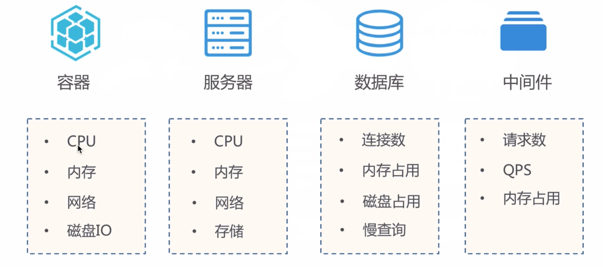
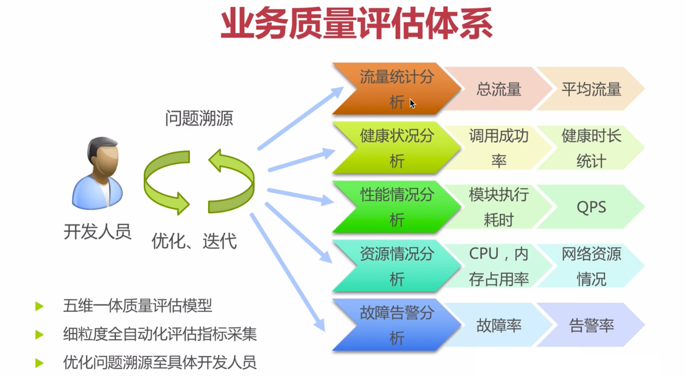
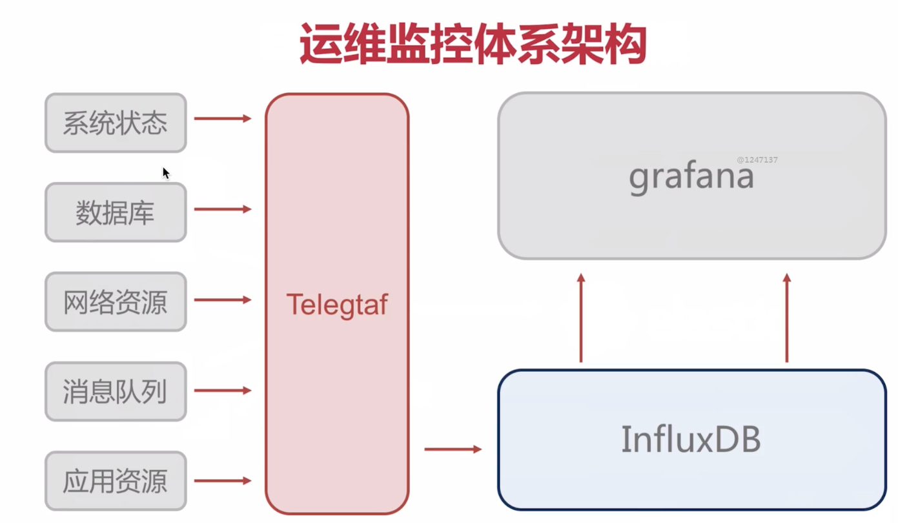

# 运维监控体系

## 运维监控体系架构







## telegraf 安装

收集系统和服务的统计数据，并写入到InfluxDB

 [下载位置](https://www.influxdata.com/time-series-platform/telegraf/)

- `service telegraf start`

## telegraf 配置

* `vim /etc/telegraf/telegraf.conf`

````
hostname = "" # 可以配置为空或自定义主机名
urls = ["http://192.168.232.195:8086"] # 输出配置
database = "telegraf" # 数据库配置

 [[inputs.docker]]
   endpoint = "unix:///var/run/docker.sock"
````

* `service telegraf restart`

## influxdb安装

[安装位置](https://portal.influxdata.com/downloads/)

时序、事件指标数据库

````
docker run -d -p 8086:8086 -p 8083:8083 -e INFLUXDB_ADMIN_ENABLED=true influxdb
````

* database 数据库
* measurement 数据表
* points 记录，每一条
  * time 每个数据记录时间，是数据库中的索引
  * fields 各种记录的值，字段没有索引的，性能不及tag。fields相当于没有SQL的索引的列。fields字段是必选的，值可以是string，int等等
  * tags tag是有索引的，tags相当于SQL中的有索引的列。tag是可选的，且tag value只能是string类型

## influxdb操作

* `series` 图标中的数据

### HTTP接口

````
# 创建数据库
curl -POST http://192.168.232.195:8086/query --data-urlencode "q=CREATE DATABASE imooc"
````

````
# 插入数据
curl -i -X POST 'http://192.168.232.195:8083/write?db=imooc' --data-binary 'imoox_cpu, host=mesos-master1, region=us-west value=0.78 1528034368441000000'

db=imooc 指定数据库
imoox_cpu 指表名
最后为时间戳
````

### web界面

## grafana介绍

[下载](https://grafana.com/docs/installation/docker/)

时序统计和监控

```
docker run \
  -d \
  -p 3000:3000 \
  --name=grafana \
  -e "GF_SERVER_ROOT_URL=http://192.168.232.195" \
  -e "GF_SECURITY_ADMIN_PASSWORD=secret" \
  grafana/grafana
```


把相同原因而变化的东西聚到一起，把因不同原因而变化的东西分离开