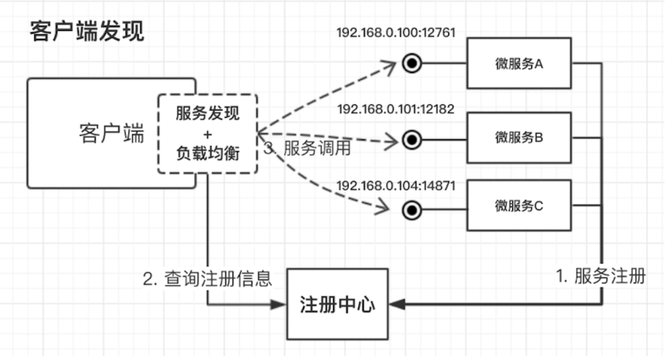
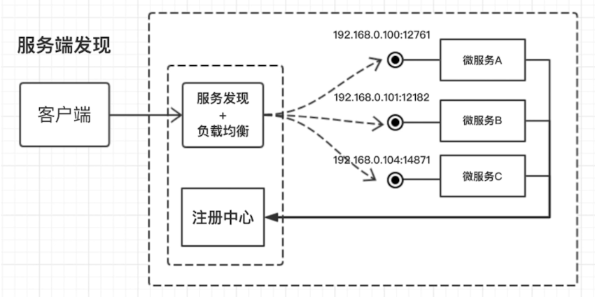

# 微服务带来的问题及解决方案分析

使用一套小服务来开发单个应用的方式，每个服务运行在独立的进程里，一般采用轻量级的通讯机制互联,并且它们可以通过自动化的方式部署。

## 微服务间如何通讯

### 通信协议角度

* REST API
* RPC
* MQ

###  选择RPC框架

* I/O 线程调度模型
* 序列化方式
* 多语言支持
* 服务治理

可选项

* Dubbo/Dubbox
* Motan
* thrift
* Grpc

## 服务发现、部署更新和扩容

* 客户端发现

* 服务端发现

  

## springboot&springcloud

核心组件

* Netflix Eureka 服务发现组件
* Netflix Ribbon 客户端负载均衡
* Netflix Hystrix 调度器
* Netflix Zuul 服务网关
* Spring Cloud Config 分布式配置