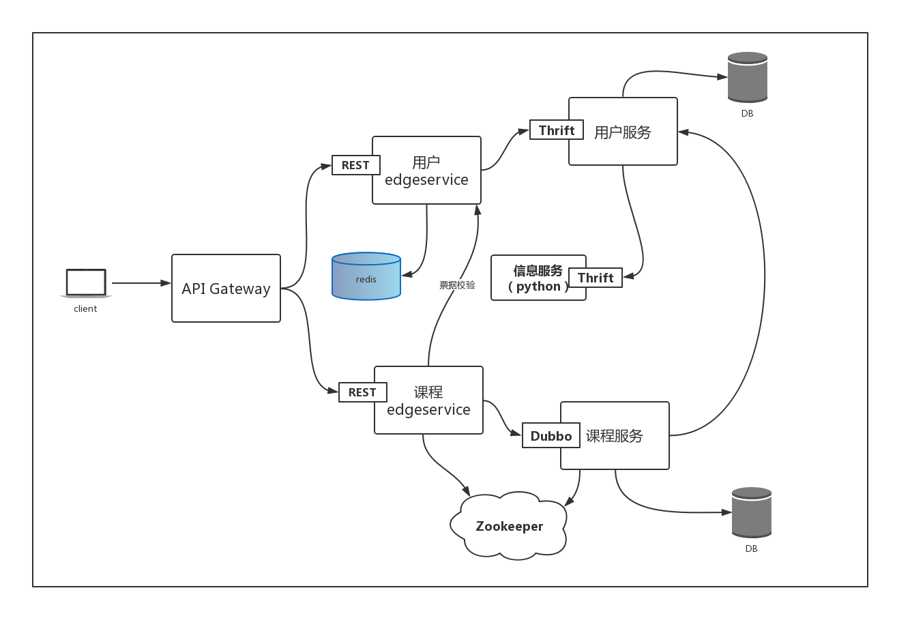

# 微服务开发



## 业务分析

- 用户服务
  - 用户登录
  - 用户注册
  - 用户基本倌患查询
  - 无状态，无session
  - 单点登录
- 课程服务
  - 登录验证
  - 课程的 curd
- 信息服务
  - 发送邮件
  - 发送短信
- 用户页面服务（离用户最近的服务）
  - 用户edgeservice
  - 课程edgeservice
  - API GATEWAY

## Thirft安装和验证

1. 下载`http://thrift.apache.org/download`

2. 相关环境

   ```
   apt-get install -y automake bison flex g++ git libboost-all-dev libevent-dev libssl-dev libtool make
   ```

3. 构建

   ```
   ./bootstrap.sh
   ./configure
   make
   make check
   make install
   ```

4. 编写测试文件

   ```
   namespace py thrift.demo

   service DemoService {

       void sayHello(1:string name);

   }
   ```

5. `thrift --gen python demo.thrift`进行文件生成

## Python开发信息服务

* `pip3 install thrift`
* `python3 message_service.py` 运行服务
* `netstat -na | grep 9090` 检查9090是否监听