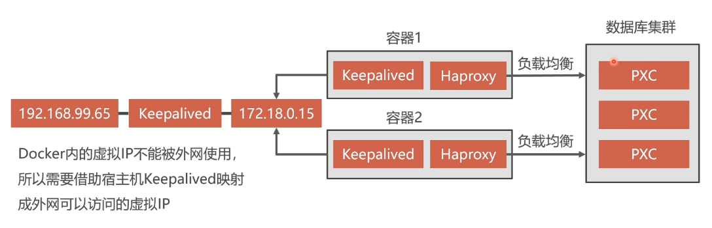

# 搭建MySQL集群

## 数据库集群方案


* 建议使用PerconaServer（性能提升很多）


## PXC集群安装介绍

* `https://hub.docker.com/r/percona/percona-xtradb-cluster`  镜像位置
* `docker tag percona/percona-xtradb-cluster:latest pxc`修改名字

### 创建内部网络

* 需要给PXC集群实例创建Docker内部网络
  * `docker network create mysql_net` 创建docker网段
  * `docker network inspect mysql_net` 查看网段信息
  * `docker network rm mysql_net` 删除网段
  * `docker network create --subnet=172.18.0.0/24 mysql_net `

### 创建Docker卷

* 容器中的PXC节点映射数据目录的解决办法
  * `docker volume create volume1` 创建数据卷
  * `docker inspect volume1`查看数据卷
  * `docker volume rm volume1` 删除数据卷

### 创PXC容器

````
docker run -d -p 3306:3306 
-v volume1:/var/lib/mysql  #数据卷和数据库位置映射
-e MYSQL_ROOT_PASSWORD=abcd123456  # 数据库密码
-e CLUSTER_NAME=MYSQL_PXC # PXC集群名称
-e XTRABACKUP_PASSWORD=abcd123456 # 数据库节点之间同步数据使用的密码
--privileged # 基于最高权限
--name=node1 # 容器名称
--net=mysql_net 
--ip 172.18.0.2  # 指定的IP
pxc # 使用的镜像名称
````

````
docker run -d -p 3306:3306 -v volume1:/var/lib/mysql -e MYSQL_ROOT_PASSWORD=abcd123456 -e CLUSTER_NAME=MYSQL_PXC -e XTRABACKUP_PASSWORD=abcd123456 --privileged --name=node1 --net=mysql_net  --ip 172.18.0.2 pxc

docker run -d -p 3307:3306 -v volume2:/var/lib/mysql -e CLUSTER_JOIN=node1 -e MYSQL_ROOT_PASSWORD=abcd123456 -e CLUSTER_NAME=MYSQL_PXC -e XTRABACKUP_PASSWORD=abcd123456 --privileged --name=node2 --net=mysql_net  --ip 172.18.0.3 pxc

docker run -d -p 3308:3306 -v volume3:/var/lib/mysql -e CLUSTER_JOIN=node1 -e MYSQL_ROOT_PASSWORD=abcd123456 -e CLUSTER_NAME=MYSQL_PXC -e XTRABACKUP_PASSWORD=abcd123456 --privileged --name=node3 --net=mysql_net  --ip 172.18.0.4 pxc

docker run -d -p 3309:3306 -v volume4:/var/lib/mysql -e CLUSTER_JOIN=node1 -e MYSQL_ROOT_PASSWORD=abcd123456 -e CLUSTER_NAME=MYSQL_PXC -e XTRABACKUP_PASSWORD=abcd123456 --privileged --name=node4 --net=mysql_net  --ip 172.18.0.5 pxc

docker run -d -p 3310:3306 -v volume5:/var/lib/mysql -e CLUSTER_JOIN=node1 -e MYSQL_ROOT_PASSWORD=abcd123456 -e CLUSTER_NAME=MYSQL_PXC -e XTRABACKUP_PASSWORD=abcd123456 --privileged --name=node5 --net=mysql_net  --ip 172.18.0.6 pxc
````

在任意节点上的数据操作都会同步到其他节点上

## 数据库负载均衡

使用Haproxy做负载均衡，请求被均匀分发到每个节点，单节点负载低，性能好

* `docker pull haproxy` 

### 编写配置文件

```c
global
	#工作目录
	chroot /usr/local/etc/haproxy
	#日志文件，使用rsyslog服务中local5日志设备（/var/log/local5），等级info
	log 127.0.0.1 local5 info
	#守护进程运行
	daemon

defaults
	log	global
	mode	http
	#日志格式
	option	httplog
	#日志中不记录负载均衡的心跳检测记录
	option	dontlognull
    #连接超时（毫秒）
	timeout connect 5000
    #客户端超时（毫秒）
	timeout client  50000
	#服务器超时（毫秒）
    timeout server  50000

#监控界面	
listen  admin_stats
	#监控界面的访问的IP和端口
	bind  0.0.0.0:8888
	#访问协议
    mode        http
	#URI相对地址
    stats uri   /dbs
	#统计报告格式
    stats realm     Global\ statistics
	#登陆帐户信息
    stats auth  admin:abc123456
#数据库负载均衡
listen  proxy-mysql
	#访问的IP和端口
	bind  0.0.0.0:3306  
    #网络协议
	mode  tcp
	#负载均衡算法（轮询算法）
	#轮询算法：roundrobin
	#权重算法：static-rr
	#最少连接算法：leastconn
	#请求源IP算法：source 
    balance  roundrobin
	#日志格式
    option  tcplog
	#在MySQL中创建一个没有权限的haproxy用户，密码为空。Haproxy使用这个账户对MySQL数据库心跳检测
    option  mysql-check user haproxy
    server  MySQL_1 172.18.0.2:3306 check weight 1 maxconn 2000  
    server  MySQL_2 172.18.0.3:3306 check weight 1 maxconn 2000  
	server  MySQL_3 172.18.0.4:3306 check weight 1 maxconn 2000 
	server  MySQL_4 172.18.0.5:3306 check weight 1 maxconn 2000
	server  MySQL_5 172.18.0.6:3306 check weight 1 maxconn 2000
	#使用keepalive检测死链
    option  tcpka  
```

容器创建命令

````
docker run -it -d 
-p 4001:8888 # 后台监控画面的对外暴露
-p 4002:3306 # 数据库对外的负载均衡端口
-v /docker/haproxy:/usr/local/etc/haproxy # 目录映射，配置文件
--name haproxy1 
--privileged # 为了修改一些如/etc/sys里面的文件的时候才需要的
--net=mysql_net # 指定网段
haproxy
````

```
docker run -it -d -p 4001:8888 -p 4002:3306 -v /docker/haproxy:/usr/local/etc/haproxy --name haproxy1 --privileged --net=mysql_net --ip 172.18.0.7 haproxy
```

* `docker exec -it haproxy1 bash `
  * `haproxy -f /usr/local/etc/haproxy`
* `CREATE USER 'haproxy'@'%' IDENTIFIED BY '';` 在数据库中创建用户以进行心跳检测
* `http://192.168.232.161:4001/dbs`  访问监控查看
* `docker stop node1` 尝试挂掉一个节点

## 节点冗余设计(haproxy双机热备)




* keepalived必须安装在Haproxy所在的容器上

  * `apt-get update`
  * `apt-get install keepalived`

* `/etc/keepalived/keepalived`.conf

  ````
  vrrp_instance  VI_1 { # VI_1名称
      state  MASTER # keepalived节点的身份（MASTER为主服务器，BACKUP备份服务器）,主服务器会抢占虚拟IP,备用服务器不会抢占
      interface  eth0 # 虚拟网卡，eth0为docker虚拟机的网卡
      virtual_router_id  51 # 虚拟路由标识符，MASTER和BACKUP的虚拟路由标识必须一致。标识为0~255
      priority  100 # 抢占时权重，数字越大权重越高
      advert_int  1 # 心跳检测的时间间隔，单位秒，主备之间必须一致
      authentication { # 主从服务器的验证方式，主机必须使用相同的密码才能通信
          auth_type  PASS
          auth_pass  123456
      }
      virtual_ipaddress { # 虚拟IP，在docker内部可见，可以多行设置多个
          172.18.0.201
      }
  }
  ````

  ````
  vrrp_instance  VI_1 {
      state  MASTER
      interface  eth0
      virtual_router_id  51
      priority  100
      advert_int  1
      authentication {
          auth_type  PASS
          auth_pass  123456
      }
      virtual_ipaddress {
          172.18.0.201
      }
  }
  ````

  * 启动keeplived
    * service keepalived start
    * `ping 172.168.0.201` 在宿主机中去ping


### DOCKER内虚拟IP映射到局域网

* 在宿主机上安装keepalived

  * `apt-get install keepalived`

* 配置文件

  ````
  vrrp_instance VI_1 { # 定义局域网的虚拟IP
      state MASTER
      interface ens33 # 网卡
      virtual_router_id 51
      priority 100
      advert_int 1
      authentication {
          auth_type PASS
          auth_pass 1111
      }
      virtual_ipaddress {
         	192.168.232.222 # 定义的虚拟IP地址
      }
  }
  ````


  virtual_server 192.168.232.222 8888 { # 定义从dockerdao到宿主机的转发规则，宿主机的IP和转发的端口
      delay_loop 3 # 心跳检测的间隔时间
      lb_algo rr # 轮训模式
      lb_kind NAT # NAT模式
      persistence_timeout 50 # 超时时间
      protocol TCP
    
      real_server 172.18.0.201 8888 { # 需要转发的docker虚拟IP，端口是管理界面的端口
          weight 1
      }
  }


  virtual_server 192.168.232.161 3306 { # 宿主机IP，转发端口
      delay_loop 3
      lb_algo rr 
      lb_kind NAT
      persistence_timeout 50
      protocol TCP
    
      real_server 172.18.0.201 3306 { # 对应转发到docker上的虚拟IP上
          weight 1
      }
  }

  ````

  * `service keepalived start`

### 暂停PXC集群的方法

* `vi /etc/sysctl.conf`

  ```
  # 文件中添加 net.ipv4.ip_forward=1 
  ```

  

* `systemctl restart network`

## 热备份

* 常见Mysql的热备份有LVM（加锁，可读不可写）和XtraBackup两种方案

### XtraBackup

* 分为全量备份和增量备份，第一次备份使用全量备份，后续使用增量备份

* `docker volume create mysql_back` 创建数据卷

* 创建mysql容器

  `````
  docker run -d -p 3306:3306 -e MYSQL_ROOT_PASSWORD=abcd123456 -e CLUSTER_NAME=PXC -e XTRABACKUP_PASSWORD=abcd123456 -v volume1:/var/lib/mysql -v mysql_back:/data --privileged -e CLUSTER_JOIN=node2 --name=node1 --privileged --net=mysql_net --ip 172.18.0.2 pxc
  `````

#### 安装XtraBackup

* `apt-get update`
* `apt-get install percona-xtrabackup-24`
* `innobackupex --user=root --password=abcd123456 /data/backup/full` 全量备份

#### 全量恢复

* 数据库可以热备份但不能热还原，为避免恢复过程中的数据同步，请采用空白数据库进行还原后建立PXC集群
* 还原数据之前要将未提交的事务回滚，还原数据后重启
* `rm -rf /var/lib/mysql/*` 删除数据
* `innobackupex --user=root --password=abcd123456 --apply-back /data/backup/full/2018-04-15_05-09-07/` 删除所有未提交的事物
* `innobackupex --user=root --password=abcd123456 --cppy-back /data/backup/full/2018-04-15_05-09-07/` 恢复数据
  ````