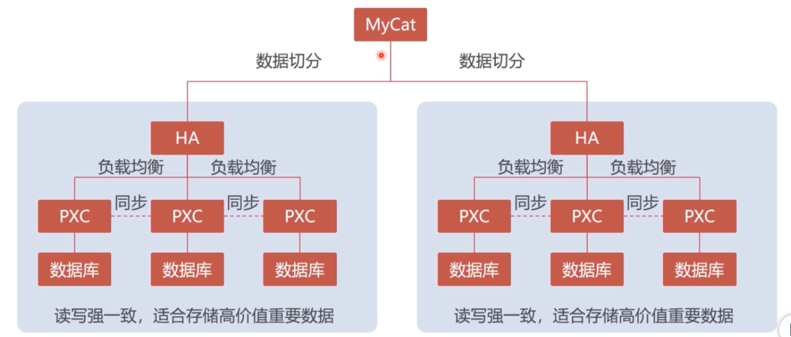
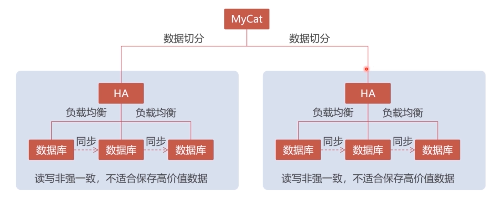
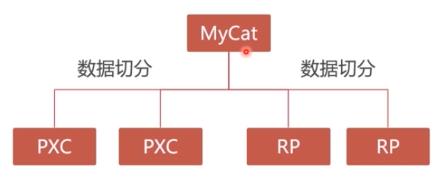
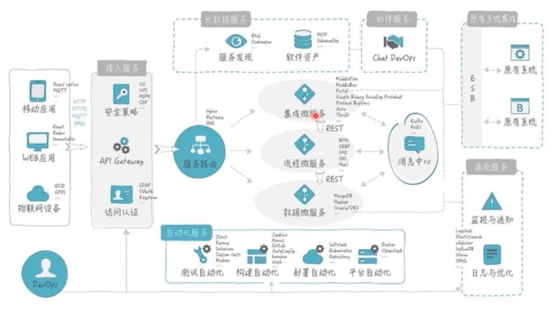
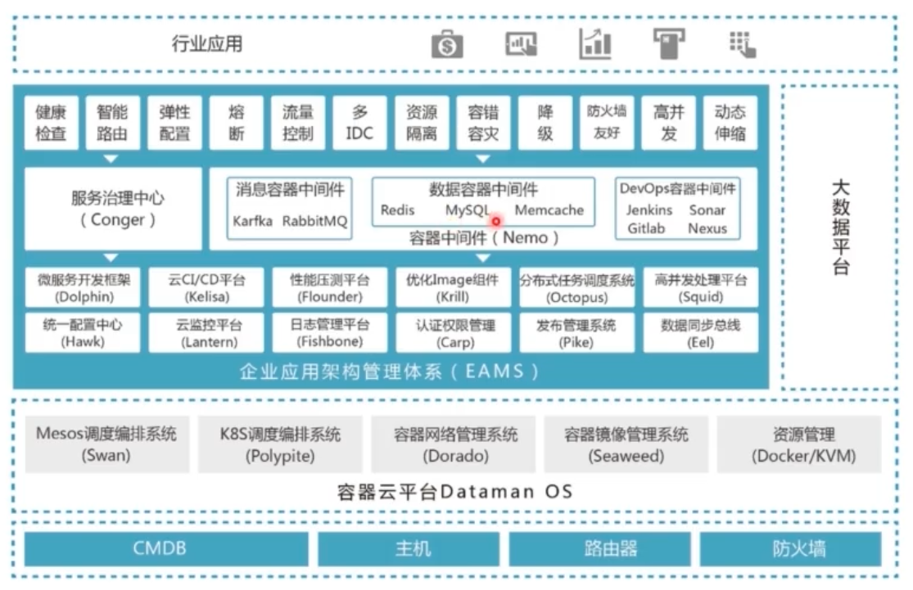

# mysql_PXC

## PXC 原理

* `mysqlslap -h 127.0.0.1 -u root -p root -P 3306 --concurrency=5000 --iterations=1 --auto-generate-sql --auto-generate-sql-load-type=mixed --auto-generate-sql-add-autoincrement --engine=innodb --number-of-queries=5000 --debug-info` Mysql单节点压力测试
* Mycat数据库分库分表中间

### PXC 集群架构

* 最终会牺牲部分性能

### Replication集群方案

* 非强一致性，读写速度快的，例如日志

### 最终方案

### 系统架构方案

## PXC 介绍

* PXC通过Mysql自带的Galera将不同的Mysql实例连接起来，实现多主集群
* PXC基于Percona Server（性能较Mysql有大幅提升）
* PXC是众多Mysql集群中的一种

## PXC数据一强致性

* 同步复制，事物在所有集群节点要么同时提交，要么不提交
* Replication采用异步复制，无法保证数据一致性

## PXC的多节点并发写入

* 缓存
* 微服务
* 分布式架构