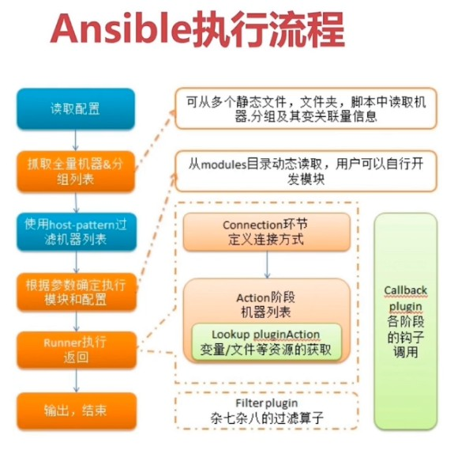

# Ansible



## 安装

* 方式一`pip install ansible`
* 方式二`apt-get install ansible`
* `ansible --version`

## 配置

### host配置

* `/etc/ansible/hosts`

* 配置内容示例：

  `````
  [test]
  192.168.2.1
  `````

*   配置远程登录

  * 添加公钥
    * `ssh-copy-id -i ~/.ssh/id_rsa.pub root@192.168.2.1`

* 连通测试

  * 运行Ansible命令：
    * `ansible all -m ping --user=root`

## 基本使用

### Ad-hoc命令行工具

1. 列出目标主机文件
   * `ansible test -m shell -a "ls /root" --user=root`
   * `ansible all  -m shell -a 'ls /root' --user=root`
2. 使用密码登录
   * `ansible test -m shell -a "ls /root" --user=root --ask-paas`

**常用参数**

* `-a` 传递给模块的参数
* `-f` 开辟多个进程同时操作多台机器
* `-m` 选定使用的模块
* `-M` 作用同上，但指定的是模块的路径
* `-i` 改变默认行为

****

* `-k` 询问登录密码
* `--private-key=` 私钥文件的位置
* `-u` 指定使用的用户

*****

* `-s` 使用sudo
* `-b` 切换到root不使用密码

### Inventory

目的是定义主机之间的关系，默认路径`/etc/ansible/hosts`

 `````
192.168.232.180
 `````

* `ansible 192.168.232.180 -m ping --user=root`

`````
[test]
192.168.232.180
`````

* `ansible test -m ping --user=root`
* `ansible 192.168.232.180 -m ping --user=root` 放到组中，并不妨碍单独的使用

````
test ansible_ssh_port=22 ansible_ssh_host=192.168.232.180 ansible_ssh_user=root
````

* `ansible test -m ping --user=root` 别名机制

````
test ansible_ssh_port=22 ansible_ssh_host=192.168.232.180 ansible_ssh_user=root

[node]
test
````

**链接参数**

* `ansible_ssh_host` 将要连接的远程主机名，与你想要设定的主机别名不同的话，通过此设置
* `ansible_ssh_port` ssh端口，如果不是默认的端口号，通过次变量设置
* `ansible_ssh_user` 默认的ssh用户名
* `ansible_ssh_pass` ssh密码(不建议使用)
* `ansible_sudo_pass` sudo的密码，推荐使用--ask_sudo_pass

**批量配**

````
[webservers]
www[01:50].example.com
[databases]
db-[a:f].example.com
````

### 安装mysql

* `ansible test -m apt -a 'name=mysql-server state=latest'` 安装mysql
* `ansible test -m service -a 'name=mysql state=started'` 启动暂停
* `ansible test -m shell -a "ps -ef | grep mysql | grep -v grep"` 执行shell命令

## playbook

````yaml
---
- hosts: test # 选择机器
  remote_user: root # 选择远程登录的机器
  tasks: # 执行的任务
    - name: Hello World # 任务名称
      shell: ls /root # 执行的模块及参数
````

* `ansible-playbook test.yml`

**变量**

````yaml
---
- hosts: test # 选择机器
  remote_user: root # 选择远程登录的机器
  vars: 
  	com: /root # 自定义一个变量
  tasks: # 执行的任务
    - name: Hello World # 任务名称
      shell: ls {{ com }} # 执行的模块及参数
````

> 注意

````yaml
---
- hosts: test # 选择机器
  remote_user: root # 选择远程登录的机器
  vars: 
  	com: ls /root # 自定义一个变量
  tasks: # 执行的任务
    - name: Hello World # 任务名称
      shell: "{{ com }}" # 执行的模块及参数
````

**when语句**

````yaml
vars: 
	epic: true
tasks:
	- shell: echo "This certainly is epic!"
	  when: epic
	-shell: echo "This certainly is epic!"
	  when: not epic
````

**with_items循环语句**

`````yaml
- name: add several users
	user: name={{ item }} state=present groups=wheel
	with_items:
		- testuser1
		- testuser2
`````

**with_nested嵌套循环**

```yaml
- name: users access control
  mysql_user: name={{ item[0] }}
              priv={{ item[1] }}.*.:ALL
              append_privs=yes
              password=foo
  with_nested:
    - ['alice', 'bob']
    - ['clientdb', 'employeedb', 'providerdb']
```

**有条件循环**

````
tasks:
  - command: echo {{ item }}
  with_items: [0, 2, 4, 6, 8, 10]
  when: item > 5
````

### 安装flask环境

````python
---
- hosts: test # 选择机器
  remote_user: root
  become: true
  tasks:
    - name: 在centos上安装python 
      yum:
        name: "{{ item }}"
        state: installed
      with_items:
        - python-devel
        - python-setuptools
      when: ansible_distribution == 'CentOS'
    - name: 在ubuntu上安装python
      apt:
        name: "{{ item }}"
        state: latest
        update_cache: yes
      with_items:
        - libpython-dev
        - python-setuptools
        - python-pip
      when: ansible_distribution == 'Ubuntu'
    - name: 安装flask环境
      pip:
        name: "{{ item }}"
      with_items:
        - flask
        - redis
````

## 安装zabbix

`````
centos ansible_ssh_port=22 ansible_ssh_host=192.168.232.180 ansible_ssh_user=root
ubuntu ansible_ssh_port=22 ansible_ssh_host=192.168.232.181 ansible_ssh_user=root

[test]
centos
ubuntu
`````

`````yaml
---
- hosts: test
  become: true
  tasks:
    - name: install zabbix rpm
      yum:
        name: http://repo.zabbix.com/zabbix/3.4/rhel/7/x86_64/zabbix-release-3.4-2.el7.noarch.rpm
        state: installed
      when: ansible_distribution == 'CentOS'
    - name: download zabbix deb
      get_url:
        url: http://repo.zabbix.com/zabbix/3.4/ubuntu/pool/main/z/zabbix-release/zabbix-release_3.4-1+xenial_all.deb
        dest: /tmp/zabbix.deb
      when: ansible_distribution == 'Ubuntu'
    - name: install zabbix deb
      apt:
        #deb: /tmp/zabbix.deb
        name: zabbix-agent
      when: ansible_distribution == 'Ubuntu'
    - name: install zabbix server
      yum:
        name: "{{ item }}"
        state: installed
      with_items:
        - zabbix-server-mysql
        - zabbix-proxy-mysql
        - zabbix-web-mysql
      when: ansible_distribution == 'CentOS'
    - name: install zabbix agent
      apt:
        name: zabbix-agent
        update_cache: yes
      when: ansible_distribution == 'Ubuntu'
    - name: config zabbix server
      replace:
        path: /etc/zabbix/zabbix_server.conf
        regexp: DBUser=zabbix
        replace: DBUser=root
      when: ansible_distribution == 'CentOS'
    - name: import db format
      shell: zcat /usr/share/doc/zabbix-server-mysql-3.4.7/create.sql.gz | mysql -uroot zabbix
      when: ansible_distribution == 'CentOS'
    - name: disable seliunx
      selinux:
        stste: disable
      when: ansible_distribution == 'CentOS'
    - name: start zabbix server
      systemd:
        name: zabbix-server
        state: started
      when: ansible_distribution == 'CentOS'
    - name: start zabbix agent
      systemd:
        name: zabbix-agent
        state: started
      when: ansible_distribution == 'Ubuntu'
`````

* `ansible test -m shell -a 'ps -ef | grep zabbix'`