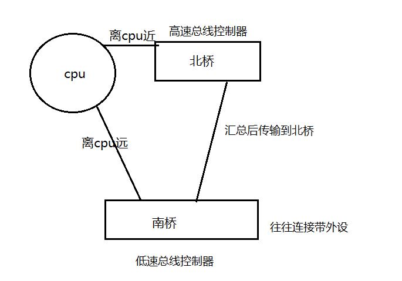

# 基础使用

## 创建虚拟机

*　create a new
*　custom
*　不用兼容其他
*　I will instale
*　linux 和发行版
*　虚拟机的名字 选择存储位置（会直接把文件放在这个下面，建议根据名字再下级建一个子文件夹）
*　选择cpu 和核心数
*　512M
*　use bridged
*　LISI
*　create
*　scsI
*　120G
*　启动

## 使用

* 当网络链接有问题选择edit->virtual 一般选桥接(利用物理设备链接)eth0 修改brided to
* edit virtual machine可对设备进行编辑
* 编辑cd/dvd->导入镜像
* ctr+alt+insert调整启动的介质
* ctrl+alt鼠标退出
* suspend使系统挂起

## 计算机基础

计算机五大部分: 运算器、控制器、存储器(内存-编址存储，平面编址)、输入设备、输出设备

* 运算器对运算进行操作，需要数据的输入输出，并受到控制器的运算控制
* 运算数据需要从内存中载入
* 将输入和运算结果暂存到寄存器中
* 运算器、寄存器、控制器组成了CPU
* 存储器(内存)存储数据和指令

RAM随机访问存储器，ROM只读存储器(被映射到内存中)

元芯片的记录永不销毁，硬件逻辑映射到内存中的最开始位置，进行加电自检(进行硬件检测)

POLL轮训：

interrupt中断（硬件通知机制）：当有交互时提示CPU过来查看，产生中断

可编程中断控制器：和cpu相连和外设也相连

## 前端总线（FSB）

**南桥并不直接连接到CPU**

固态硬盘：快速磁盘I/O

CPU：开关速度的描述，完成一次动作的时间

即便cpu速度很快，但内存工作慢，依然需要多级缓存来处理

## 一些概念

程序局部性原理

硬件架构CPU系列：ARM（省电）、X86、X64（AMD64）、alpha、uttrasparc、powerpc、power（IBM多核）

memory（内存）:分段、虚拟地址空间

system call 系统调用，system call内核进行系统调用(调用库)

shell 人机交互接口

### 计算机各个层之间的关系（从下到上）

***

应用程序（特殊程序shell人机交互接口）

库

系统

硬件

（骇客一般使用库编程和接近硬件的编程，执行权限大）

****

服务（自动启动）

交互式程序（按需求调用）

内核实际上也被分配到内存中

0级别 内核，被映射到内存中的保护位置

1

2

3级别 应用程序位置

内存碎片指：应用程序在内存中存放的位置相互间隔造成的

****

shell 交互界面，转译为内核指令，人机交互接口

GUI 图形用户界面

CLI 命令行接口

​	`#` 管理员

​	`$`普通用户

​	命令 选项 参数（命令的作用对象） （选项：修正命令的执行方式）

​	`_` 短选项，可以组合使用

​	`--` 长选项

***

### 内核功能

* 进程管理
* 内存管理
* 文件系统
* 网络链接
* 硬件驱动
* 安全机制

***

su -l 用户名 完全切换用户

x-window中的x指的是图形协议