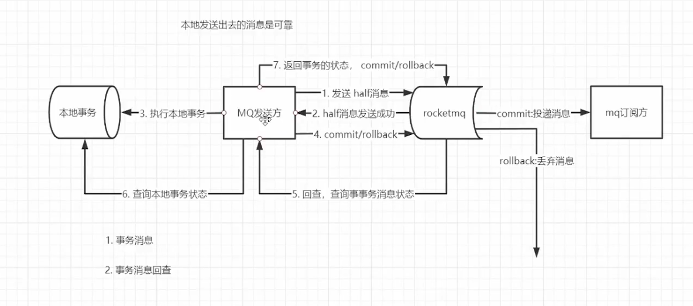

# 分布式理论基础和常见的分布式事务解决方案

## cap理论

* Consistency(一致性) : “all nodes see the same data at the sametime”, 即更新操作成功并返回客户端后, 所有节点在同一时间的数据 完全一致,这就是分布式的一致性。一致性的问题在并发系统中不可避免,对于客户端来说,一致性指的是并发访问 时更新过的数据如何获取的问题。从服务端来看,则是更新如何复制分布到整个系统,以保证数据最终一致。
* Availability(可用性) : 可用性指“Reads and writes always succeed”, 即服务一直可用, 而且是正常响应时间。好的可用性主要是指系 统能够很好的为用户服务,不出现用户操作失败或者访问超时等用户体验不好的情况。
* Partition Tolerance(分区容错性) : 即分布式系统在遇到某节点或网络分区故障的时候,仍然能够对外提供满足一致性和可用性的服务。分区容错性要求 能够使应用虽然是一个分布式系统,而看上去却好像是在一个可以运转正常的整体。比如现在的分布式系统中有某一 个或者几个机器宕掉了,其他剩下的机器还能够正常运转满足系统需求,对于用户而言并没有什么体验上的影响。

**一致性和可用性存在矛盾**

分布式系统常用：CP、AP

## BASE理论

分布式系统中的一致性是弱一致性，单数据库应用是强一致性

BASE是Basically Available(基本可用) 、Soft state(软状态) 和Eventually consistent(最终一致性) 三个短语的 缩写。BASE理论是对CAP中一致性和可用性权衡的结果, 其来源于对大规模互联网系统分布式实践的总结, 是基于 CAP定理逐步演化而来的。BASE理论的核心思想是:即使无法做到强一致性, 但每个应用都可以根据自身业务特 点, 采用适当的方式来使系统达到最终一致性。接下来看一下BASE中的三要素:

1. 基本可用 

   基本可用是指分布式系统在出现不可预知故障的时候,允许损失部分可用性一-注意,这绝不等价于系统不可用。比 如:

   * 响应时间上的损失。正常情况下,一个在线搜索引擎需要在0.5秒之内返回给用户相应的查询结果,但由于出现 故障,查询结果的响应时间增加了1~2秒 
   * 系统功能上的损失:正常情况下,在一个电子商务网站上进行购物的时候,消费者几乎能够顺利完成每一笔订 单,但是在一些节日大促购物高峰的时候,由于消费者的购物行为激增,为了保护购物系统的稳定性,部分消费者可 能会被引导到一个降级页面

2. 软状态

   软状态指允许系统中的数据存在中间状态,并认为该中间状态的存在不会影响系统的整体可用性,即允许系统在不同 节点的数据副本之间进行数据同步的过程存在延时

3. 最终一致性 

   最终一致性强调的是所有的数据副本,在经过一段时间的同步之后,最终都能够达到一个一致的状态。因此,最终一 致性的本质是需要系统保证最终数据能够达到一致, 而不需要实时保证系统数据的强一致性。总的来说, BASE理论 面向的是大型高可用可扩展的分布式系统, 和传统的事物ACID特性是相反的, 它完全不同于ACID的强一致性模型, 而是通过牺牲强一致性来获得可用性,并允许数据在一段时间内是不一致的,但最终达到一致状态。但同时,在实际 的分布式场景中,不同业务单元和组件对数据一致性的要求是不同的,因此在具体的分布式系统架构设计过程中, ACID特性和BASE理论往往又会结合在一起。

**一句话:CAP就是告诉你:想要满足C、A、P就是做梦, BASE才是你最终的归宿 **

## 2pc两阶段提交分布式事务

### 常见分布式事务解决方案 

* 两阶段提交(2PC, Two-phase Commit) 
* TCC补偿模式 
* 基于本地消息表实现最终一致性 
* 最大努力通知 
* **基于可靠消息最终一致性方案**

### 两阶段提交（2PC）

两阶段提交又称2PC,2PC是一个非常经典的中心化的原子提交协议。 这里所说的中心化是指协议中有两类节点:一个是中心化协调者节点(coordinator) 和N个参与者节点 (part ci pant) 。 两个阶段:第一阶段:投票阶段和第二阶段:提交/执行阶段。 举例订单服务A,需要调用支付服务B去支付,支付成功则处理购物订单为待发货状态,否则就需要将购物订单处 理为失败状态。 那么看2PC阶段是如何处理的

* 存在性能问题
  * 加锁导致的
  * 服务之间相互影响
* 单点故障

## TCC分布式事务

将2PC的锁使用业务代码实现

#### 优点

1. 解决了跨服务的业务操作原子性问题, 例如组合支付,订单减库存等场景非常实用 
2. TCC的本质原理是把数据库的二阶段提 交上升到微服务来实现,从而避免了数据库2阶段中锁冲突的长事务低性能 风险。 
3. TCC异步高性能, 它采用了try先检查, 然后异步实现confirm, 真正提交的是在confirm方法中。

#### 缺点

1. 对微服务的侵入性强,微服务的每个事 务都必须实现try, confirm, cancel等3个方法, 开发成本高, 今后维护改造 的成本也高。 
2. 为了达到事务的一致性要求, try, con n firm、 cancel接口必须实现等幂性操作。 (定时器+重试) 
3. 由于事务管理器要记录事务日志,必定 会损耗一定的性能, 并使得整个TCC事务时间拉长, 建议采用red is的方式来 记录事务日志。 
4. tcc需要通过锁来确保数据的一致性, 会加锁导致性能不高

##  基于本地消息的最终一致性方案

## 基于可靠消息的最终一致性

事务消息

## 最大努力通知方案

