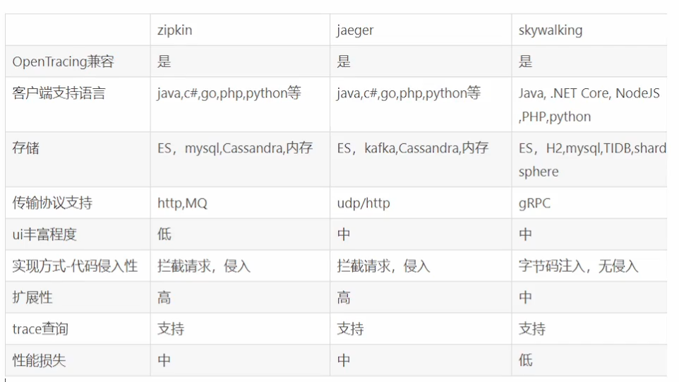

# 链路追踪



* openTracing
* trace

[jaeger](https://github.com/jaegertracing/jaeger)

````
docker run \
  --rm \
  --name jaeger \
  -p6831:6831/udp \
  -p16686:16686 \
  jaegertracing/all-in-one:latest
````

## openTracing