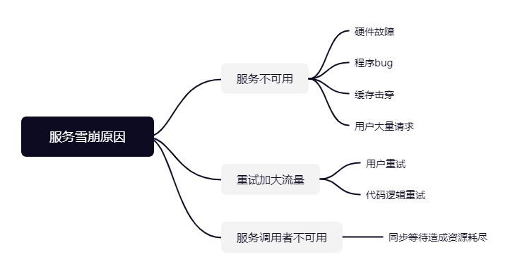
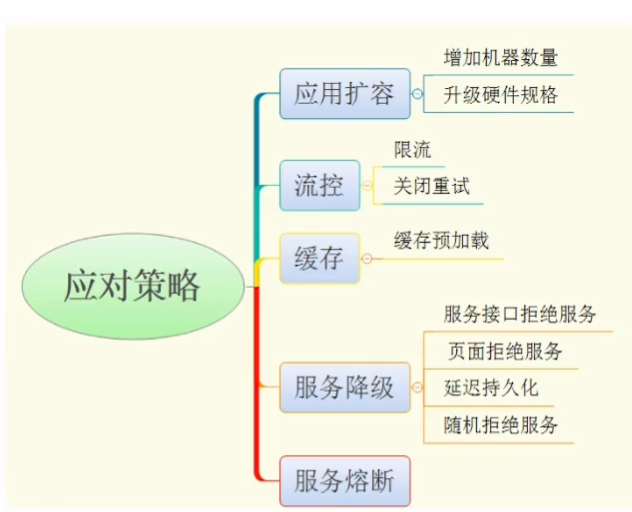

# 熔断、限流 - sentinel

## 服务雪崩





熔断：

1. 请求都很慢-很高比例慢
2. 出现大比例请求错误
3. 单位时间内错误数量多

当A出现以上情况，那么A向B请求的服务，主动断开，一段时间后重新发送

## Sentinel

[Sentinel](https://github.com/alibaba/sentinel-golang)

[文档](https://sentinelguard.io/zh-cn/docs/introduction.html) 

[配置参数的说明](https://sentinelguard.io/zh-cn/docs/golang/flow-control.html)

- `Resource`：资源名，即规则的作用目标。
- `TokenCalculateStrategy`: 当前流量控制器的Token计算策略。Direct表示直接使用字段 Threshold 作为阈值；WarmUp表示使用预热方式计算Token的阈值。
- `ControlBehavior`: 表示流量控制器的控制策略；Reject表示超过阈值直接拒绝，Throttling表示匀速排队。
- `Threshold`: 表示流控阈值；如果字段 StatIntervalInMs 是1000(也就是1秒)，那么Threshold就表示QPS，流量控制器也就会依据资源的QPS来做流控。
- `RelationStrategy`: 调用关系限流策略，CurrentResource表示使用当前规则的resource做流控；AssociatedResource表示使用关联的resource做流控，关联的resource在字段 `RefResource` 定义；
- `RefResource`: 关联的resource；
- `WarmUpPeriodSec`: 预热的时间长度，该字段仅仅对 `WarmUp` 的TokenCalculateStrategy生效；
- `WarmUpColdFactor`: 预热的因子，默认是3，该值的设置会影响预热的速度，该字段仅仅对 `WarmUp` 的TokenCalculateStrategy生效；
- `MaxQueueingTimeMs`: 匀速排队的最大等待时间，该字段仅仅对 `Throttling` ControlBehavior生效；
- `StatIntervalInMs`: 规则对应的流量控制器的独立统计结构的统计周期。如果StatIntervalInMs是1000，也就是统计QPS。

## 基于QPS的限流

```go
package main

import (
	"fmt"
	sentinel "github.com/alibaba/sentinel-golang/api"
	"github.com/alibaba/sentinel-golang/core/base"
	"github.com/alibaba/sentinel-golang/core/flow"
	"log"
)

func main() {
	//先初始化sentinel
	err := sentinel.InitDefault()
	if err != nil {
		log.Fatalf("初始化sentinel异常：%v", err)
	}

	//配置限流规则
	_, err = flow.LoadRules([]*flow.Rule{
		{
			Resource:               "some-test",
			TokenCalculateStrategy: flow.Direct, // 统计的方式
			Threshold:              10,          // QPS
			StatIntervalInMs:       1000,        // 以一秒作为统计周期
			ControlBehavior:        flow.Reject, //流量控制的行为 拒绝，或匀速排队
		},
		{
			Resource:               "some-test2",
			TokenCalculateStrategy: flow.Direct, // 统计的方式
			Threshold:              10,          // QPS
			StatIntervalInMs:       1000,        // 以一秒作为统计周期
			ControlBehavior:        flow.Reject, //流量控制的行为 拒绝，或匀速排队
		},
	})

	if err != nil {
		log.Fatalf("加载规则失败：%v", err)
	}

	for i := 0; i <= 12; i++ {
		e, b := sentinel.Entry("some-test", sentinel.WithTrafficType(base.Inbound)) // 进行流入控制
		if b != nil {
			fmt.Printf("发生限流，检查不通过%d\n", i)
		}else {
			fmt.Printf("检查通过%d\n", i)
			e.Exit() //没问题一定要退出
		}
	}
}
```

## 预热

WarmUp方式，即预热/冷启动方式。当系统长期处于低水位的情况下，当流量突然增加时，直接把系统拉升到高水位可能瞬间把系统压垮。通过"冷启动"，让通过的流量缓慢增加，在一定时间内逐渐增加到阈值上限，给冷系统一个预热的时间，避免冷系统被压垮。

```go
package main

import (
	"fmt"
	sentinel "github.com/alibaba/sentinel-golang/api"
	"github.com/alibaba/sentinel-golang/core/base"
	"github.com/alibaba/sentinel-golang/core/flow"
	"log"
	"math/rand"
	"time"
)

func main() {
	//先初始化sentinel
	err := sentinel.InitDefault()
	if err != nil {
		log.Fatalf("初始化sentinel异常：%v", err)
	}

	var globalTotal int
	var passTotal int
	var blockTotal int
	var ch = make(chan struct{})

	//配置限流规则
	_, err = flow.LoadRules([]*flow.Rule{
		{
			Resource:               "some-test",
			TokenCalculateStrategy: flow.WarmUp, // 冷启动策略
			ControlBehavior:        flow.Reject, //流量控制的行为 拒绝，或匀速排队
			Threshold:              1000,        // QPS
			WarmUpPeriodSec:        30,          //预热的时长 s
			// 以上限制为在30秒内最大达到1000qps，这种缓慢的增加是允许的。
			//WarmUpColdFactor: 3, // 预热因子，表示速度
		},
	})

	if err != nil {
		log.Fatalf("加载规则失败：%v", err)
	}

	// 每一秒中统计，一秒钟内通过的数量，总请求数量，block数；数量
	for i := 0; i < 10; i++ {
		go func() {
			for {
				globalTotal++
				e, b := sentinel.Entry("some-test", sentinel.WithTrafficType(base.Inbound)) // 进行流入控制
				if b != nil {
					blockTotal++
					time.Sleep(time.Duration(rand.Uint64() % 10)*time.Millisecond)
				} else {
					passTotal++
					e.Exit() //没问题一定要退出
				}
			}

		}()
	}

	go func() {
		var oldTotal int // 一秒钟时间内总请求
		var oldPass int // 一秒钟时间内通过
		var oldBlock int // 一秒钟时间内屏蔽数量


		for {
			tmpGlobalTotal := globalTotal
			tmpPassTotal := passTotal
			tmpBlockTotal := blockTotal

			time.Sleep(time.Second)
			oldTotal = globalTotal - tmpGlobalTotal
			oldPass = passTotal - tmpPassTotal
			oldBlock = blockTotal - tmpBlockTotal
			fmt.Printf("一秒内请求量(QPS)%d，一秒内通过数量%d, 一秒内屏蔽数量%d\n", oldTotal, oldPass, oldBlock)
		}
	}()
	<- ch
}
```

## 匀速通过

````go
package main

import (
	"fmt"
	sentinel "github.com/alibaba/sentinel-golang/api"
	"github.com/alibaba/sentinel-golang/core/base"
	"github.com/alibaba/sentinel-golang/core/flow"
	"log"
)

func main() {
	//先初始化sentinel
	err := sentinel.InitDefault()
	if err != nil {
		log.Fatalf("初始化sentinel异常：%v", err)
	}

	//配置限流规则
	_, err = flow.LoadRules([]*flow.Rule{
		{
			Resource:               "some-test2",
			TokenCalculateStrategy: flow.Direct, // 统计的方式
			Threshold:              10,          // QPS
			StatIntervalInMs:       1000,        // 以一秒作为统计周期
			// 表示10QPS
			ControlBehavior:        flow.Throttling, //匀速排队通过，即100秒通过一个
		},
	})

	if err != nil {
		log.Fatalf("加载规则失败：%v", err)
	}

	for i := 0; i <= 12; i++ {
		e, b := sentinel.Entry("some-test2", sentinel.WithTrafficType(base.Inbound)) // 进行流入控制
		if b != nil {
			fmt.Printf("发生限流，检查不通过%d\n", i)
		}else {
			fmt.Printf("检查通过%d\n", i)
			e.Exit() //没问题一定要退出
		}
	}
}

````

## 熔断


1. Closed 状态：也是初始状态，该状态下，熔断器会保持闭合，对资源的访问直接通过熔断器的检查。
2. Open 状态：断开状态，熔断器处于开启状态，对资源的访问会被切断。
3. Half-Open 状态：半开状态，该状态下除了探测流量，其余对资源的访问也会被切断。探测流量指熔断器处于半开状态时，会周期性的允许一定数目的探测请求通过，如果探测请求能够正常的返回，代表探测成功，此时熔断器会重置状态到 Closed 状态，结束熔断；如果探测失败，则回滚到 Open 状态。

Sentinel 支持以下几种熔断策略：

- 慢调用比例策略 (SlowRequestRatio)：Sentinel 的熔断器不在静默期，并且慢调用的比例大于设置的阈值，则接下来的熔断周期内对资源的访问会自动地被熔断。该策略下需要设置允许的调用 RT 临界值（即最大的响应时间），对该资源访问的响应时间大于该阈值则统计为慢调用。
- 错误比例策略 (ErrorRatio)：Sentinel 的熔断器不在静默期，并且在统计周期内资源请求访问异常的比例大于设定的阈值，则接下来的熔断周期内对资源的访问会自动地被熔断。
- 错误计数策略 (ErrorCount)：Sentinel 的熔断器不在静默期，并且在统计周期内资源请求访问异常数大于设定的阈值，则接下来的熔断周期内对资源的访问会自动地被熔断。

**配置参数**

- `Id`: 表示 Sentinel 规则的全局唯一ID，可选项。
- `Resource`: 熔断器规则生效的埋点资源的名称；
- `Strategy`: 熔断策略，目前支持`SlowRequestRatio`、`ErrorRatio`、`ErrorCount`三种；
  - 选择以**慢调用比例** (SlowRequestRatio) 作为阈值，需要设置允许的**最大响应时间**（MaxAllowedRtMs），请求的响应时间大于该值则统计为慢调用。通过 `Threshold` 字段设置触发熔断的慢调用比例，取值范围为 [0.0, 1.0]。规则配置后，在单位统计时长内请求数目大于设置的最小请求数目，并且慢调用的比例大于阈值，则接下来的熔断时长内请求会自动被熔断。经过熔断时长后熔断器会进入探测恢复状态，若接下来的一个请求响应时间小于设置的最大 RT 则结束熔断，若大于设置的最大 RT 则会再次被熔断。
  - 选择以**错误比例** (ErrorRatio) 作为阈值，需要设置触发熔断的异常比例（`Threshold`），取值范围为 [0.0, 1.0]。规则配置后，在单位统计时长内请求数目大于设置的最小请求数目，并且异常的比例大于阈值，则接下来的熔断时长内请求会自动被熔断。经过熔断时长后熔断器会进入探测恢复状态，若接下来的一个请求没有错误则结束熔断，否则会再次被熔断。代码中可以通过 `api.TraceError(entry, err)` 函数来记录 error。
- `RetryTimeoutMs`: 即熔断触发后持续的时间（单位为 ms）。资源进入熔断状态后，在配置的熔断时长内，请求都会快速失败。熔断结束后进入探测恢复模式（HALF-OPEN）。
- `MinRequestAmount`: 静默数量，如果当前统计周期内对资源的访问数量小于静默数量，那么熔断器就处于静默期。换言之，也就是触发熔断的最小请求数目，若当前统计周期内的请求数小于此值，即使达到熔断条件规则也不会触发。
- `StatIntervalMs`: 统计的时间窗口长度（单位为 ms）。
- `MaxAllowedRtMs`: 仅对`慢调用熔断策略`生效，MaxAllowedRtMs 是判断请求是否是慢调用的临界值，也就是如果请求的response time小于或等于MaxAllowedRtMs，那么就不是慢调用；如果response time大于MaxAllowedRtMs，那么当前请求就属于慢调用。
- `Threshold`: 对于`慢调用熔断策略`, Threshold表示是慢调用比例的阈值(小数表示，比如0.1表示10%)，也就是如果当前资源的慢调用比例如果高于Threshold，那么熔断器就会断开；否则保持闭合状态。 对于`错误比例策略`，Threshold表示的是错误比例的阈值(小数表示，比如0.1表示10%)。对于`错误数策略`，Threshold是错误计数的阈值。

## 按错误数量

`````go
package main

import (
	"errors"
	"fmt"
	"log"
	"math/rand"
	"time"

	sentinel "github.com/alibaba/sentinel-golang/api"
	"github.com/alibaba/sentinel-golang/core/circuitbreaker"
	"github.com/alibaba/sentinel-golang/core/config"
	"github.com/alibaba/sentinel-golang/logging"
	"github.com/alibaba/sentinel-golang/util"
)

type stateChangeTestListener struct {
}

func (s *stateChangeTestListener) OnTransformToClosed(prev circuitbreaker.State, rule circuitbreaker.Rule) {
	fmt.Printf("rule.steategy: %+v, From %s to Closed, time: %d\n", rule.Strategy, prev.String(), util.CurrentTimeMillis())
}

func (s *stateChangeTestListener) OnTransformToOpen(prev circuitbreaker.State, rule circuitbreaker.Rule, snapshot interface{}) {
	fmt.Printf("rule.steategy: %+v, From %s to Open, snapshot: %d, time: %d\n", rule.Strategy, prev.String(), snapshot, util.CurrentTimeMillis())
}

func (s *stateChangeTestListener) OnTransformToHalfOpen(prev circuitbreaker.State, rule circuitbreaker.Rule) {
	fmt.Printf("rule.steategy: %+v, From %s to Half-Open, time: %d\n", rule.Strategy, prev.String(), util.CurrentTimeMillis())
}

func main() {
	total := 0
	totalPass := 0
	totalBlock := 0
	totalErr := 0

	conf := config.NewDefaultConfig()
	// for testing, logging output to console
	conf.Sentinel.Log.Logger = logging.NewConsoleLogger()
	err := sentinel.InitWithConfig(conf)
	if err != nil {
		log.Fatal(err)
	}
	ch := make(chan struct{})
	// 注册转态转换
	circuitbreaker.RegisterStateChangeListeners(&stateChangeTestListener{})

	_, err = circuitbreaker.LoadRules([]*circuitbreaker.Rule{
		// Statistic time span=5s, recoveryTimeout=3s, maxErrorCount=50
		{
			Resource:                     "abc",
			Strategy:                     circuitbreaker.ErrorCount,
			RetryTimeoutMs:               3000, // 3秒后进入半恢复状态
			MinRequestAmount:             10, // 静默数量
			StatIntervalMs:               5000, // 统计周期
			Threshold:                    50, // 错误数量
		},
	})
	if err != nil {
		log.Fatal(err)
	}

	logging.Info("[CircuitBreaker ErrorCount] Sentinel Go circuit breaking demo is running. You may see the pass/block metric in the metric log.")
	go func() {
		for {
			total ++
			e, b := sentinel.Entry("abc")
			if b != nil {
				// g1 blocked
				totalBlock ++
				fmt.Println("协程发生熔断")
				time.Sleep(time.Duration(rand.Uint64()%20) * time.Millisecond)
			} else {
				totalPass ++
				if rand.Uint64()%20 > 9 {
					// Record current invocation as error.
					totalErr ++
					sentinel.TraceError(e, errors.New("biz error"))
				}
				// g1 passed
				time.Sleep(time.Duration(rand.Uint64()%20+10) * time.Millisecond)
				e.Exit()
			}
		}
	}()
	go func() {
		for {
			total ++
			e, b := sentinel.Entry("abc")
			if b != nil {
				// g2 blocked
				totalBlock ++
				time.Sleep(time.Duration(rand.Uint64()%20) * time.Millisecond)
			} else {
				totalPass ++
				// g2 passed
				time.Sleep(time.Duration(rand.Uint64()%80) * time.Millisecond)
				e.Exit()
			}
		}
	}()

	go func() {
		time.Sleep(time.Second)
		for {
			fmt.Printf("一秒内请求量(QPS)%d，一秒内通过数量%d, 一秒内屏蔽数量%d，一秒钟发生的错误数量%d \n", total, totalPass, totalBlock, totalErr)
		}
	}()


	<-ch
}
`````

## 按错误比例

`````go
package main

import (
	"errors"
	"fmt"
	"log"
	"math/rand"
	"time"

	sentinel "github.com/alibaba/sentinel-golang/api"
	"github.com/alibaba/sentinel-golang/core/circuitbreaker"
	"github.com/alibaba/sentinel-golang/core/config"
	"github.com/alibaba/sentinel-golang/logging"
	"github.com/alibaba/sentinel-golang/util"
)

type stateChangeTestListener struct {
}

func (s *stateChangeTestListener) OnTransformToClosed(prev circuitbreaker.State, rule circuitbreaker.Rule) {
	fmt.Printf("rule.steategy: %+v, From %s to Closed, time: %d\n", rule.Strategy, prev.String(), util.CurrentTimeMillis())
}

func (s *stateChangeTestListener) OnTransformToOpen(prev circuitbreaker.State, rule circuitbreaker.Rule, snapshot interface{}) {
	fmt.Printf("rule.steategy: %+v, From %s to Open, snapshot: %.2f, time: %d\n", rule.Strategy, prev.String(), snapshot, util.CurrentTimeMillis())
}

func (s *stateChangeTestListener) OnTransformToHalfOpen(prev circuitbreaker.State, rule circuitbreaker.Rule) {
	fmt.Printf("rule.steategy: %+v, From %s to Half-Open, time: %d\n", rule.Strategy, prev.String(), util.CurrentTimeMillis())
}

func main() {
	conf := config.NewDefaultConfig()
	// for testing, logging output to console
	conf.Sentinel.Log.Logger = logging.NewConsoleLogger()
	err := sentinel.InitWithConfig(conf)
	if err != nil {
		log.Fatal(err)
	}
	ch := make(chan struct{})
	// Register a state change listener so that we could observer the state change of the internal circuit breaker.
	circuitbreaker.RegisterStateChangeListeners(&stateChangeTestListener{})

	_, err = circuitbreaker.LoadRules([]*circuitbreaker.Rule{
		// Statistic time span=5s, recoveryTimeout=3s, maxErrorRatio=40%
		{
			Resource:                     "abc",
			Strategy:                     circuitbreaker.ErrorRatio,
			RetryTimeoutMs:               3000,
			MinRequestAmount:             10,
			StatIntervalMs:               5000,
			StatSlidingWindowBucketCount: 10,
			Threshold:                    0.4,
		},
	})
	if err != nil {
		log.Fatal(err)
	}

	logging.Info("[CircuitBreaker ErrorRatio] Sentinel Go circuit breaking demo is running. You may see the pass/block metric in the metric log.")
	go func() {
		for {
			e, b := sentinel.Entry("abc")
			if b != nil {
				// g1 blocked
				time.Sleep(time.Duration(rand.Uint64()%20) * time.Millisecond)
			} else {
				if rand.Uint64()%20 > 6 {
					// Record current invocation as error.
					sentinel.TraceError(e, errors.New("biz error"))
				}
				// g1 passed
				time.Sleep(time.Duration(rand.Uint64()%80+20) * time.Millisecond)
				e.Exit()
			}
		}
	}()
	go func() {
		for {
			e, b := sentinel.Entry("abc")
			if b != nil {
				// g2 blocked
				time.Sleep(time.Duration(rand.Uint64()%20) * time.Millisecond)
			} else {
				// g2 passed
				time.Sleep(time.Duration(rand.Uint64()%80+40) * time.Millisecond)
				e.Exit()
			}
		}
	}()
	<-ch
}
`````

## 慢请求

`````go
package main

import (
	"errors"
	"fmt"
	"log"
	"math/rand"
	"time"

	sentinel "github.com/alibaba/sentinel-golang/api"
	"github.com/alibaba/sentinel-golang/core/circuitbreaker"
	"github.com/alibaba/sentinel-golang/core/config"
	"github.com/alibaba/sentinel-golang/logging"
	"github.com/alibaba/sentinel-golang/util"
)

type stateChangeTestListener struct {
}

func (s *stateChangeTestListener) OnTransformToClosed(prev circuitbreaker.State, rule circuitbreaker.Rule) {
	fmt.Printf("rule.steategy: %+v, From %s to Closed, time: %d\n", rule.Strategy, prev.String(), util.CurrentTimeMillis())
}

func (s *stateChangeTestListener) OnTransformToOpen(prev circuitbreaker.State, rule circuitbreaker.Rule, snapshot interface{}) {
	fmt.Printf("rule.steategy: %+v, From %s to Open, snapshot: %.2f, time: %d\n", rule.Strategy, prev.String(), snapshot, util.CurrentTimeMillis())
}

func (s *stateChangeTestListener) OnTransformToHalfOpen(prev circuitbreaker.State, rule circuitbreaker.Rule) {
	fmt.Printf("rule.steategy: %+v, From %s to Half-Open, time: %d\n", rule.Strategy, prev.String(), util.CurrentTimeMillis())
}

func main() {
	conf := config.NewDefaultConfig()
	// for testing, logging output to console
	conf.Sentinel.Log.Logger = logging.NewConsoleLogger()
	err := sentinel.InitWithConfig(conf)
	if err != nil {
		log.Fatal(err)
	}
	ch := make(chan struct{})
	// Register a state change listener so that we could observer the state change of the internal circuit breaker.
	circuitbreaker.RegisterStateChangeListeners(&stateChangeTestListener{})

	_, err = circuitbreaker.LoadRules([]*circuitbreaker.Rule{
		// Statistic time span=5s, recoveryTimeout=3s, slowRtUpperBound=50ms, maxSlowRequestRatio=50%
		{
			Resource:                     "abc",
			Strategy:                     circuitbreaker.SlowRequestRatio,
			RetryTimeoutMs:               3000,
			MinRequestAmount:             10,
			StatIntervalMs:               5000,
			StatSlidingWindowBucketCount: 10,
			MaxAllowedRtMs:               50,
			Threshold:                    0.5,
		},
	})
	if err != nil {
		log.Fatal(err)
	}

	logging.Info("[CircuitBreaker SlowRtRatio] Sentinel Go circuit breaking demo is running. You may see the pass/block metric in the metric log.")
	go func() {
		for {
			e, b := sentinel.Entry("abc")
			if b != nil {
				// g1 blocked
				time.Sleep(time.Duration(rand.Uint64()%20) * time.Millisecond)
			} else {
				if rand.Uint64()%20 > 9 {
					// Record current invocation as error.
					sentinel.TraceError(e, errors.New("biz error"))
				}
				// g1 passed
				time.Sleep(time.Duration(rand.Uint64()%80+10) * time.Millisecond)
				e.Exit()
			}
		}
	}()
	go func() {
		for {
			e, b := sentinel.Entry("abc")
			if b != nil {
				// g2 blocked
				time.Sleep(time.Duration(rand.Uint64()%20) * time.Millisecond)
			} else {
				// g2 passed
				time.Sleep(time.Duration(rand.Uint64()%80+10) * time.Millisecond)
				e.Exit()
			}
		}
	}()
	<-ch
}
`````

## gin集成熔断限流

## python下熔断限流

[python熔断](https://github.com/danielfm/pybreaker)

[限流](https://github.com/tomasbasham/ratelimit)

