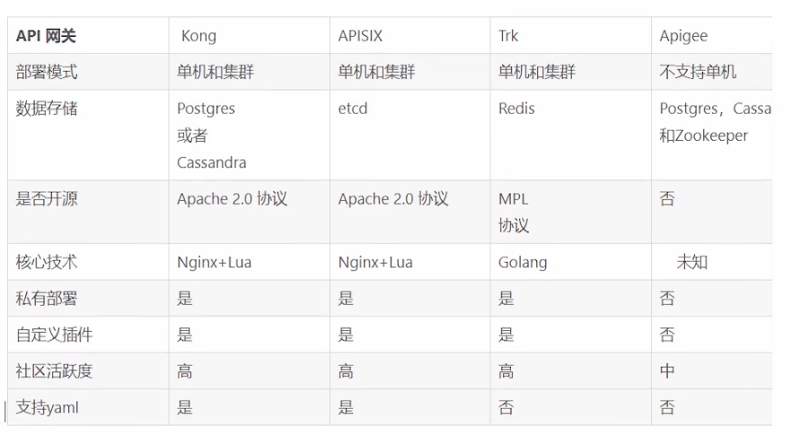

# 网关介绍

## api网关具备的功能

1. 服务路由
   * 动态路由
   * 负载均衡
2. 服务发现
3. 限流
4. 熔断、降级
5. 流量管理
   * 黑白名单
   * 反爬虫



[goku](https://github.com/eolinker/goku)

[manba](https://github.com/fagongzi/manba)

## kong安装

[文档](https://github.com/qianyugang/kong-docs-cn)

### 安装postgresql和migrations

````
docker run -d --name kong-database -p 5432:5432 -e "POSTGRES_USER=kong" -e "POSTGRES_DB=kong" -e "POSTGRES_PASSWORD=kong" postgres:12
````

`````
docker run --rm -e "KONG_DATABASE=postgres" -e "KONG_PG_HOST=192.168.2.57" -e "KONG_PG_PASSWORD=kong" -e "POSTGRES_USER=kong" -e "KONG_CASSANDRA_CONTACT_POINTS=kong-database" kong kong migrations bootstrap
`````

### 安装kong

[ubuntu安装文档](https://docs.konghq.com/install/ubuntu/)

`````
$ curl -Lo kong.2.4.1.amd64.deb "https://download.konghq.com/gateway-2.x-ubuntu-$(lsb_release -cs)/pool/all/k/kong/kong_2.4.1_amd64.deb"
$ sudo dpkg -i kong.2.4.1.amd64.deb

https://download.konghq.com/gateway-2.x-ubuntu-bionic/pool/all/k/kong/kong_2.4.1_amd64.deb
`````

* 关闭防火墙
* 重新启动docker服务

**进行配置**

````
cp /etc/kong/kong.conf.default /etc/kong/kong.conf
````

`````
database = postgres
pg_host = 192.168.2.57
pg_port = 5432
pg_timeout = 5000
pg_user = kong
pg_password = kong
pg_database = kong

# 以下需要单独添加
dns_resolver = 127.0.0.1:8600 # 这是为了集成consul的dns端口，默认是8600
admin_listen = 0.0.0.0:8001 reuseport backlog=16384, 0.0.0.0:8444 http2 ssl reuseport backlog=16384
proxy_listen = 0.0.0.0:8000 reuseport backlog=16384, 0.0.0.0:8443 http2 ssl reuseport backlog=16384
`````

**启动**

* `kong start -c /etc/kong/kong.conf `

````
firewall-cmd--zone=public --add-port=8001/tcp--permanent 
firewall-cmd--zone=public--add-port=8000/tcp--permanent 
sudo firewall-cmd --reload
````

访问：`http://192.168.2.57:8001/`

### 安装konga（图形化工具）

````
docker run -d -p 1337:1337 --name konga pantsel/konga
````

