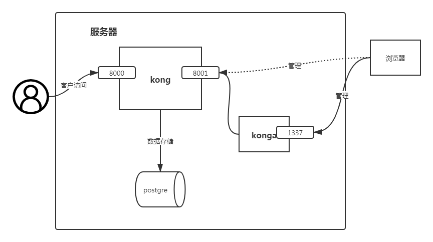

# kong的基本功能

## kong的8001、8000和1337端口号的关系

````
Kong Admin URL
http://192.168.2.57:8001
````

* 8001
  * `kong的管理端口`
* 8000
  * 用户访问
* 1337
  * konga地址



## 基本的路由转发配置

Service

顾名思义，就是我们自己定义的上游服务，通过Kong匹配到相应的请求要转发的地方，Service可以与下面的Route进行关联，一个Service可以有很多Route，匹配到的Route就会转发到Service中，当然中间也会通过Plugin的处理，增加或者减 少一些相应的Header或者其他信息。

Routes: 

​	Route路由相当于nginx配置中的location

​	Route实体定义匹配客户端请求的规则。每个路由都与一个服务相关联，而服务可能有多个与之相关联的路由。每一个匹配给定路线的请求都将被提交给它的相关服务。

​	路由和服务的组合(以及它们之间的关注点分离)提供了一种强大的路由机 制，可以在Kong中定义细粒度的入口点，从而引导您的访问到不同upstream服务。

## kong的service、routes、upstream的请求过程


## kong集成consul实现服务发现和负载均衡

在`DNS resolve`设置好的情况下，安装配置时有设置。

将service中的Host改为：`goods-web.service.consul`在consel中配置的信息，Port改为`80`

## kong配置jwt实现登录校验

### 通用认证

一般情况下, 上游API服务都需要客户端有身份认证, 且不允许错误的认证或无认证的请求通过。认证插件可以实 现这一需求。这些插件的通用方案/流程如下: 

1. 向一个API或全局添加AUTH插件(此插件不作用于consumers) ; 
2. 创建一个consumer对象; 
3. 为consumer提供指定的验证插件方案的身份验证凭据; 
4. 现在, 只要有请求进入Kong, 都将检查其提供的身份验证凭据(取决于auth类型) , 如果该请求无法被验证 或者验证失败,则请求会被锁定,不执行向上游服务转发的操作。 

但是, 上述的一般流程并不是总是有效的。譬如, 当使用了外部验证方案(比如LDAP) 时, KONG就不会(不需 要) 对consumer进行身份验证。 

### Consumers

最简单的理解和配置consumer的方式是, 将其于用户进行——映射, 即一个consumer代表一个用户(或应用) 。 但是对于KONG而言, 这些都无所谓。consumer的核心原则是你可以为其添加插件, 从而自定义他的请求行为。 所以, 或许你会有一个手机APP应用, 并为他的每个版本都定义一个consumer, 又或者你又一个应用或几个应 用, 并为这些应用定义统一个consumer, 这些都无所谓。这是一个模糊的概念, 他叫做consumer, 而不是user! 万万要区分开来,且不可混淆。

### 匿名验证

首先需要创建一个Service来做上有服务, 来匹配到相应的相应的转发的目的地, 一个Service可以由多个Route, 匹配到的Route都会转发给Service。 

Service可以是一个世纪的地址, 也可以是kong内部提供的upstream object 

**配置过程**

1. 新建一个`consumer`
2. 为这个`consmer`添加`jwt`
   * 需要记住key
3. 配置`plugins`
   * 添加一个`header names` 我们叫`x-token`
4. 到[jwt.io](https://jwt.io)生成一个token
   * 在payload中添加`iss` 即前面的key  和代码中的`Issuer`保持一致
   * `secret`也要和生成的保持一致

**注意:新建jwt的时候key必须和实际生成的token中的payload中的iss的值保持一致**

## 其他


