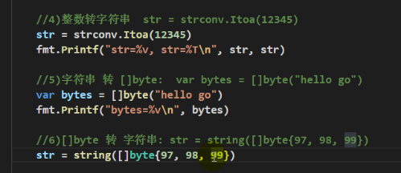

#  常用函数

## 字符串常用函数

* `len(str)`

  ````go
  func main()  {
  	str := "hello哈"
  	fmt.Printf("str len=%v \n", len(str))  //中文按3个字符长度
  }
  ````

* 字符串遍历同时处理中文乱码

  `````go
  func main()  {
  	str2 := "hello北京"
  	r := []rune(str2) // 测试这行不要的效果
  	for i := 0; i<len(r); i++ {
  		fmt.Printf("字符=%c \n", r[i])
  	}
  }
  `````

* 将字符串转整数

  ````go
  package main // 打包

  import (  // 引入包
  	"fmt"
  	"strconv"
  )

  func main()  {
  	// 字符串转整数
  	n, err := strconv.Atoi("123")
  	if err != nil {
  		fmt.Println("转换错误", err)
  	} else {
  		fmt.Println("转换的结果是", n)
  	}
  }
  ````

* 整数转字符串`str := strconv.Itoa(123456)`)

* 字符串转字节 `bytes:=[]byte("hello go")`

* 字节转字符串 `str := String([]byte{97, 98, 99})`

  

* 查找子字符串中是否有指定的字符串：

  ````go
  package main // 打包

  import (  // 引入包
  	"fmt"
  	"strings"
  )

  func main()  {
  	// 字符串转整数
  	b := strings.Contains("seafood", "foo")
  	fmt.Printf("b=%v \n", b)
  }
  ````

## 内置函数

* `len`长度计算

* `new`内存分配， 分配值类型

  `````go
  package main // 打包

  import (  // 引入包
  	"fmt"
  )

  func main()  {
  	num1 := 100
  	fmt.Printf("类型%T, 值%v, 地址%v\n", num1, num1, &num1)

  	num2 := new(int)
  	fmt.Printf("类型%T, 值%v, 地址%v, 指向的值%v \n", num2, num2, &num2, *num2)
  	*num2 = 100
  	fmt.Printf("类型%T, 值%v, 地址%v, 指向的值%v \n", num2, num2, &num2, *num2)
  }
  `````

* `make` 分配内存，分配引用类型

## 错误处理机制

````go
package main // 打包

import (  // 引入包
	"fmt"
)

func test()  {
	//使用defer + recover捕获和处理异常
	defer func() {
		err := recover() // recover()内置函数，可以捕获到异常
		if err != nil { //说明捕获到错误
			fmt.Println("error=", err)
		}
	}()
	1/0
}

func main()  {
	test()
}
````

## 自定义错误

`````go
package main // 打包

import (  // 引入包
	"fmt"
	"errors"
)

func readconf(name string) (err error) {
	if name == "config.ini" {
		return nil
	} else {
		return errors.New("读取文件错误")
	}
}

func test() {
	err := readconf("config.i2ni")
	if err != nil {
		panic(err) //终止程序
	}
	fmt.Println("test()继续执行")
}

func main()  {
	test()
}
`````

