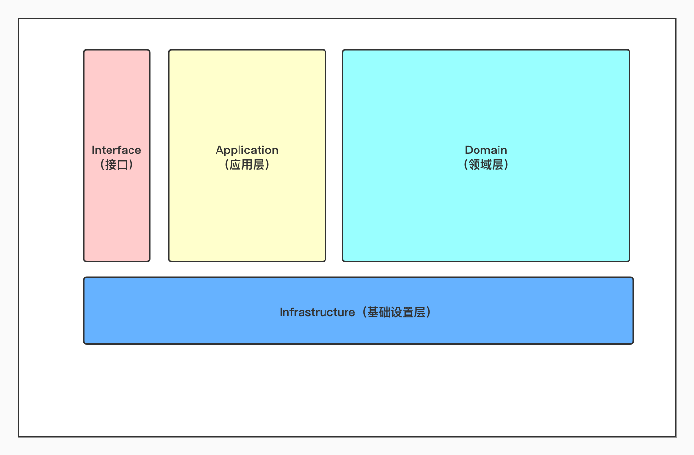
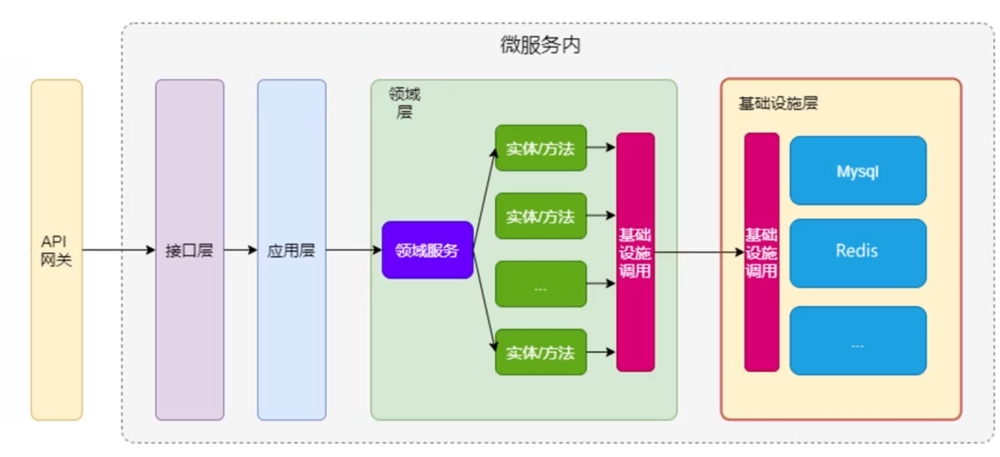
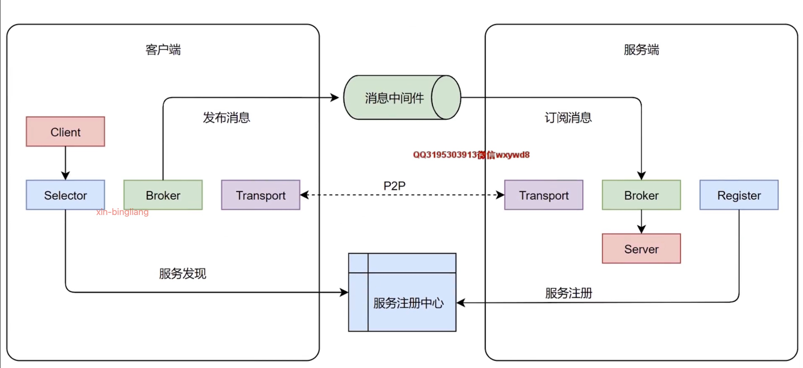

# Go微服务介绍与容器化入门

* 领域驱动设计（DDD）--（真正决定软件复杂性的是设计方法）
  * 领域：领域是有范围界线的，也可以说是有边界的
  * 核心域：核心域是业务系统的核心价值
  * 通用子域：所有子域的消费者，提供着通用的服务
  *  支持子域：专注于业务系统某一重要的业务    
* 康威定律：设计系统的组织其产生的设计等价于组织间的沟通结构。
  * 组织沟通方式会通过系统设计表达出来
  * 时间再多一件事情也不可能做的完美，但总有时间做完一件事情
  * 线型系统和线型组织架构间有潜在的异质同态特性
  * 大的系统组织总是比小系统更倾向于分解




变种



## 微服务的设计原则

* 领域驱动设计，而不是数据驱动设计，也不是界面驱动设计
* 边界清晰的微服务，而不是泥球小单体
* 职能清晰的分层，而不是什么都放到大箩筐
* 自己适用，而不过度拆分

## grpc

### 案例

*  `product.proto`

````
syntax = "proto3"; //版本号

package go.micro.server.product; //包名

service Product {//驼峰首字母大写 定义的服务
  rpc AddProduct(ProductInfo) returns (ResponseProduct){}
}

message ProductInfo{//为节省空间，一般不超过15个参数  消息格式
  int64 id = 1;
  string product_name = 2;
}

message ResponseProduct{
  int64 product_id = 1;
}
````

* Docker根据.proto文件生成微服务文件

  * `docker pull cap1573/cap-protoc`

* 运行

  * `docker run --rm -v $(PWD):$(PWD) -w $(PWD) -e ICODE=06E29A8E29787866  cap1573/cap-protoc -I ./ --go_out=./ --micro_out=./ ./*.proto`
  

## go-micro

* 用来构建和管理分布式程序的系统
* Runtime（运行时）：用来管理配置，认证，网络等
  * 是工具集，工具名称是“micro”
  * 官方docker版本：`docker pull micro/micro`
  * 课程扩展：`docker pull cap1573/cap-micro`
  * 组成部分：
    * api网关
    * broker：允许异步消息的消息代理
    * network：通过微网络服务构建多云网络
    * new：服务模版生成器
    * proxy：构建在go micro上的透明服务代理
    * registry：一个服务资源管理器
    * store：简单的存储状态
    * web：仪表盘允许浏览器上浏览服务
* Framework(程序开发框架)：用来方便的编写微服务
  * 对分布式系统的高度抽象
  * 提供分布式系统开发的核心库
  * 可插拔的架构，按需要使用
  * 组件
    * Registry（注册）：提供服务发现机制
    * selector（选择器）：能够实现负载均衡 
    * Transport（传输）：服务与服务之间的通信接口
    * Broker：提供异步消息的发布/订阅接口
    * Codec（编码）：消息传输到两段时编码解码
    * server（服务端）
    * client（客户端）
* Clients(多语言的客户端)：支持多语言访问服务端



## 实验

* proto文件

  ````protobuf
  syntax = "proto3";
  
  package go.micro.service.imooc;
  
  service Cap {
    rpc SayHello(SayRequest) returns (SayResponse){}
  }
  
  message SayRequest{
    string message = 1;
  }
  
  message SayResponse {
    string answer = 1;
  }
  ````

* ` docker run --rm -v $(PWD):$(PWD) -w $(PWD) -e ICODE=06E29A8E29787866  cap1573/cap-protoc -I ./ --go_out=./ --micro_out=./ ./proto/cap/*.proto`

* `go get github.com/micro/go-micro/v2`

* `server.go`

  ````go
  package main
  
  import (
  	"context"
  	"fmt"
  	"github.com/micro/go-micro/v2"
  	imooc "newmicro/proto/cap"
  )
  
  type CapServer struct{}
  
  func (c *CapServer) SayHello(ctx context.Context, req *imooc.SayRequest, res *imooc.SayResponse) error {
  	res.Answer = "我们的口号是什么：" + req.Message
  	return nil
  }
  
  func main() {
  	//创建新的服务
  	service := micro.NewService(
  		micro.Name("cap.imooc.server"), //注册到服务发现中，作为唯一到标志
  	)
  	// 初始化方法
  	service.Init()
  	//注册服务
  	imooc.RegisterCapHandler(service.Server(), new(CapServer))
  
  	// 运行服务
  	if err := service.Run(); err != nil {
  		fmt.Println(err)
  	}
  }
  ````

* `client.go`

```
package main

import (
	"context"
	"fmt"
	"github.com/micro/go-micro/v2"
	imooc "newmicro/proto/cap"
)

func main() {
	//创建服务
	server := micro.NewService(
		micro.Name("cap.imooc.client"),
	)
	//初始化
	server.Init()
	capImooc := imooc.NewCapService("cap.imooc.server", server.Client()) // 指定要访问的服务
	res, err := capImooc.SayHello(context.TODO(), &imooc.SayRequest{
		Message: "哈哈哈哈",
	})

	if err != nil {
		fmt.Println(err)
	}

	fmt.Println(res.Answer)
}

```

