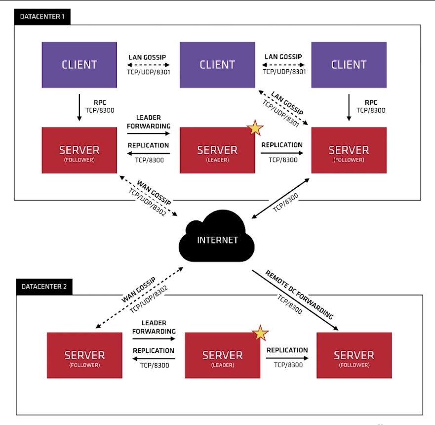
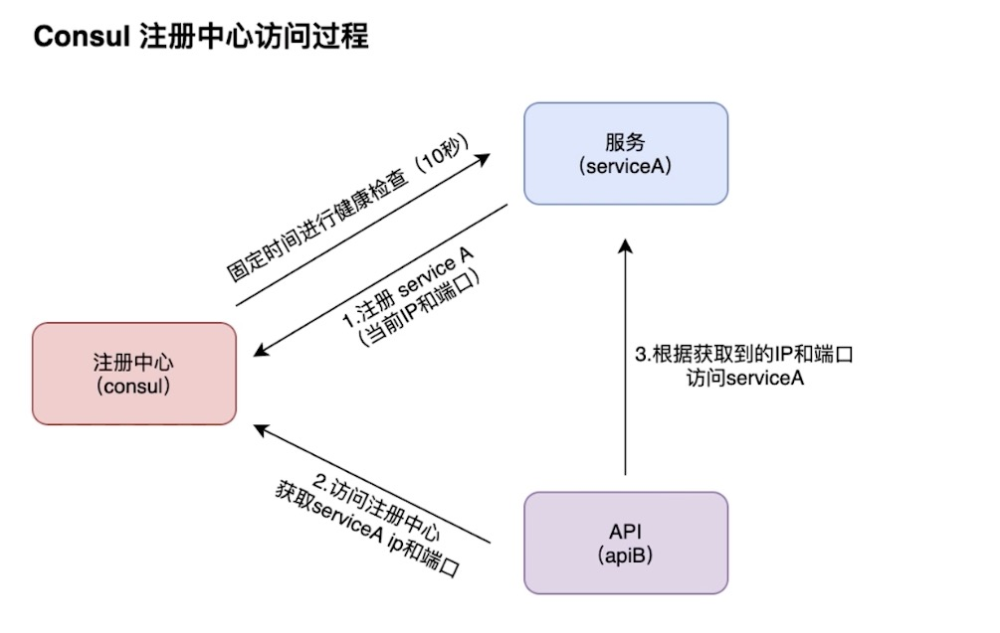

# 注册配置中心实现

## 注册中心Consul

### 介绍

* 是一种网络服务解决方案
* 提供具有服务发现，配置和分段功能的全面控制平面
* 简单的内置代理，开箱即用

### 注册中心Consul关键功能

* 服务发现：客户端可以注册服务，程序可以轻松找到它们所依赖的服务
* 运行状况的监测，Consul客户端可以提供任何数量的运行状况监测
* kv存储：应用程序可以将Consul的层级键/值存储用于任何目的，包括动态配置，功能标记，协调，领导者选举等
* 安全的服务通信：Consul可以为服务生成和分发TLS证书，建立相互的TLS链接
* 多数据中心：Consul支持多个数据中心

### Consul集群多架构



#### 两个重要的协议

* Gossip Protocol（八卦协议）
  * 局域网池（LAN Pool）
    * 让client自动发现Server节点，减少所需要的配置量
    * 分布式故障检测在某几个server机上执行
    * 能够用来快速的广播事件
  * 广域网池（WAN Pool）
    * WAN Pool全局唯一
    * 不同数据中心的server都会加入Wan Pool
    * 允许服务器执行跨数据中心的请求
* Raft Protocol （选举协议）



## 安装consul

* `docker pull cap1573/consul`
* `docker run -d -p 8500:8500 cap1573/consul`

## 分类开发

### 分类模块的建立

* `docker run --rm -v $(pwd):$(pwd) -w $(pwd) -e ICODE=06E29A8E29787866  cap1573/cap-micro new git.imooc.com/xinneirong/category`

### 分类模块代码的开发

略

* 使用`make proto`

### 分类模块接入注册中心和配置中心

* `go get github.com/micro/go-plugins/config/source/consul/v2` 配置中心
* `go get github.com/micro/go-plugins/registry/consul/v2` 注册中心
* `go get github.com/micro/go-micro/v2/registry`

----

`http://127.0.0.1:8500/ui/dc1/services`

* 新增一个key/value

  * `micro/config/mysql`

    ````
    {
      "host": "127.0.0.1",
      "user": "root",
      "password": "123456",
      "database": "micro",
      "port":3306
    }
    ````

    

