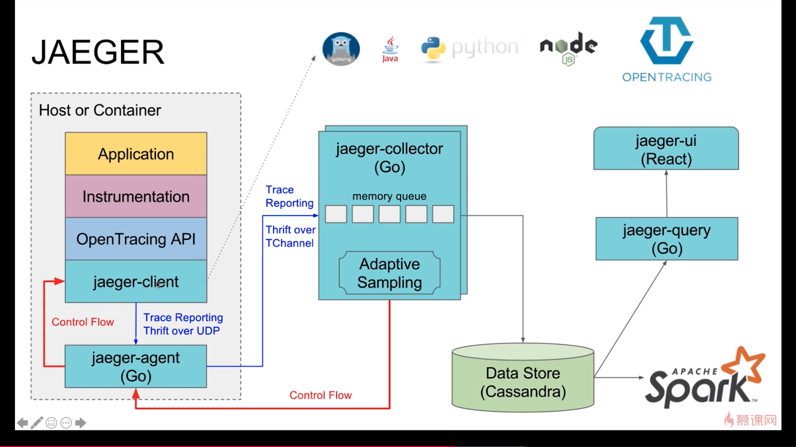
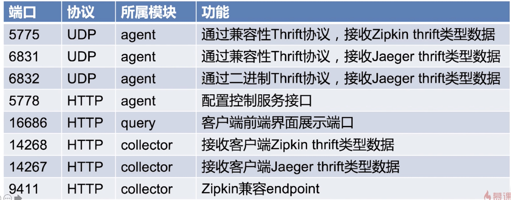

# 链路追踪

## 链路追踪作用与特性

* 高扩展性
* 原生支持OpenTracing
* 可观察性

## 链路追踪的jaeger术语，原理，组件，安装

### jaeger术语

* span：
  * jaeger中的逻辑工作单元
  * 具有操作名称，操作开始时间和持续时间
  * 跨度可以嵌套并排序以建立因果关系模型
  * Operation name：操作名称（也可以称作span name）
  * Start timestamp：开始时间
  * Finish timestamp：结束时间
  * span tag：一组键值对构成的span标签集合
  * span log：一组span日志集合
  * spanContext：上下文
  * References（span间的关系）：相关的零个或多个span

### 调用原理

### 组件

* Jaeger-client(客户端库)
* Agent（客户端代理）
* Collector（数据收集处理）
* Data Store（数据存储）
* UI（数据查询与前端界面展示  ）

### 端口

## 安装

* `docker pull cap1573/jaeger`
* `docker run -d --name jaeger -p 6831:6831/udp -p 16686:16686 cap1573/jaeger`

## 在代码中使用链路追踪jaeger

* `go get github.com/opentracing/opentracing-go`
* `go get github.com/uber/jaeger-client-go`
* `go get github.com/micro/go-plugins/wrapper/trace/opentracing/v2`