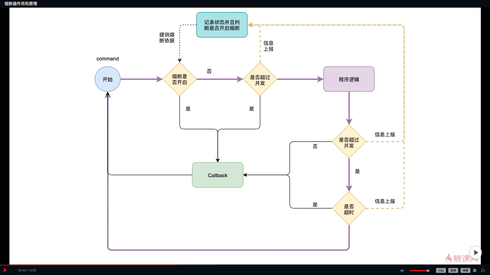
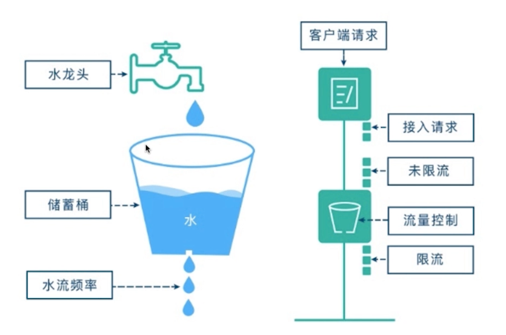
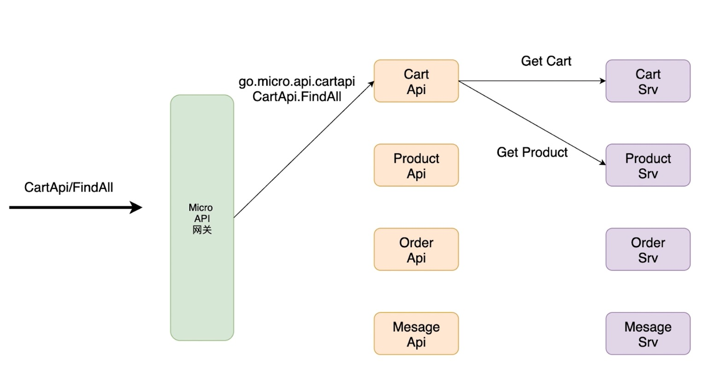

# 熔断、限流、负载均衡

熔断（客户端）、限流（服务端）、负载均衡（客户端）

## 熔断（hystrix-go）

为防止微服务中的服务雪崩效应

### 微服务熔断的（hystrix-go）目标

* 组织故障的连锁反应
* 快速失败并 迅速恢复
* 回退并优雅的降级
* 提供近实时的监控与警告

### 使用过程中的一些原则

* 防止任何单独的依赖耗尽资源（线程）
* 过载立即切断并快速失败，防止排队
* 尽可能提供回退的机制以保护用户免受故障
* 通过近实时的指标，监控和警告，确保故障呗及时发现

### （hystrix-go）熔断器的状态

* CLOSED关闭状态：允许流量通过
* OPEN打开状态：不允许流量通过，即处于降级状态，走降级逻辑
* HALF_OPEN半开状态：允许某些流量通过，如果出现超时、异常等情况，将进入OPEN状态，如果成功，那么将进入CLOSED状态

### 配置参数

* Timeout：执行Command的超时时间，默认时间是1000毫秒
* MaxConcurrentRequests：最大并发量，默认值是10
* SleepWindow：熔断打开后多久进行再次尝试，默认是5000毫秒
* RequestVolumeThreshold：10秒内的请求量，默认值20，判断是否熔断
* ErrorPercentThreshold：熔断百分比，默认值为50%，超过启动熔断

### 计数器

* 每一个Command都会有一个默认统计控制器 
* 默认的统计控制器Default Metric Collector 
* 保存熔断器的所有状态，调用次数，失败次数，被拒绝次数等信息

### Hystrix原理

### Docker安装Hystrix控制面板

* `docker pull cap1573/hystrix-dashboard`
* `docker run -d -p 9002:9002 cap1573/hystrix-dashboard`

## 限流

### （uber/limit）作用

* 限制流量在服务端生效
* 保护后端服务
* 与熔断互补

### 原理（uber/limit）漏桶算法

## 负载均衡

### 作用

* 提高系统的扩展性
* 支持HTTP、HTTPS、TCP、UDP请求
* 循环算法/随机算法

## 微服务API网关介绍

* Micro api网关
* 聚合业务层
* 基础服务层

## 熔断、限流、负载均衡代码实现

* `docker run --rm -v $(PWD):$(PWD) -w $(PWD) -e ICODE=06E29A8E29787866 cap1573/cap-micro new git.imooc.com/xinneirong/cart `服务端
* 