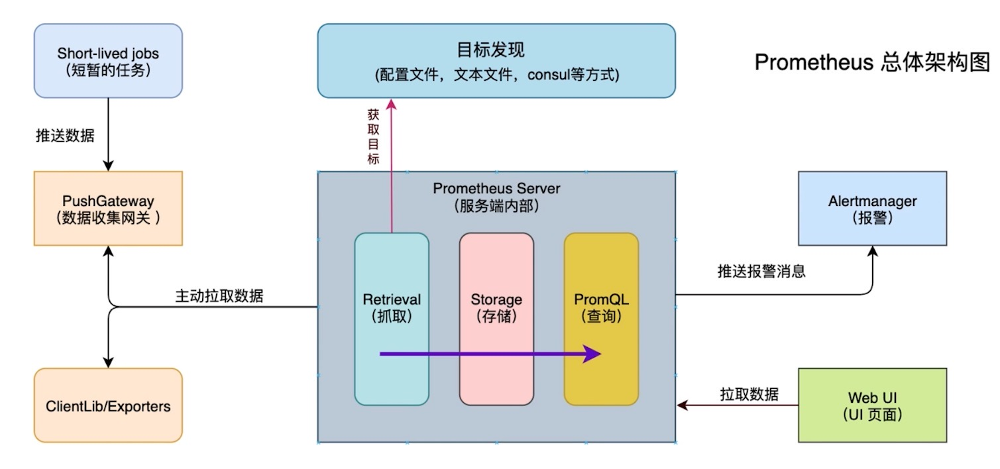

# 性能监控

## 基本

### 基本概念

* 监控、报警、时序数据库

### 原理

* http协议周期抓取

#### 组件

* `Prometheus Server:` 用于收集和存储时间序列数据
* `client Library:` 客户端库组相应的metrics并暴露给`Prometheusser`
* `Push Gateway:` 主要用于短期jobs
* `Exporters:`用于暴露已有的第三方服务的`metrics`给`Prometheus`
* `Alertmanager`：从`Prometheus server`端接收到alerts后， 会进行 去除重复，分组，并路由到对收的接受方式，发出报警

#### 微服务监控系统pro met hues 相关概念-metric(指标) )类型 Counter类型

* Counter类型： 种累加的指标，如：请求的个数，出现的错误数等
* Gauge类型：可 以任意加减，如：温度，运行的goroutines的个数
* Histogram 类型 可以对观察结果采样，分组及统计，如：柱状图
* Summary:提供观测count和sum功能，如：请求持续时间

#### 微服务监控系统promethues相 关概念-instance和jobs

*  instance ：一个单独监控的目标 -般对应于一个进程。 
* jobs：一组同种类型的instances( 主要用于保证可扩展性和可靠性)

#### 微服务监控系统 grafana 看板 

* 拥有丰富dashboard和图表编辑的指标分析平台 
* 拥有自己的权限管理和用户管理系统 
* Grafana更适合用于数据可视化展示

### 安装

* `docker pull cap1573/promethues-grafana`
* `docker run -d -p 9090:9090 -p 9100:9100 -p 30000:3000 cap1573/promethues-grafana`

## 订单相关

* `docker run --rm -v $(pwd):$(pwd) -w $(pwd) -e ICODE=06E29A8E29787866  cap1573/cap-micro new git.imooc.com/xinneirong/order`

