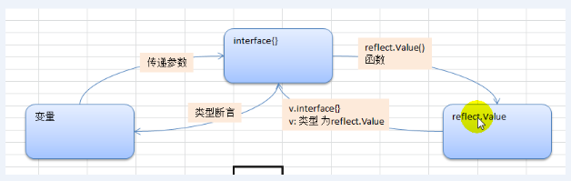

# 反射



基本介绍 

1. 反射可以在运行时动态获取变量的各种信息，比如变量的类型，类别 
2. 如果是结构体变量，还可以获取到结构体本身的信息(包括结构体的字段、方法) 
3. 通过反射，可以修改变量的值，可以调用关联的方法。 
4. 使用反射， 需要import(“reflect")

反射重要的函数和概念 

1. `reflect.TypeOf`(变量名) ， 获取变量的类型， 返回`reflect.Type`类型 
2. `reflect.ValueOf`(变量名) ， 获取变量的值， 返回`reflect.Value`类型`reflect.Value`是一个结构体类型。 通过`reflect.Value`， 可以获取到关于该变量的很多信息。
3. 变量、`interface{}`和`reflect.Value`是可以相互转换的， 这点在实际开发中， 会经常使用到。

## 简单操作

````go
package main

import (
	"fmt"
	"reflect"
)

func reflectTest(b interface{})  { //为了对任何数据类型接受
	//通过反射获得传入变量的type 和 kind 值
	//1. 先获取到reflect.Type
	rTyp := reflect.TypeOf(b)
	fmt.Println(rTyp) // int

	//2. 获取到reflect.value
	rVal := reflect.ValueOf(b)
	fmt.Println(rVal) //这个不是普通100， 而是reflect.int
	fmt.Printf("%T", rVal) //真实类型 reflect.Value

	n2 := 2 + rVal.Int()
	fmt.Println(n2)

	//3. 将rVal 转interface{}
	iv := rVal.Interface()
	//将interface{}通过断言转成需要的类型
	num2 := iv.(int)
	fmt.Println("num2", num2)
}

func main() {
	var num int = 100
	reflectTest(num)
}
````

### 结构体

````go
package main

import (
	"fmt"
	"reflect"
)

type Student struct {
	Name string
	Age  int
}

func reflectTest(b interface{}) { //为了对任何数据类型接受
	//通过反射获得传入变量的type 和 kind 值
	//1. 先获取到reflect.Type
	rTyp := reflect.TypeOf(b)
	fmt.Println(rTyp) // int

	//2. 获取到reflect.value
	rVal := reflect.ValueOf(b)
	//fmt.Println(rVal) //这个不是普通100， 而是reflect.int
	//fmt.Printf("%T\n", rVal) //真实类型 reflect.Value

	//3.获取变量对应的kind
	t1 := rVal.Kind()
	fmt.Println(t1)
	t2 := rTyp.Kind()
	fmt.Println(t2)

	//3. 将rVal 转interface{}
	iv := rVal.Interface()
	fmt.Printf("iv=%v iv=%T\n", iv, iv) //iv={Tom 21} iv=main.Student
	stu, ok := iv.(Student)
	if ok {
		fmt.Println(stu.Name)
	}
}

func main() {
	stu := Student{
		Name: "Tom",
		Age:  21,
	}
	reflectTest(stu)
}
````

## 细节说明

1. `reflect.Value.kind`获取变量的类别，返回一个常量

2. Type是类型，Kind是类别，返回值可能相同

3. 通过反射可以使变量和`interface{}`与`Reflect.Value`之间相互切换

4. 使用反射的方式获取变量的值（并返回对应的类型），要求数据类型匹配，比如x是int。那么就应该使用`reflect.Value(x).Int()`

5. 使用反射修改变量

   `````go
   package main

   import (
   	"fmt"
   	"reflect"
   )

   func reflect01(b interface{})  {
   	//获取reflect.Value
   	rVal := reflect.ValueOf(b)
   	fmt.Println(rVal.Kind()) // ptr

   	rVal.Elem().SetInt(120)
   }

   func main() {
   	var num int = 10
   	reflect01(&num)
   	fmt.Println(num)
   }
   `````

## 实践

反射遍历结构体字段，调用结构体方法，获取结构体标签

``````go
package main

import (
	"fmt"
	"reflect"
)

type Monster struct {
	Name  string `json:"name"`
	Age   int    `json:"age"`
	Score float32
	Sex   string
}

func (s Monster) Print() {
	fmt.Println("----start----")
	fmt.Println(s)
	fmt.Println("---end---")
}
func (s Monster) GetSum(n1, n2 int) int {
	return n1 + n2
}

func (s Monster) set(name string, age int, score float32, sex string)  {
	s.Name = name
	s.Age = age
	s.Score = score
	s.Sex = sex
}

func TestStruct(a interface{})  {
	//获取reflect.Type类型
	typ := reflect.TypeOf(a)
	//获取reflect.Value类型
	val := reflect.ValueOf(a)
	//获取对应的类别
	kd := val.Kind()
	//类型判断，必须是结构体
	if kd != reflect.Struct {
		fmt.Println("expect struct")
		return
	}
	// 1获取结构体中的字段数
	num := val.NumField()
	fmt.Printf("struct has %d fields\n", num)
	for i:=0; i< num;i++ {
		fmt.Printf("Field %d:值为=%v\n", i, val.Field(i))
		//获取到struct标签，注意reflect.Type获取tag标签的值
		tagVal := typ.Field(i).Tag.Get("json")
		if tagVal != "" {
			fmt.Printf("Field %d:tag为=%v\n",i, tagVal)
		}
	}
	//获得方法数量
	numofMethod := val.NumMethod()
	fmt.Printf("struct has %d methods\n", numofMethod)
	val.Method(1).Call(nil) //获取第二个方法，按函数名排序

	//调用结构体第一个方法Methods(0)
	var params []reflect.Value //声明切片
	params = append(params, reflect.ValueOf(10))
	params = append(params, reflect.ValueOf(40))
	res := val.Method(0).Call(params) //传入参数参数是 []reflect.Value，返回[]reflect.Value
	fmt.Println("res=", res[0].Int()) //返回结果 []reflect.value
}

func main() {
	var a Monster = Monster{
		Name: "黄鼠狼",
		Age: 400,
		Score: 38.12,
	}
	TestStruct(a)
}
``````


