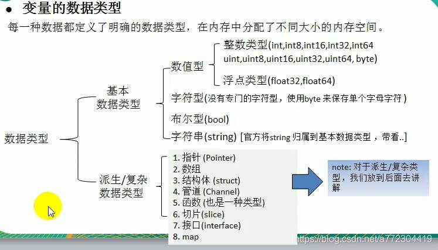

# 基础

`````go
package main //表示改文件所在包

import "fmt" //表示引入包
func main()  { //
	fmt.Println("Hello world!")
}
`````

* `go build main.go` 编译
* `go run main.go` 临时执行


## 规范

* `gofmt -w xx.go` 格式化代码
* 使用行注释注释代码

## 变量

````go
package main

import "fmt"
func main()  { 
	var i int  //声明
	i = 10 //赋值
	fmt.Println("i=", i) //使用
}
````

1. 指定变量类型，声明后不赋值，使用默认值

   `````go
   package main

   import "fmt"
   func main()  { 
   	var i int //int默认值为0
   	fmt.Println("i=", i)
   }
   `````


2. 根据值自行判断变量类型

   ````go
   package main

   import "fmt"
   func main()  { 
   	var i = 10.1
   	// i = "hahah"
   	fmt.Println(i)
   }
   ````

3. 省略var

   `````go
   package main

   import "fmt"
   func main()  { 
   	i := 100
   }
   `````

## 多变量声明

* 一次性声明多个变量

  `````go
  package main

  import "fmt"
  func main()  {
  	var n1, n2, n3 int
  }
  `````

* 一次性声明多个变量并类型不同

  ````go
  package main

  import "fmt"
  func main()  {
  	var n1, name, n3 = 100, "xin", 888
  }
  ````

* 使用类型推导

  `````go
  package main

  import "fmt"
  func main()  {
  	n1, name, n3 := 100, "xin", 888
  }
  `````

* 另外的做法

  ````go
  package main
  import "fmt"

  var n1 = 100
  var n2 = 200
  var name = "xin"

  var (
  	n3 = 100
  	n4 = 200
  )

  func main()  {
  	fmt.Println("n1=", n1, "n2=", n2, "name=", name)
  }
  ````

## 数据类型



### 整数

```` go
package main
// import "fmt"
// import "unsafe"
import (
	"fmt"
)

func main()  {
	var i int = 1
	fmt.Println("i=", i)

	var j int8 = 127
	fmt.Println("j=", j)

	var a int = 8900
	fmt.Println("a=", a)
	var b uint = 1
	var c byte = 255
	fmt.Println("b=", b, "c=", c)

	var n1 = 100
	fmt.Printf("n1 的类型 %T\n", n1) //输出类型
}
````

### 浮点数

* 浮点数都是有符号的，均存在精度丢失
* 默认使用float64

````go
package main

import (
	"fmt"
)

func main()  {
	var price float32 = 8989.12
	fmt.Println("price=", price)
}
````

* 单精度float32
* 双精度float64


## 字符类型

* 没有专门的字符类型，单个字符一般用byte保存

  `````go
  package main

  import (
  	"fmt"
  )

  func main()  {
  	var c1 byte = 'a'  // 注意使用的''
  	var c2 byte = '0'
  	fmt.Println("c1 =", c1)
  	fmt.Println("c2 =", c2)
  	fmt.Printf("c2 =%c", c2)

  	var c3 int = '北'  // 不在ASCII中的字符
  	fmt.Printf("c3 =%c  对应码值=%d", c3, c3)

  }
  `````

## bool

* true false

````go
package main

import (
	"fmt"
	"unsafe"
)

func main()  {
	var b = false

	fmt.Println("b=", b)
	fmt.Println("b 的占用空间 =", unsafe.Sizeof(b))
}
````

## 字符串

`````go
package main

import (
	"fmt"
)

func main()  {
	var address string = "林绍宝"
	fmt.Println(address)

	// address[0] = 'a' //字符串是不可变类型

	str2 := "abc\ndef"
	str3 := `abc\ndef`
	fmt.Println(str2)
	fmt.Println(str3)
}
`````

* 双引号，会识别转义字符
* 反引号，会以字符串的原生形式输出

## 基本数据默认值

| 数据类型 |  默认值  |
| :--: | :---: |
|  整型  |   0   |
| 浮点型  |   0   |
| 字符串型 |  “”   |
| 布尔类型 | false |

## 类型转换

只允许显示转换，不能自动转换

````go
package main

import (
	"fmt"
)

func main()  {
	var i int32 = 1
	var f1 float32 = float32(i)
	fmt.Printf("f1=%v", f1)
}
````

* 原变量数据类型不变

* 不同类型相加会报错，不允许隐式转化

  `````go
  package main

  import (
  	_ "fmt"
  )

  func main()  {
  	var i int32 = 1
  	var j int64 = 100
  	i = i + j  //会报错
  	i = i + int32(j)  //报错
  }
  `````

### String的转换

#### 其他类型转string

1. `fmt.Sprintf("%参数"， 表达式)`

   `````go
   package main

   import (
   	"fmt"
   )

   func main()  {
   	var num1 int = 99
   	var num2 float64 = 23.434
   	var b bool = true
   	var mychar byte = 'h'
   	var str string
     	str = fmt.Sprintf("%d", num1)
      	fmt.Printf("type %T str=%v", str, str)
      	fmt.Println()
      	str = fmt.Sprintf("%f", num2)
      	fmt.Printf("type %T str=%v", str, str)
     
      	fmt.Println()
      	str = fmt.Sprintf("%t", b)
      	fmt.Printf("type %T str=%q", str, str)
      	fmt.Println()
     
      	str = fmt.Sprintf("%c", mychar)
      	fmt.Printf("type %T str=%q", str, str)
      	fmt.Println()
   }
   `````


2. `strconv`包

   `````go
   package main

   import (
   	"fmt"
   	"strconv"
   )

   func main()  {
   	var num1 int = 99
   	var num2 float64 = 23.434
   	var b bool = true
   	// var mychar byte = 'h'
   	var str string

   	str = strconv.FormatInt(int64(num1), 10)
   	fmt.Printf("type %T str=%v\n", str, str)

   	str = strconv.FormatFloat(num2, 'f', 10, 64)
   	fmt.Printf("type %T str=%v\n", str, str)

   	str = strconv.FormatBool(b)
   	fmt.Printf("type %T str=%v\n", str, str)
   }
   `````

#### string转其他类型

`strconv`包

`````go
package main

import (
	"fmt"
	"strconv"
)

func main()  {
	var str string = "true"
	var b bool

	b , _ = strconv.ParseBool(str)
	fmt.Printf("type %T  b=%v", b,b)

	var str2 string = "12121200"
	var n1 int64
	var n2 int

	n1 , _ = strconv.ParseInt(str2, 10, 64)
	n2 = int(n1)
	fmt.Printf("type %T  n1=%v", n1,n1)
	fmt.Printf("type %T  n2=%v", n2,n2)

	var str3 string = "12.232"
	var f1 float64
	f1, _ = strconv.ParseFloat(str3, 64)
	fmt.Printf("type %T  f1=%v", f1,f1)
}
`````

* 当无效转换时会转换为默认值

## 指针

````go
package main

import "fmt"

func main()  {
	var i int = 10
	fmt.Println(&i)  // 使用&变量的地址

	//指针在内存中存在的形式
	// 1. ptr为指针变量
	// 2. ptr 的类型为*int
	// 3. ptr 本身的值为&i
	var ptr *int = &i //取地址
	fmt.Printf("ptr=%v\n", ptr)
	fmt.Printf("ptr的地址为：%v\n", &ptr)

	// 获取指针指向的值使用*
	fmt.Printf("ptr的值=%v", *ptr)
}
````

## 值类型和引用类型

* 值类型：基本数据类型，int系列，float系列，string、数组和结构体struct
  * 值类型：变量直接存储值，内存通常在栈中分配
* 引用类型：指针、slice切片、map、管道chan、interface等都是引用类型
  * 引用类型：变量存储的是一个地址，这个地址对应空间才真正存储数据（值）

## 标识符

* 下换线`_`本身在go中是一个特殊的标志符，称为空标识符，可以代表任何其他的标识符，但是他对应的值会被忽略，所以仅能被作为占位符使用，不能作为标识符
* 包名：保持包名和目录名一致
* 包内资源首字母大写公开，小写内部私有。

## 算数运算符

* `i++` 只能独立使用

## 分支结构

````
package main

import (
	"fmt"
)

func main()  {
	age := 18

	if age >= 18{
		fmt.Println("已经成年")
	}
}
````

## for循环

```go
package main

import (
	"fmt"
)

func main()  {
	// 第一种循环
	for i := 1; i<= 10; i++ {
		fmt.Println("1.测试 ", i)
	}

	// 第二种循环
	j := 1
	for j <= 10 {
		fmt.Println("2.测试 ", j)
		j++
	}

	// 死循环
	// for {
	// 	fmt.Println("死循环")
	// }

	// 第三种写法
	k := 1
	for {
		if k <= 10 {
			fmt.Println("ok~")
		} else {
			break
		}
		k++
	}
}
```

### for-range

````go
package main

import (
	"fmt"
)

func main()  {
	// 方式1-字符串遍历
	var  str string = "hello, world!"
	for i := 0; i < len(str); i++ {
		fmt.Printf("%c", str[i])
	}

	// 方式2-字符串遍历
	for index, val := range str {
		fmt.Printf("index=%d, val=%c\n", index, val)
	}
}
````


