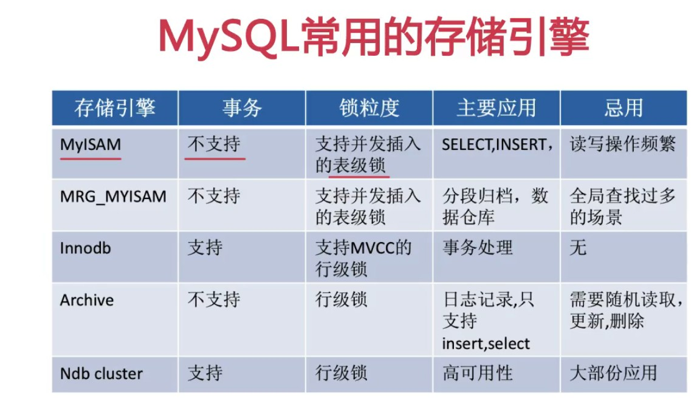
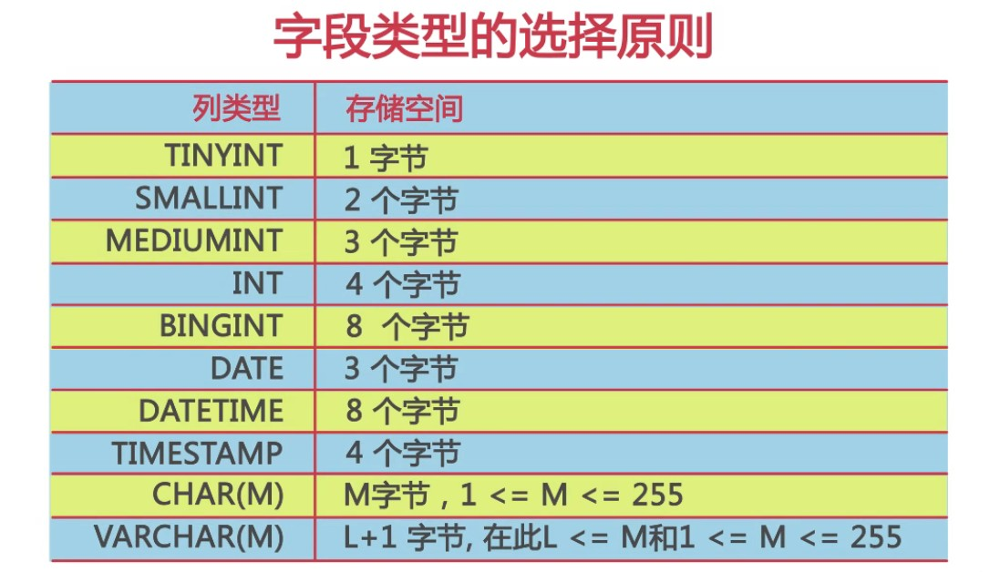
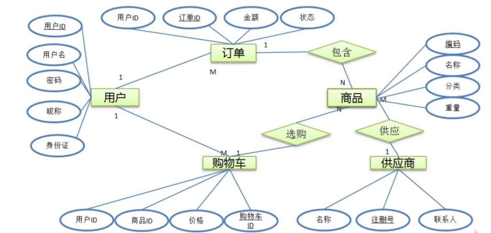

# 数据库设计

## 设计步骤

* 需求分析
  * 实体
  * 实体属性和特点
* 逻辑设计
* 物理设计
* 维护优化

## 需求分析

### 简单电商

- 用户模块

  用户名、密码、电话、邮箱、身份证号、姓名、昵称

- 商品模块

  商品编码、商品名称、商品描述、商品类别、供应商名称、重量、有效期、价格

- 订单模块

  订单号码、用户名、用户电话、收货地址、商品编号、商品名称、数量、价格、订单状态、支付状态、订单类

- 购物车模块

  和上表类似

- 供应商模块

  供应商编号、供应商名称、联系人、电话、营业执照、地址、法人

- 弄清模块之间的关系

## 物理设计

1. 选择合适的数据库管理系统

   

2. 定义数据库、表及字段的命名规范

   - 大小写类增加可读性
   - 名称表意
   - 不要使用缩写

3. 选择适合的字段类型

   

   * 优先考虑数字类型，其次日期二进制，最后字符串
   * 相同级别，使用占用空间小的
   * 字符处理比数字慢
   * 列长度越小，越有利于性能的提升
   * char>varchar，小于50Byte使用char，列很少使用可以考虑`varchar`，大于`50Byte`不要使用char，`utf8`每个字符三个字节，>15字符使用`varchar`
   * `decimals`用于精确数据存储，而float用于非精确，float空间开销更小
   * 当时间类型很少被查询建议使用时间类型

4. 注意

   * 主键的选择

     1. 区别业务主键和数据主键

        业务主键用来标识业务数据，进行表和表之间的关联，

        数据库的主键为了优化数据存储(Innodb会生成6个字节的隐含主键)

        数据库主键尽量使用自增

     2. 跟数据库的类型，考虑主键是否要顺序增长

        有些数据库是按主键的顺序逻辑存储的

     3. 主键的字段类型所占空间尽可能小

        对于使用聚集索引方式存储的表，每一个索引后都会附加主键信息

   * 避免使用外键

     1. 降低数据导入的效率
     2. 增加维护的成本
     3. 虽然不建议使用外键约束，但是相关连的列上一定要建立索引

   * 避免使用触发器

     1. 降低数据导入的效率
     2. 可能导致意想不到的数据异常
     3. 使业务逻辑变的复杂

   * 预留字段

     1. 无法准确的知道预留字段的类型
     2. 无法准确知道预留字段所存储的内容
     3. 后期维护预留字段所要的成本，同增加一个字段所需要的成本是相同的
     4. 严禁使用预留字段

5. 反范式化（空间换时间）

## 维护优化

1. 维护数据字典
2. 维护索引
   - 出现在Where从句GROUP BY从句ORDER BY从句中的列
   - 可选择性高的列要放到索引的前面
   - 索引中不要包括太长的数据类型
3. 维护表结构
   - 数据结构修改后要修改数据字典
   - 控制表的宽度和大小
   - 少使用select * 
   - 控制用户自定义函数
   - 不要使用全文索引
4. 在适当的时候对表进行水平拆分和垂直拆分
   - 垂直拆分
     - 经常在一起查询的列放在一起
     - text，blob等大字段拆分到附加表中
   - 水平拆分
     - 主键Hash key 

*******

## 名词解释

- 关系：一个关系对应通常所说的一张表
- 元组：表中的一行即为一个元组
- 属性：表中的一列即为一个属性；每一个属性都有一个名称为属性名称
- 候选码：表中的某个属性组，它可以唯一确定一个元组
- 主码：一个关系有多个候选码，选定其中一个为主码
- 域：属性的取值范围
- 分量：元组中一个属性值

## ER图说明

- 矩形：表示实体集，矩形内写实体集的名称
- 菱形：表示联系集
- 椭圆：表示实体的属性
- 线段：将属性连接到实体集，或将实体集连接到联系集

下划线表示主键

## 数据库设计范式

### 第一范式

数据库中表的所有字段都是单一的属性，不可再分，这个单一的属性是由基本的数据类型构成的，如整数、浮点数、字符串等，表是二维的

### 第二范式

数据库的表中不存在非关键字段对任意候选关键字段的部分函数依赖。

部分函数依赖是指存在着组合关字中的某一关键字决定非关键的情况。

所有关键字段的表都符合第二范式

其他字段和表中组合关键字的某一字段存在依赖就不符合

供应商和供应商电话依赖

### 第三范式

如果数据表中不存在非关键字段，对任意候选关键字段的传递函数依赖则符合第三范式

(商品名称)->(分类)->(分类描述)，存在字段间的传递依赖便不符合第三范式

### BC范式

在第三范式的基础上，数据库表中如果存在任何字段对任一候选关键字段的传递函数依赖复合BC范式

如果是复合关键字，则复合关键字之间也不能存在函数的依赖关系

