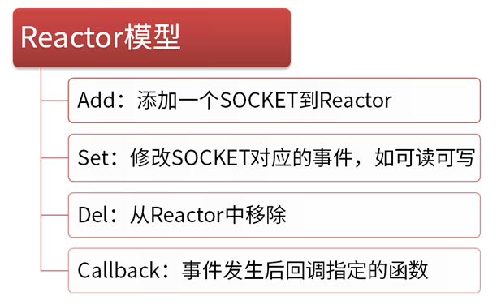

# PHP-socket

## 协议族


Socket其实就是一个门面模式，它把复杂的TCP/IP协议族隐藏在Socket接口后面，对用户来说，一组简单的接口就是全部，让Socket去组织数据，以符合指定的协议。

## 服务端和客户端之间的关系


服务器端先初始化Socket，然后与端口绑定(bind)，对端口进行监听(listen)，调用accept阻塞，等待客户端连接。在这时如果有个客户端初始化一个Socket，然后连接服务器(connect)，如果连接成功，这时客户端与服务器端的连接就建立了。客户端发送数据请求，服务器端接收请求并处理请求，然后把回应数据发送给客户端，客户端读取数据，最后关闭连接，一次交互结束。


## PHP socket扩展

### 服务端

```php
//确保连接永远不会超时
set_time_limit(0);
//设置IP和端口
$address = "127.0.0.1";
$port = "2016";

/*
 * 创建一个socket
 * AF_INET是IPV4 如果使用IPV6则参数是AF_INET6
 * socket_stream为socket的tcp类型，如果是UDP则使用socket_DGRAM
 * */
$socket = socket_create(AF_INET, SOCK_STREAM, SOL_TCP) or
die("socket_create()失败的原因是:".socket_strerror(socket_last_error())."\n");

//阻塞模式
socket_set_block($socket) or
die("socket_set_block()失败的原因是:".socket_strerror(socket_last_error())."\n");

//绑定到socket端口
$result = socket_bind($socket, $address, $port) or
die("socket_bind()失败的原因是：".socket_strerror(socket_last_error())."\n");

//开始监听
$result = socket_listen($socket, 4) or
die("socket_listen()失败的原因是:".socket_strerror(socket_last_error())."\n");

echo "OK\nBinding the socket on {$address}:{$port}....";
echo "OK\nNow readyc to accept connections.\nListening on the socket ...\n";

do {
    //接受连接请求,并调用一个子连接socket来处理客户端和服务器之间的信息
    $msgsocket = socket_accept($socket) or
    die("socket_accept() failed: reason:".socket_strerror(socket_last_error())."\n");

    //读取客户端的数据
    echo "Read client data\n";
    //socket_read函数会一直读取客户端数据，直到遇见\n，\t或者\0字符，php脚本把这写字符看作是输入的结束符
    $buf = socket_read($msgsocket, 8192);
    echo "Received msg: $buf \n";

    //数据传送 向客户端写入返回结果
    $msg = "welcome \n";
    socket_write($msgsocket, $msg, strlen($msg)) or die("socket_write() failed: reason:".socket_strerror(socket_last_error())."\n");
    //一旦输出被返回到客户端，父/子socket都应通过socket_close($msgsock)函数来终止
    socket_close($socket);

} while(true);

socket_close($socket);
```

```php
//使用协议类型
$commonProtocol = getprotobyname("tcp");

//创建一个socket，并返回一个socket资源类型
$socket = socket_create(AF_INET, SOCK_STREAM, $commonProtocol);
//将socket绑定到一个IP和某个端口上
socket_bind($socket, "localhost", 2016);
//监听所有的连接
socket_listen($socket);
```

```php
//使用协议类型
$commonProtocol = getprotobyname("tcp");

//创建一个socket，并返回一个socket资源类型
$socket = socket_create(AF_INET, SOCK_STREAM, $commonProtocol);
//将socket绑定到一个IP和某个端口上
socket_bind($socket, "localhost", 2016);
//监听所有的连接
socket_listen($socket);

$buffer = "NO DATA";

while (true){
    $connection = socket_accept($socket);   //接受连接
    printf("SOCKET connected\r\n");

    if($buffer !== ""){
        printf("something is in the buffer .... sending data...\r\n");
        socket_write($connection, $buffer, "\r\n");
        printf("Wrote to socket\r\n");
    } else {
        printf("NO Data in the buffer\r\n");
    }

    while ($data = socket_read($connection, 1024, PHP_NORMAL_READ)){    //数据读取
        $buffer = $data;
        socket_write($connection, "Information Received\r\n");
        printf("BUffer:".$buffer."\r\n");
    }

    socket_close($connection);
    printf("Closed the socket\r\n\r\n");
}
```

```php
//设置超时时间，确保连接的客户端不会超时
set_time_limit(0);

//设置一些基本的变量
$ip = "127.0.0.1";
$port = "2016";


/*
 * 整个通信的过程
 *
 * @socket_create
 * @socket_bind
 * @socket_listen
 * @socket_accept
 * @socket_read
 * @socket_write
 * @socket_close
 *
 * */
// 创建一个socket
if(($socket = socket_create(AF_INET, SOCK_STREAM, SOL_TCP)) < 0){
    echo "socket_create()失败的原因是:".socket_strerror($socket)."\r\n";
}

//绑定socket到端口
if(($ret = socket_bind($socket, $ip, $port)) < 0){
    echo "socket_bind() 失败的原因是:".socket_strerror($ret)."\r\n";
}

//开始监听链接
if(($ret = socket_listen($socket, 4))< 0){
    echo "socket_listen()失败的原因是:".socket_strerror($ret)."\r\n";
}

$count = 0;

do{
    //另外一个socket来处理通信
    if(($msgsocket = socket_accept($socket)) < 0){
        echo "socket_accept() failed: reason:".socket_strerror($msgsocket)."\r\n";
        break;
    } else {
        //发到客户端
        $msg = "测试成功!\r\n";
        socket_write($msgsocket, $msg, strlen($msg));

        echo "测试成功了啊!\r\n";
        //获得客户端输入
        $buf = socket_read($msgsocket, 8192);

        $talkback = "收到的消息:$buf\n";
        echo $talkback;

        if(++$count >= 5){
            break;
        };
    }

    socket_close($msgsocket);
} while (true);

socket_close($socket);
```


* 协议
  * AF_INET 大多数用来产生socket的协议，使用TCP或UDP来传输，用IPV4地址
  * AF_INET6 和上面类似，但是是使用IPV6地址
* socket类型
  * `SOCK_STREAM` 这个协议是按照顺序，可靠的，数据完整基于字节流的连接，这是使用最多的socket类型，这个socket是使用TCP来进行传输
  * `SOCK_DGRAM` 这个协议是无连接的，固定长度的传输调用。该协议不可靠，使用UDP来进行他的连接
  * `SOCK_SEQPACKET` 这个协议是双线路的、可靠的的连接、发送固定长度的数据包进行传输。必须把包完整才能进行读取
  * `SOCK_RAW` 单一的网络访问，这个socket类型使用ICMP公共协议
  * `SOCK_ RDM` 很少使用，在大部分系统上都没有实现
* 公共协议
  * ICMP 互联网控制消息协议，主要使用在网关和主机上，用来检查网络状况和错误报告
  * UDP 用户数据报文协议，他是一个无连接，不可靠的传输协议
  * TCP 传输控制协议，这是一个使用最多的可靠的公共协议，它能保证数据包能够到达接受者那里，如果发生错误将重新传递。

### 客户端

```php
set_time_limit(0);
$host = "127.0.0.1";
$port = "2016";

//创建一个socket
$socket = socket_create(AF_INET, SOCK_STREAM, SOL_TCP) or
die("could not create socket\n");

//连接
$connection = socket_connect($socket, $host, $port) or die("colud not connect server\n");

socket_write($socket, "hello socket") or die("write faild\n"); //数据传送 向服务发送消息

while ($buff = socket_read($socket, 1024, PHP_NORMAL_READ)){
    echo ("Response was:".$buff."\n");
}
socket_close($socket);
```

```php
$socket = socket_create(AF_INET, SOCK_STREAM, SOL_TCP);
$connection = socket_connect($socket, 'localhost', '2016');

while ($buffer = socket_read($socket, 1024, PHP_NORMAL_READ)){
    if($buffer == "NO DATA"){
        echo "<p>NO DATA</p>";
        break;
    } else {
        echo "<p>Buffer DATA:{$buffer}</p>";
    }
}

echo "<p>Writing to Socket</p>";

if(!socket_write($socket, "SOME DATA\r\n")){
    echo "<p>write failed</p>";
}

while ($buffer = socket_read($socket, 1024, PHP_NORMAL_READ)){
    echo "<p>DATA SENT WAS: SOME DATA <br/> RESPONSE was:{$buffer}</p>";
}

echo "<p>DONE Reading form Soket</p>";
```

* `PHP_BINARY_READ` 使用系统`recv()`函数。用于读取二进制数据安全
* `PHP_NORMAL_RED` 读停在\n或\r

## 多进程/多线程同步阻塞

* php默认没有安装pcntl扩展包

```php
//创建和销毁都有极大的开销不建议使用

//1.创建一个socket，绑定服务器端口，监听端口
$server = stream_socket_server("tcp://0.0.0.0:2016", $errno, $errstr) or
die("create server failed");

//进入while循环，阻塞accept操作，等待客户端的连接，
//此时程序进入睡眠状态，直到有新的客户端发起connect到服务端，
//操作系统会唤醒此进程。accept函数返回客户端连接的socket
while (1){
    $conn = stream_socket_accept($server);

    if(pcntl_fork() == 0){  //发生连接，创建子进程或子线程
        $request = fread($conn);

        $response = "Hello world!"; //等待向客户端发送数据
        fwrite($response);  //向客户端发送数据
        fclose($conn);
        exit(); //子进程退出并销毁所有资源，主进程回收资源
    }
}
```

## Leader-Follower模型

```php
//对即时应用力不从心

$server = stream_socket_server("tcp://0.0.0.0:2016", $errno, $errstr) or
die("create server failed");

for ($i = 0;$i < 32; $i ++){  //一次性启动多个线程
    if (pcntl_fork() == 0) {    //客户端连接时就被唤醒
        while (1) {
            $conn = stream_socket_accept($server);
            if($conn == false){
                continue;
            }
            $request = fread($conn);
            $response = "hello world";
            fwrite($response);
            fclose($conn);
        }
        exit(0);
    }
}
```

## IO复用/事件循环/异步非阻塞



#### 4个核心操作

* add 添加socket到reactor，可以是listen socket也可以使客户端socket，也可以是管道、eventfd、 信号等
* set修改事件监听，可以设置监听类型，如可读、可写，对于listen socket就是有新客户端连接到来了需要accept。对于客户端连接就是收到数据，需要recv。可写事件比较难理解一些。一个SOCKET是有缓存区的，如果要向客户端连接发送2M的数据，一次性是发不出去的，操作系统默认TCP缓存区只有256K。一次性只能发256K，缓存区满了之后send就会返回EAGAIN错误。这时候就要监听可写事件，在纯异步的编程中，必须去监听可写才能保证send操作是完全非阻塞的。
* del从reactor中移除，不再监听事件
* callback就是事件发生后对应的处理逻辑，一般在add/set时制定。C语言用函数指针实现，JS可以用匿名函数，PHP可以用匿名函数、对象方法数组、字符串函数名。

Reactor只是一个事件发生器，实际对socket句柄的操作，如connect/accept、send/recv、close是在callback中完成的

## 函数一览

* socket_accept() 接受一个Socket连接
* socket_bind() 把socket绑定在一个IP地址和端口上
* socket_clear_error() 清除socket的错误或最后的错误代码
* socket_close() 关闭一个socket资源
* socket_connect() 开始一个socket连接
* socket_create_listen() 在指定的端口打开一个socket监听
* socket_create_pair() 产生一个没有差别的的socket到一个数组里面
* socket_create()  产生一个socket，相当于产生一个socket的数据结构
* socket_get_option() 获取socket选项
* socket_getpeername() 获取远程类似主机的ip地址
* socket_getsocketname() 获取本地socket的ip地址
* socket_iovec_add() 添加一个新的向量到一个分散/聚合的数组
* socket_iovec_alloc() 这个函数创建一个能够发送接收读写的iovec数据结构
* socket_iovec_delete() 删除一个已分配的iovec
* socket_iovec_fetch() 返回指定的iovec资源
* socket_iovec_free() 释放一个iovec资源
* socket_last_error() 获取当前socket的最后错误代码
* socket_listen() 监听由指定socket的所有连接
* socket_read() 读取指定长度的数据
* socket_readv() 读取从分散/聚合数组过来的数据
* socket_recv()  从socket里结束数据到缓存
* socket_recvfrom() 接受数据从指定的socket，如果没有指定则默认当前sockets
* socket_recvmsg() 从iovec中接受消息
* socket_select() 多路选择
* socket_send() 发送数据到已连接的socket
* socket_sendmsg() 发送消息到socket
* socket_sendto() 发送消息到指定地址的socket
* socket_set_block() 在socket里设置为块
* socket_set_nonblock() socket里设置为非块模式
* socket_set_option() 设置socket选项
* socket_shutdown() 允许你关闭s读、写、或指定的socket
* socket_strerror()  返回指定错误号的周详错误
* socket_write() 写数据到socket缓存
* socket_writev() 写数据到分散/聚合数组

## 扩展库

```php
if(!extension_loaded('sockets')){
    if(strtoupper(substr(PHP_OS, 3)) === "WIN"){
        dl('php_sockets.dll');
    }else{
        dl("sockets.so");
    }
}
```


