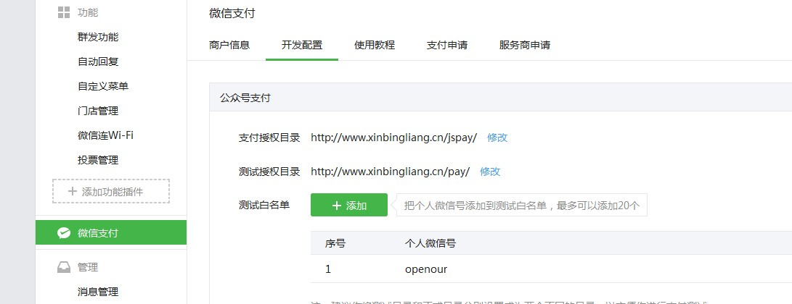

## 微信支付

## 认证

## 配置

### 配置域名

* 微信支付->开发配置->支付目录授权(要精确到域名下的目录)


* 接口权限->网页服务->网页授权->修改->网页授权域名
  * 先下载给定的文件，上传到到需要付款的域名下
  * 填写域名

以上是在公众号中配置

****

* [API安全](https://pay.weixin.qq.com/index.php/account/api_cert)配置
  * 下载证书
  * 设置API密钥  后面的KEY将会使用到(先记录下来)


* 下载开发SDK
  * 将证书中获得的文件对SDK中的文件进行替换

以上内容在商户中心做设置

## 获取数据

* AppID和AppSecret


* KEY上一步已经配置
* 商户中心->商户信息->微信支付商户号(即MCHID)

## 开发

* 到支付目录下`lib/WxPay.Config.php`

```php
//替换成自己获得的参数
const APPID = 'wx1e809bf9fc3b40a5';
const MCHID = '1408878902';
const KEY = 'BcIttktqL36u7VhLImS2cgBH5gt672H4';
const APPSECRET = 'f3115f1a294af7b09c9af2736e45108c';
```

* 到`example/native.php`下

  ```php
  $input->SetBody("美美哒服饰");	//设置商品名称
  $input->SetOut_trade_no('xin_1234568');		//设置订单号,
  $input->SetTotal_fee("1");  //价格，以分为单位
  $input->SetNotify_url("http://www.xinbingliang.cn/example/native_notify.php"); //设置请求成功后调用的位置
  ```


* 去除`example/native.php`没有必要的前端代码
* 当用户扫码成功支付后会触发`/example/native_notify.php`

### 扫码成功后的处理

修改`native_notify.php`文件

```php
$xml = $GLOBALS['HTTP_RAW_POST_DATA'];	//获得微信服务器发送过来的信息
$arr = json_decode(json_encode(simplexml_load_string($xml, 'SimpleXMLElement', LIBXML_NOCDATA)), true);	//将xml信息转化为array
ob_start();	//伪静态
echo '<pre>';
var_dump($arr);
echo '</pre>';
$str = ob_get_clean();
//file_put_contents('../data.php', $str);	//测试获得输出

if($arr['out_trade_no'] == 'xin_1234568'){	//判断订单是否对应，正常情况下是应该到数据库或缓存中读取，因为微信请求和当前支付界面完全无关
    $result = $notify->Handle(true);	//如果对应，通知微信服务器
  	//应该将支付结果写数据库
} else {
    $result = $notify->Handle(false);	//失败也要告知服务器
}
```

### 用户扫码界面处理

以上操作用户支付后，因为扫码界面`native.php`和`native_notify.php`完全无关，页面不能跳转，轮询读取订单是否支付成功(也可以轮询到微信服务器上做订单查询)，建议查询微信订单，详细参考`orderquery.php`

*****

## 微信HTML5支付

该支付只能发生在微信中，在其他类型浏览器中调用没有效果

## 配置

1. 配置授权目录
2. 
3. 设置JS接口安全域名


## 开发

* 到支付目录下`lib/WxPay.Config.php`配置参数，同上

* 到`example/jsapi.php`配置订单信息，页面中有很多事件监听

  ```php
  $input->SetNotify_url("http://www.xinbingliang.cn/pay/notify.php"); //设置了支付后的信息处理，同上native_notify.php
  ```

  * `getBrandWCPayRequest` 支付成功后被调用
  * `editAddress` 用户选择了收货地址

 


