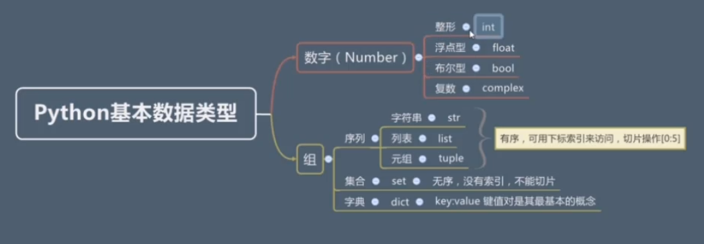
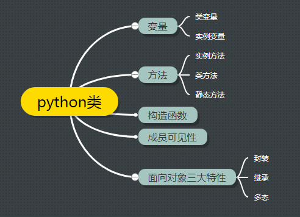

# 合集



## 包与模块

````
|--包
|----模块
|------类
````

* 包：物理展示为一个文件夹，并含有`__init__.py`
* 模块：物理上展示为一个`.py`文件

```` 
import module_name as xx
from module import a
````

````python
__all__=["a", "b"] # 定义允许*被导入的数据
a = 2
b = 3
c = 4
````

### `__init__.py`使用

推荐换行方式

````python
from module import (a, b,
c)
````

* 包导入时`__init__.py`文件会首先被执行

* 常用来做包和模块的初始化工作

* 在`__init__.py` 中决定哪些模块能被导出

  ```
  __all__ = ['demo']
  ```

  `````
  from module import *
  `````

* 进行批量导入

  ````
  |--libs
  |---- __init__.py
  |----demo1.py
  |----demo2.py
  ````

  ````
  # __init__.py
  import sys 
  import datetime
  import io
  ````

  当demo1和demo2都有导入相同包需求时，在`__init__.py`中导入

  ````
  # demo1.py
  import libs

  print(libs.sys.path)
  ````

## 函数

### 序列解包

```python
a, b, c = 1, 2, 3

d = 1, 2, 3

print(type(d))

e, f, g = d

a=b=c=1
```

## 面向对象



* 类变量：类本身的属性
* 实例变量：和对象相关联，对象本身属性
* 类方法
* 实例方法

类变量

```python
class Student():
    sum = 0

    def __init__(self, name, age):
        self.name = name
        self.age = age
        self.__class__.sum += 1
        print('当前班级学生总数为：' + str(self.__class__.sum))


stu1 = Student('aa', 'aa')
stu2 = Student('bb', 'bb')
stu3 = Student('cc', 'cc')
stu4 = Student('dd', 'dd')
stu5 = Student('ee', 'ee')
```

类方法

```python
class Student():
    sum = 0

    def __init__(self, name, age):
        self.name = name
        self.age = age

    @classmethod
    def plus_sum(cls):
        cls.sum += 1
        print('当前班级学生总数为：' + str(cls.sum))

stu1 = Student('aa', 'aa')
stu1.plus_sum()
stu2 = Student('bb', 'bb')
stu2.plus_sum()
stu3 = Student('cc', 'cc')
stu3.plus_sum()
stu4 = Student('dd', 'dd')
stu4.plus_sum()
stu5 = Student('ee', 'ee')
stu5.plus_sum()
```

静态方法：当方法和类和对象没有关联性时使用

````python
class Student():
    sum = 0

    def __init__(self, name, age):
        self.name = name
        self.age = age

    @classmethod
    def plus_sum(cls):
        cls.sum += 1
        print('当前班级学生总数为：' + str(cls.sum))

    @staticmethod
    def add(x, y):
        print(Student.sum)
        print('This is static method!')


stu1 = Student('aa', 'aa')
stu1.add(1, 2)
Student.add(1, 2)
````

### 成员可见性

* 前方添加一个`__`即可
* 类属性修改应该通过方法进行


### 继承

````python
class people():
	def __init__(self, name, age):
		pass

class studen():
	def __init__(self, name, age):
      people.__init__(self, name, age)
````

``````python
class people():
	def __init__(self, name, age):
		pass

class studen():
	def __init__(self, name, age):
      super(studen, self).__init__(name, age)
``````

## 正则表达式与JSON

```python
import re

lanuage = 'PythonC#\nJavaPHP'
r = re.sub('c#', "Go", lanuage, 0) # 匹配无限性替换
print(r)
```

````python
import re

def convert(value):  # value是匹配到的结果
    matched = value.group()
    print(matched)
    return "!!" + matched + "!!"

lanuage = 'PythonC#JavaPHPC#rouby'
r = re.sub('C#', convert, lanuage)
print(r)
````

1.37