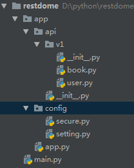
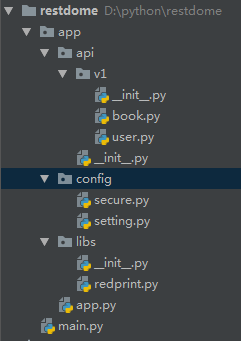

# 起步与红图

## 初始化项目

* pip install cymysql
* pip install flask-cors
* pip install flask-httpAuth
* pip install flask-sqlalchemy
* pip install flask-wtf
* pip install request

## 新建入口文件

````
|-app
|----config
|------secure.py # 存放API的敏感配置项
|------setting.py
|----app.py # flask初始化相关工作执行位置
|--main.py
````

````python
# app.py
from flask import Flask


def create_app():
    """
    flask初始化相关工作执行位置
    :return:
    """
    app = Flask(__name__)
    app.config.from_object('app.config.setting')
    app.config.from_object('app.config.secure')

    return app
````

````python
# main.py
from app.app import create_app

app = create_app()

if __name__ == '__main__':
    app.run(debug=True)
````

## 蓝图分离视图函数的缺陷



````python
# book.py
from flask import Blueprint

book = Blueprint('book', __name__)
@book.route('/v1/book/get')
def get_book():
    return "book"
````

```python
# user.py
from flask import Blueprint

user = Blueprint('user', __name__)
@user.route('/v1/user/get')
def get_user():
    return "user"
```

````python
# app.py
from flask import Flask


def register_blueprints(app):
    from app.api.v1.user import user
    from app.api.v1.book import book
    app.register_blueprint(user)
    app.register_blueprint(book)

def create_app():
    """
    flask初始化相关工作执行位置
    :return:
    """
    app = Flask(__name__)
    app.config.from_object('app.config.setting')
    app.config.from_object('app.config.secure')
    register_blueprints(app)

    return app
````

## 打开思维，创建自己的Redprint——红图



`````python
# book.py
# from flask import Blueprint
from app.libs.redprint import Redprint

# book = Blueprint("book", __name__)

api = Redprint("book")

@api.route("/book/get")
def get_book():
    return "book"
`````

`````python
# user.py
# from flask import Blueprint
from app.libs.redprint import Redprint

# user = Blueprint("user", __name__)
api = Redprint("user") # 实现视图函数向红图的注册

@api.route("/get")
def get_user():
    return "user"
`````

`````python
# v1/__init__.py
from flask import Blueprint
from app.api.v1 import book, user

def create_blueprint_v1():
    # 蓝图向红图的注册
    bp_v1 = Blueprint("v1", __name__)
    
    user.api.register(bp_v1, url_prefix="/user")
    book.api.register(bp_v1, url_prefix="/book")
    return bp_v1
`````

````python
# app.py
from flask import Flask

def register_blueprints(app):
    from app.api.v1 import create_blueprint_v1
    app.register_blueprint(create_blueprint_v1(), url_prefix="/v1")

def create_app():
    """
    flask相关的初始化工作
    :return:
    """
    app = Flask(__name__)
    app.config.from_object("app.config.secure")
    app.config.from_object("app.config.setting")

    register_blueprints(app)
    return app
````

## 实现Redprint

````python
# redprint.py
class Redprint(object):
    def __init__(self, name):
        self.name = name
        self.mound = []

    def route(self, rule, **options):
        def decorator(f):
            self.mound.append((f, rule, options))
            return f
        return decorator

    def register(self, bp, url_prefix=None):
        for f, rule, options in self.mound:
            endpoint = options.pop("endpoint", f.__name__)
            bp.add_url_rule(url_prefix + rule, endpoint, f, **options)
````

## 优化Redprint

````python
class Redprint(object):
    def __init__(self, name):
        self.name = name
        self.mound = []

    def route(self, rule, **options):
        def decorator(f):
            self.mound.append((f, rule, options))
            return f
        return decorator

    def register(self, bp, url_prefix=None):
        if url_prefix == None:
            url_prefix = '/' + self.name

        for f, rule, options in self.mound:
            endpoint = options.pop("endpoint", f.__name__)
            bp.add_url_rule(url_prefix + rule, endpoint, f, **options)
````

