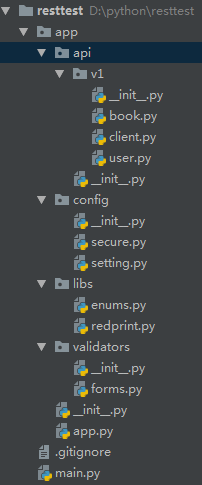

# 自定义异常对象

##  构建Client验证



````python
# client.py
from app.libs.redprint import Redprint

api = Redprint('client')

@api.route('/register/by_email')
def create_client_email():
    # 注册 登录
    # WTForms

    pass

# @api.route('/register/by_mobile')
# def create_client():
#     pass
#
# @api.route('/register/by_wx')
# def create_client():
#     pass
````

````python
# enums.py
from enum import Enum

class ClientTypeEnum(Enum):
    USER_EMAIL = 100
    USER_MOBILE = 101

    # 微信小程序登录
    USER_MINA = 200
    # 微信公众号
    USER_WX = 201
````

````python
# forms.py
from wtforms import Form, StringField, IntegerField
from wtforms.validators import DataRequired, length
from app.libs.enums import ClientTypeEnum

class ClientForm(Form):
    account = StringField(validators=[DataRequired(), length(min=5, max=32)])# 帐号
    secret = StringField() # 密码，有些客户端类型没有密码
    type = IntegerField(validators=[DataRequired()]) # 客户端的类型

    def validate_type(self, value):
        """自定义一个验证器"""
        try:
            client = ClientForm(value.data)
        except ValueError as e: # 不是定义允许的客户端
            raise e
````

## 处理不同客户端注册的方案


## 创建User模型


## 完成客户端注册


## 生成用户数据


## 自定义异常对象


## 浅谈异常返回的标准与重要性


## 自定义APIException


