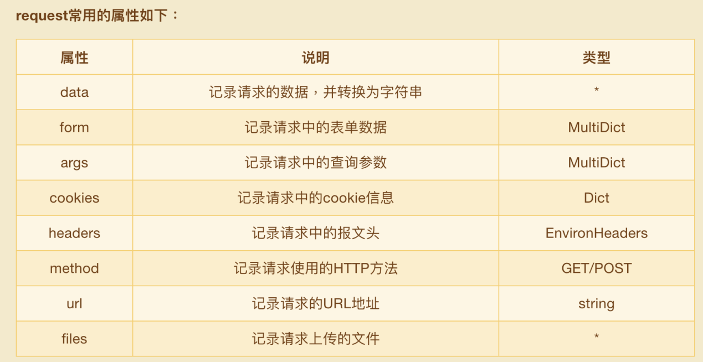

# request对象

就是 Flask 中表示当前请求的 request 对象，request对象中保存了一次HTTP请求的一切信息。



````python
from flask import Flask, request

app = Flask(__name__)

# http://127.0.0.1:5000/index?city=湖北 查询字符串类型【QueryString】
@app.route('/index', methods=["GET", "POST"])
def index():
    # request中包含前端发送过来的所有请求数据
    # form和data用来获得请求体数据
    # 通过request.form可以直接提取请求体中的表单格式的数据，是一个类字典的对象
    # 通过get方法只能获得同名参数中的第一个
    name = request.form.get('name')
    age = request.form.get('age')
    name_list = request.form.getlist('name')
    print(name_list)
    print(request.data) # 表单格式数据不会在这里进行接收，若不是表单数据则能够接收到
    # 获得查询字符串
    print(request.args.get('city'))

    return "Hello name=%s, age=%s" % (name, age)

if __name__ == '__main__':
    app.run(host='0.0.0.0', debug=True)
````

## 上传文件

````python
from flask import Flask, request

app = Flask(__name__)

@app.route('/upload', methods=["POST"])
def upload():
    """
    接收前端传送的文件
    :return:
    """
    file_obj = request.files.get("pic")

    if file_obj is None:
        return "未上传文件"

    # 将文件保存到本地
    # 1. 创建一个文件
    f = open("./files/test.jpg", 'wb')
    # 2. 向文件中写内容
    data = file_obj.read()
    f.write(data)
    # 3. 关闭文件
    f.close()
    return "上传成功"

if __name__ == '__main__':
    app.run(host='0.0.0.0', debug=True)
````

## with

````python
# 上下文管理器
with open("./files/test.jpg", 'wb') as f:
    data = file_obj.read()
    f.write(data)
````

````python
class Foo(object):
    def __enter__(self):
        """进入with语句的时候被with调用"""
        print("enter called")

    def __exit__(self, exc_type, exc_val, exc_tb):
        """离开with语句时候被with调用"""
        print("exit called")

with Foo() as foo:
    print('1111')
````

