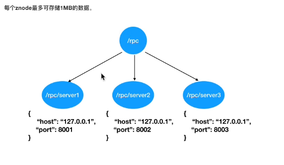

# ZooKeeper

## 概念

### 层次命名空间

 

### 节点类型

- 持久节点（PERSISTENT）
  - 指在节点创建后，就一直存在，直到有删除操作来主动清除这个节点——不会因为创建该节点的客户端会话失效而消失。
- 持久顺序节点（PERSISTENT_SEQUENTIAL）
  - 这类节点的基本特性和上面的节点类型是一致的。额外的特性是，在ZK中，每个父节点会为他的第一级子节点维护一份时序，会记录每个子节点创建的先后顺序。基于这个特性，在创建子节点的时候，可以设置这个属性，那么在创建节点过程中，ZK会自动为给定节点名加上一个数字后缀，作为新的节点名。这个数字后缀的范围是整型的最大值。
- 临时节点（EPHEMERAL）
  - 和持久节点不同的是，临时节点的生命周期和客户端会话绑定。也就是说，如果客户端会话失效，那么这个节点就会自动被清除掉。注意，这里提到的是会话失效，而非连接断开。另外，在临时节点下面不能创建子节点。
- 临时顺序节点（EPHEMERAL_SEQUENTIAL）
  - 临时节点的生命周期和客户端会话绑定。也就是说，如果客户端会话失效，那么这个节点就会自动被清除掉。注意创建的节点会自动加上编号。

### 监视

对客户端的调用发生变化时，进行客户端通知。单次有效

## 安装

### 安装java

````
java -version
````

### 安装ZooKeeper

* [下载地址](https://zookeeper.apache.org/releases.html#download)

`````
wget https://downloads.apache.org/zookeeper/zookeeper-3.6.0/apache-zookeeper-3.6.0-bin.tar.gz
tar -xvf apache-zookeeper-3.6.0-bin.tar.gz
mv apache-zookeeper-3.6.0-bin zookeeper-3.6.0
mkdir data # 创建数据文件
cp conf/zoo_sample.cfg zoo.cfg
vim ./conf/zoo.cfg
`````

```
# zookeeper服务之间活跃度的检测毫秒数，以及心跳检测
tickTime=2000 
# initLimit=10
# syncLimit=5
# 数据保存的目录
dataDir=/zookeeper/zookeeper-3.5.7/data
# 客户端的端口
clientPort=2181
```

### 命令

* `./bin/zkServer.sh start` 启动
* `./bin/zkCli.sh` 测试运行链接


