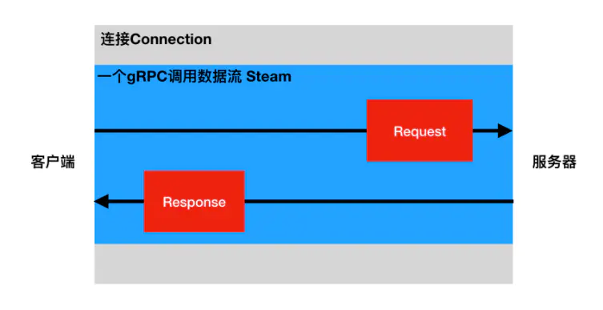
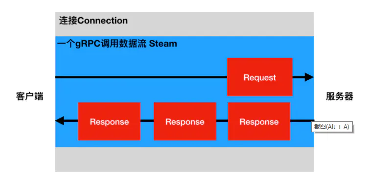
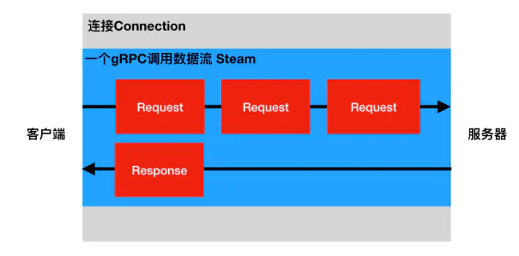
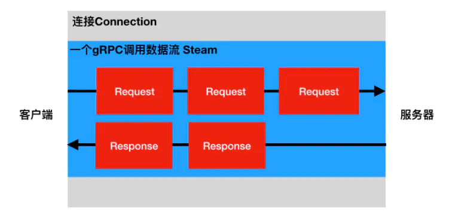

# grpc

## 接口类型

* Unary RPC （一元RPC）
* Server Streaming RPC （ 服务器流式RPC）
* Client Streaming RPC （ 客户端流式RPC）
* Bidirectional Streaming RPC （双向流式RPC）

对于底层的HTTP/2而言，这些都是数据流Steam，我们所说的接口类型是指进行一次gRPC调用的数据通讯流程（或数据流Stream的生命周期）。

### Unary RPC

最简单的RPC类型，客户端发送单个请求并返回单个响应



### Server Streaming RPC

服务器流式RPC类似于我们的简单示例，只是服务器可以返回多个响应信息。一旦客户端拥有所有服务器的响应，客户端就会完成。



### Client Steaming RPC

客户端流式RPC也类似于我们的简单示例，只是客户端向服务器发送请求流而不是单个请求。服务器发送回单个响应。



### Bidirectional Streaming RPC

在双向流式RPC中，客户端和服务器可以按任何顺序独立的读写数据流。服务器可以在收到所有的请求信息后再返回响应信息，或者收到一个请求信息返回一个响应信息，或者收到一些请求信息再返回一些请求信息，等等都是可以的。

 

## Protocol Buffers

Protocol Buffers 是一种与语言无关，平台无关的可扩展机制，用于序列化结构化数据。使用Protocol Buffers 可以一次定义结构化的数据，然后可以使用特殊生成的源代码轻松地在各种数据流中使用各种语言编写和读取结构化数据。

现在有许多框架等在使用Protocol Buffers。gRPC也是基于Protocol Buffers。 Protocol Buffers 目前有2和3两个版本号。

### 文档结构

#### Protocol Buffers版本

Protocol Buffers文档的第一行非注释行，为版本申明，不填写的话默认为版本2。

````
syntax = "proto3";
或者
syntax = "proto2";
````

#### Package包

Protocol Buffers 可以声明package，来防止命名冲突。 Packages是可选的。

````
package foo.bar;
message Open { ... }
````

使用的时候，也要加上命名空间，

````
message Foo {
  ...
  foo.bar.Open open = 1;
  ...
}
````

注意：对于Python而言，package会被忽略处理，因为Python中的包是以文件目录来定义的。

#### 导入

````
Protocol Buffers 中可以导入其它文件消息等，与Python的import类似。

import “myproject/other_protos.proto”;
````

#### 定义各种消息和服务

消息messge是用来定义数据的，服务service是用来gRPC的方法的。

### 注释

Protocol Buffers 提供以下两种注释方式。
// 单行注释
/* 多行注释 */

### 数据类型

#### 枚举

在 Proto Buffers 中，我们可以定义枚举和枚举类型，

````
enum Corpus {
    UNIVERSAL = 0;
    WEB = 1;
    IMAGES = 2;
    LOCAL = 3;
    NEWS = 4;
    PRODUCTS = 5;
    VIDEO = 6;
}
Corpus corpus = 4;
````

枚举定义在一个消息内部或消息外部都是可以的，如果枚举是 定义在 message 内部，而其他 message 又想使用，那么可以通过 MessageType.EnumType 的方式引用。

定义枚举的时候，我们要保证第一个枚举值必须是0，枚举值不能重复，除非使用 option allow_alias = true 选项来开启别名。

`````
enum EnumAllowingAlias {
    option allow_alias = true;
    UNKNOWN = 0;
    STARTED = 1;
    RUNNING = 1;
}
`````

枚举值的范围是32-bit integer，但因为枚举值使用变长编码，所以不推荐使用负数作为枚举值，因为这会带来效率问题。

### 消息类型

Protocol Buffers使用message定义消息数据。在Protocol Buffers中使用的数据都是通过message消息数据封装基本类型数据或其他消息数据，对应Python中的类。

`````
message SearchRequest {
  string query = 1;
  int32 page_number = 2;
  int32 result_per_page = 3;
}
`````

#### 字段编号

消息定义中的每个字段都有唯一的编号。这些字段编号用于以消息二进制格式标识字段，并且在使用消息类型后不应更改。 请注意，1到15范围内的字段编号需要一个字节进行编码，包括字段编号和字段类型。16到2047范围内的字段编号占用两个字节。因此，您应该为非常频繁出现的消息元素保留数字1到15。请记住为将来可能添加的常用元素留出一些空间。

最小的标识号可以从1开始，最大到2^29 - 1,或 536,870,911。不可以使用其中的[19000－19999]的标识号， Protobuf协议实现中对这些进行了预留。如果非要在.proto文件中使用这些预留标识号，编译时就会报警。同样你也不能使用早期保留的标识号。

####  指定字段规则

消息字段可以是以下之一：
singular：格式良好的消息可以包含该字段中的零个或一个（但不超过一个）。
repeated：此字段可以在格式良好的消息中重复任意次数（包括零）。将保留重复值的顺序。对应Python的列表。

```
message Result {
  string url = 1;
  string title = 2;
  repeated string snippets = 3; 
}
```

#### 添加更多消息类型

可以在单个.proto文件中定义多个消息类型。

```
message SearchRequest {
  string query = 1;
  int32 page_number = 2;
  int32 result_per_page = 3;
}

message SearchResponse {
 ...
}
```

#### 保留字段

保留变量不被使用
如果通过完全删除字段或将其注释来更新消息类型，则未来用户可以在对类型进行自己的更新时重用字段编号。如果以后加载相同的旧版本，这可能会导致严重问题，包括数据损坏，隐私错误等。确保不会发生这种情况的一种方法是指定已删除字段的字段编号（或名称）reserved。如果将来的任何用户尝试使用这些字段标识符，协议缓冲编译器将会报错。

```
message Foo {
  reserved 2, 15, 9 to 11;
  reserved "foo", "bar";
}
```

#### 默认值

解析消息时，如果编码消息不包含特定的单数元素，则解析对象中的相应字段将设置为该字段的默认值。这些默认值是特定于类型的：

- 对于字符串，默认值为空字符串。
- 对于字节，默认值为空字节。
- 对于bools，默认值为false。
- 对于数字类型，默认值为零。
- 对于枚举，默认值是第一个定义的枚举值，该值必须为0。
- 对于消息字段，未设置该字段。它的确切值取决于语言。
- 重复字段的默认值为空（通常是相应语言的空列表）。

#### 嵌套类型

你可以在其他消息类型中定义、使用消息类型，在下面的例子中，Result消息就定义在SearchResponse消息内，如：

```
message SearchResponse {
  message Result {
    string url = 1;
    string title = 2;
    repeated string snippets = 3;
  }
  repeated Result results = 1;
}
```

如果要在其父消息类型之外重用此消息类型，使用

```
SearchResponse.Result
```

### map映射

如果要在数据定义中创建关联映射，Protocol Buffers提供了一种方便的语法：

```
map< key_type, value_type> map_field = N ;
```

其中key_type可以是任何整数或字符串类型。请注意，枚举不是有效的key_type。value_type可以是除map映射类型外的任何类型。
例如，如果要创建项目映射，其中每条Project消息都与字符串键相关联，则可以像下面这样定义它：

```
map<string, Project> projects = 3 ;
```

- map的字段可以是repeated。
- 序列化后的顺序和map迭代器的顺序是不确定的，所以你不要期望以固定顺序处理map
- 当为.proto文件产生生成文本格式的时候，map会按照key 的顺序排序，数值化的key会按照数值排序。
- 从序列化中解析或者融合时，如果有重复的key则后一个key不会被使用，当从文本格式中解析map时，如果存在重复的key，则解析可能会失败。
- 如果为映射字段提供键但没有值，则字段序列化时的行为取决于语言。在Python中，使用类型的默认值。

### oneof

如果你的消息中有很多可选字段， 并且同时至多一个字段会被设置， 你可以加强这个行为，使用oneof特性节省内存。
为了在.proto定义oneof字段， 你需要在名字前面加上oneof关键字, 比如下面例子的test_oneof:

```
message SampleMessage {
  oneof test_oneof {
    string name = 4;
    SubMessage sub_message = 9;
  }
}
```

然后你可以增加oneof字段到 oneof 定义中. 你可以增加任意类型的字段, 但是不能使用repeated 关键字。

### 定义服务

Protocol Buffers使用service定义RPC服务。

```
message HelloRequest {
  string greeting = 1;
}

message HelloResponse {
  string reply = 1;
}

service HelloService {
  rpc SayHello (HelloRequest) returns (HelloResponse) {}
}
```

###### 注意：一个service中可定义多个方法。

###### Unary RPC

```
rpc SayHello(HelloRequest) returns (HelloResponse){}
```

###### Server Streaming RPC

```
rpc LotsOfReplies(HelloRequest) returns (stream HelloResponse){}
```

###### Client Streaming RPC

```
rpc LotsOfGreetings(stream HelloRequest) returns (HelloResponse) {}
```

###### Bidirectional Streaming RPC

```
rpc BidiHello(stream HelloRequest) returns (stream HelloResponse){}
```

## 错码说明

0：Ok：返回成功
1：Canceled：操作已取消
2：Unknown：未知错误。如果从另一个地址空间接收到的状态值属 于在该地址空间中未知的错误空间，则可以返回此错误的示例。 没有返回足够的错误信息的API引发的错误也可能会转换为此错误
3：InvalidArgument：表示客户端指定了无效的参数。 请注意，这与FailedPrecondition不同。 它表示无论系统状态如何（例如格式错误的文件名）都有问题的参数
4：DeadlineExceeded：意味着操作在完成之前过期。 对于更改系统状态的操作，即使操作成功完成，也可能会返回此错误。 例如，服务器的成功响应可能会延迟足够的时间以使截止日期到期
5：NotFound：表示找不到某个请求的实体（例如文件或目录）
6：AlreadyExists：表示尝试创建实体失败，因为已经存在
7：PermissionDenied：表示调用者没有执行指定操作的权限。它不能用于因耗尽某些资源而引起的拒绝（使用ResourceExhausted代替这些错误）。如果调用者无法识别，则不能使用它（使用Unauthenticated代替这些错误）
8：ResourceExhausted：表示某些资源已耗尽，可能是每个用户的配额，或者整个文件系统空间不足
9：FailedPrecondition：表示操作被拒绝，因为系统不处于操作执行所需的状态。
10：Aborted：表示操作被中止，通常是由于并发问题（如序列器检查失败，事务异常终止等）造成的。请参阅上面的试金石测试以确定FailedPrecondition，Aborted和Unavailable之间的差异
11：OutOfRange：表示操作尝试超过有效范围。
12：Unimplemented：该方法未实现
13：Internal： 意味着底层系统预期的一些不变量已被打破。 如果你看到其中的一个错误，那么事情就会非常糟糕
14：Unavailable：内部Grpc服务不可用，请求不到
15：DataLoss：指示不可恢复的数据丢失或损坏
16：Unauthenticated：表示请求没有有效的操作认证凭证