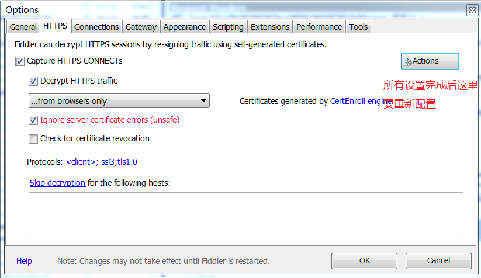
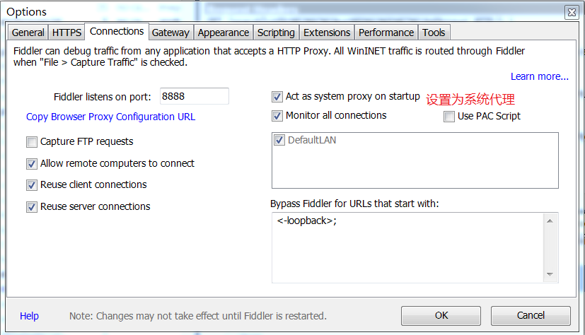
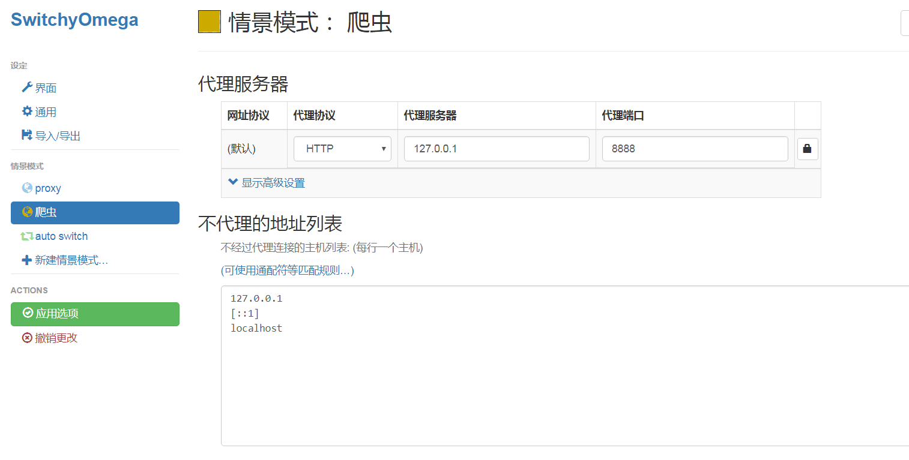

# 抓包工具使用

## 对工具配置

* Tools->options

  

* `from all process` 所有进程

* `from browsers only` 只对浏览器做代理

* `from non-broesers only `除了浏览器都用

* `from remote clients only` 远程链接使用代理

  

## 配置浏览器代理

最后点击应用