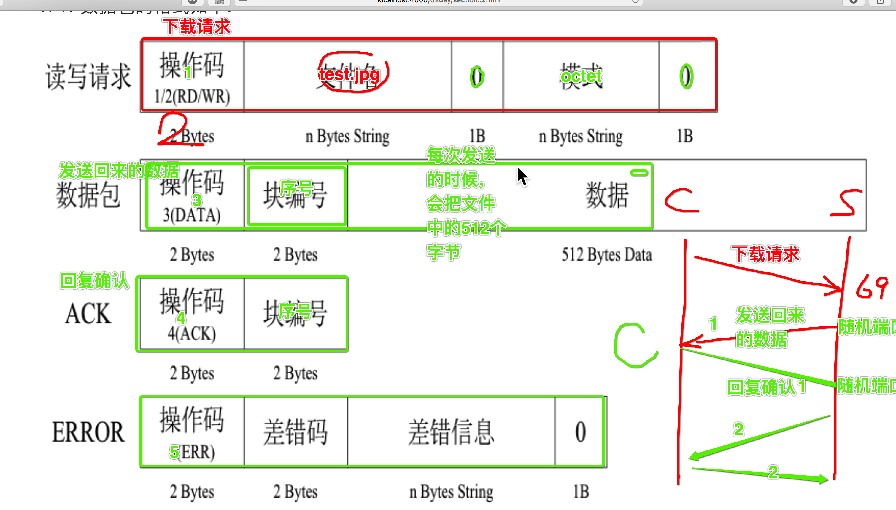

# tftp

## 抓包工具

wireshark

* `ip.dst == 192.168.2.51`
* `upd.port ==2425 `

##TFTP下载

* tftpd32.exe 创建ftp服务器（默认69）

###TFTP下载过程



### TFTP下载代码

* 小于516说明下载完成
* 大端：大型服务器，存储顺序问题，在网络上都以大端存储，低地址存储高位数据
* 小端：PC，低地址存位低数据，

###组包和解包

```python
import struct

# 将要发送的数据
fileName = bytes('ctmc.png', 'utf-8')
octet = bytes('octet', 'utf-8')

#组包
sendData = struct.pack("!H8sb5sb", 1, fileName, 0, octet, 0) #1替换H占两个字节, 1s为一个字节，8s为8个字节,b为0一个字节

result = struct.unpack("!H", sendData[:2])
print(result)
```

###代码

```python
from socket import * 
import struct
import sys


if len(sys.argv) != 3:
    print('-'*30)
    print('tips:')
    print('python xxx.python 192.168.1.1 filename')
    print('-'*30)
    exit()
else:
    ip = sys.argv[1]
    fileName = sys.argv[2]
    fileNameLen = len(fileName) 

#创建udp套接字
udpSocket = socket(AF_INET, SOCK_DGRAM)

# 构造下载请求数据
dataType = "!H%ssb5sb" % (str(fileNameLen))
fileNameByt = bytes(fileName, 'utf-8')
octetByt = bytes('octet', 'utf-8')

cmd_buf = struct.pack(dataType, 1, fileNameByt, 0, octetByt, 0)

#发送下载文件请求数据到指定的服务器
socketAddr = (ip, 69)

#发送数据
udpSocket.sendto(cmd_buf, socketAddr)

p_num = 0
recvFile = ''

while True:
    recvData, recvAddr = udpSocket.recvfrom(1024)

    recvDataLen = len(recvData)

    cmdTuple = struct.unpack("!HH", recvData[:4]) #取四个字节

    # print(cmdTuple)

    cmd = cmdTuple[0]   # 状态
    currentPackNum = cmdTuple[1] # 数据包序列块
 
    if cmd == 3:    # 判断收到的为数据包
        # 如果是第一次收到数据
        if currentPackNum == 1:
            recvFile = open(fileName, 'ab') #注意写入模式

        # 包编号是否和上次相等
        if p_num + 1 == currentPackNum:
            recvFile.write(recvData[4:]) #获得数据
            p_num += 1
            print('(%d)次收到数据'%(p_num))

            ackBuf = struct.pack("!HH", 4, p_num)

            udpSocket.sendto(ackBuf, recvAddr)

        # 如果收到的数据小于516则认为下载完毕
        if recvDataLen < 516:
            recvFile.close()
            print('已经下载完成')
            break

    elif cmd == 5:  #是否为错误应答
        print("error num:%d"%currentPackNum)
        break

udpSocket.close()
```


