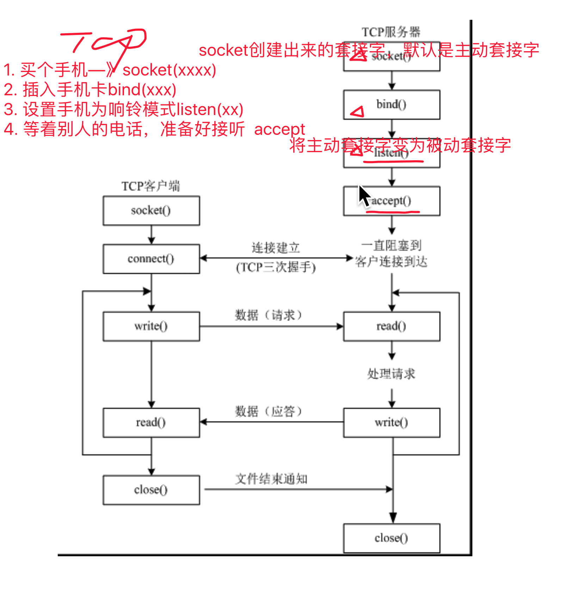
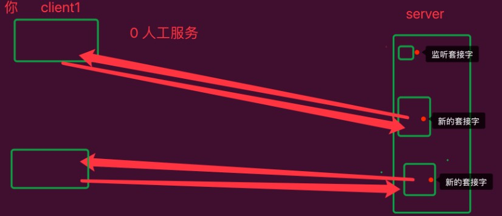

# udp广播和tcp

## UDP广播

用户数据报协议

* `udp`才有广播，广播只发送了一份，多份是交换机发送
* 单播：点对点
* 多播：一对多
* 广播：一对所有

```python
# -*- coding=utf-8 -*-
import socket,sys

#dest = ('192.168.2.255', 7788) # 最后一位肯定是255
dest = ('<broadcast>', 7788) # 此时操作系统自动识别

#创建udp套接字
s = socket.socket(socket.AF_INET, socket.SOCK_DGRAM)

# 对需要发送的广播数据套接字进行修改，否则不能发送广播数据
s.setsockopt(socket.SOL_SOCKET, socket.SO_BROADCAST, 1)

# 以广播的形式发送数据到本网络中的所有电脑中
s.sendto(b'Hi', dest)

print("等待对方回复")

while True:
    (buf, address) = s.recvfrom(2048)
    print("Received from %s: %s" % (address, buf))
```

* 广播风暴

## TCP

传输控制协议

* 稳定
* 慢一些



* 主动套接字即用来呼叫其他用户
* 被动套接字即可以接收其他用户的呼叫

### 服务端



````python
# -*- coding=utf-8 -*-
from socket import *

# 创建socket
tcpServerSocket = socket(AF_INET, SOCK_STREAM) # 使用TCP协议

# 绑定本地信息
address = ('', 7788)

tcpServerSocket.bind(address)

# 使用socket创建的套接字默认的属性是主动的，使用listen将其变为被动的，这样就可以接收
tcpServerSocket.listen(5) #最多允许多少个客户连接到服务器

# 如果有新的客户端来链接服务器，那么就产生一个新的套接字专门为这个客户端服务器
# newSocket用来为这个客户端服务
# tcpSerSocket就可以省下来专门等待其他新客户端的链接
newSocket, clientAddr = tcpServerSocket.accept()

print('%s'%str(clientAddr))

# 接收对方发送过来的数据，最大接收1024字节
recvData = newSocket.recv(1024)

print('接收数据为：%s'%recvData.decode('gb2312'))

# 发送数据到客户端
newSocket.send(b'thank YOU!')

# 关闭为这个客户端服务的套接字
newSocket.close()

# 关闭监听套接字
tcpServerSocket.close()
````

### 客户端

```python
#coding=utf-8
from socket import *

# 创建socket
tcpClientSocket = socket(AF_INET, SOCK_STREAM)

#链接服务器
serAddr = ('127.0.0.1', 7788)
tcpClientSocket.connect(serAddr) #将耗费一定时间，可能会堵塞

# 提示用户输入数据
sendData = input("请输入您要发送的数据：")

tcpClientSocket.send(bytes(sendData, encoding = "utf8") )

# 接收对方发送过来的数据，最大接收1024字节
recvData = tcpClientSocket.recv(1024)

print('接收的数据为:%s'%recvData)

tcpClientSocket.close()
```


