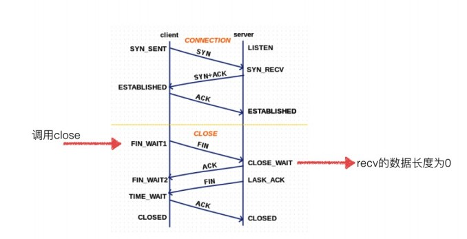
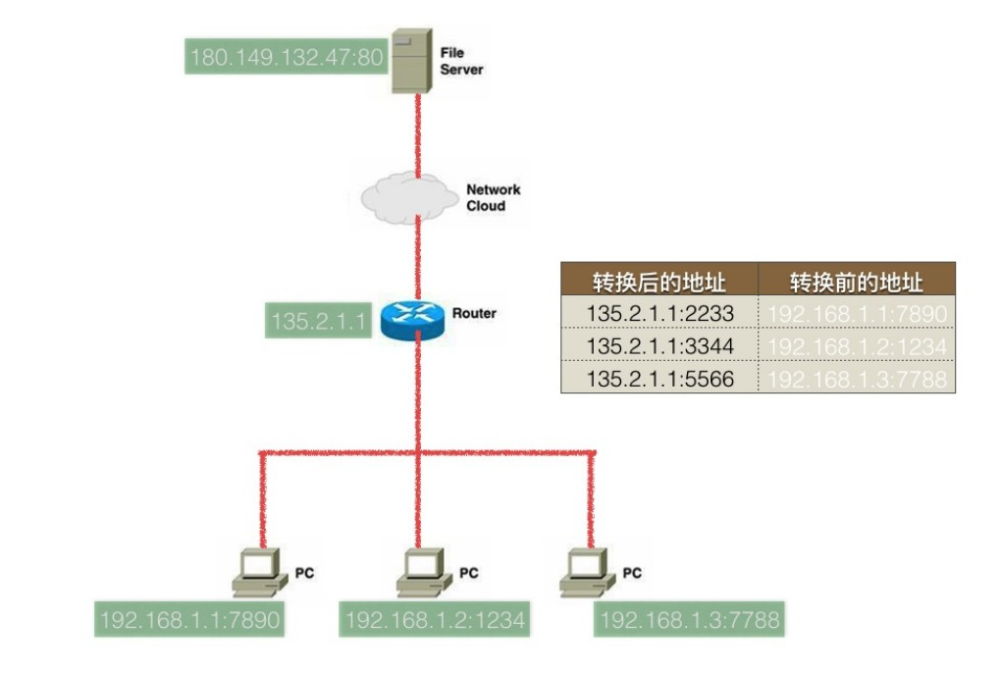

# web服务器

## TCP十种状态



##MSL问题

`TTL`指经过的路由器数量（128 - 路由数量 = TTL）

`MSL`：一个数据包在网络上存储的最长的时间，`2MSL = TIME_WAIT - CLOSED`

## Listen

其参数值为待连接数目（accept前即半链接），待已链接数取走后才能新链接。但linux由操作系统决定

## 常见网络攻击

* `tcp`半链接(DOS或SYN洪水攻击)，拒绝服务式攻击
* `dns` 攻击，（`UDP`广播回复`DNS`地址） (`nslookup baidu.com` 查看域名`dns`)
* `ARP` 伪造mac地址，中间接收数据后依然给目的服务器（中间人攻击）

python使用原始套接字，无法无天

## NAT(网络地址转换器)



## 多进程

````python
from socket import * 
from multiprocessing import * 
from time import sleep

def dealWithClient(newSocket, destAddr):
    while True:
        recvData = newSocket.recv(1024) 
        if len(recvData) > 0:
            print('recv[%s]:%s'%(str(destAddr), recvData))
        else:
            print('[%s]客户端已经关闭'%str(destAddr))
            break
    newSocket.close()

def main():
    serverSocket = socket(AF_INET, SOCK_STREAM)
    serverSocket.setsockopt(SOL_SOCKET, SO_REUSEADDR, 1)

    localAddr = ('', 7788)
    serverSocket.bind(localAddr)
    serverSocket.listen(5)

    try:
        while True:
            print('--- 主进程，等待新客户端的到来 ---')
            newSocket, destAddr = serverSocket.accept()
            print('--- 主进程，接下来创建新的进程来处理数据 ---')
            client = Process(target=dealWithClient, args=(newSocket, destAddr))
            client.start()

            newSocket.close()   # 进程中已经复制一份套接字，所以这里将其关闭
    finally:
        #当为所有的客户端服务完之后再进⾏关闭，表示不再接收新的客户端的链接
        serverSocket.close()

if __name__ == '__main__':
    main()
````

* `cow` 写时拷贝

客户端**

```python
from socket import * 

num = input("请输入对服务器的链接次数：")

for i in range(int(num)):
    clientSocket = socket(AF_INET, SOCK_STREAM)    
    clientSocket.connect(("127.0.0.1", 7788))
    print(i)
```

## 多线程

```python
from socket import * 
from threading import Thread
from time import sleep

def dealWithClient(newSocket, destAddr):
    while True:
        recvData = newSocket.recv(1024) 
        if len(recvData) > 0:
            print('recv[%s]:%s'%(str(destAddr), recvData))
        else:
            print('[%s]客户端已经关闭'%str(destAddr))
            break
    newSocket.close()

def main():
    serverSocket = socket(AF_INET, SOCK_STREAM)
    serverSocket.setsockopt(SOL_SOCKET, SO_REUSEADDR, 1)

    localAddr = ('', 7788)
    serverSocket.bind(localAddr)
    serverSocket.listen(5)

    try:
        while True:
            print('--- 主进程，等待新客户端的到来 ---')
            newSocket, destAddr = serverSocket.accept()
            print('--- 主进程，接下来创建新的线程来处理数据 ---')
            client = Thread(target=dealWithClient, args=(newSocket, destAddr))
            client.start()

            # 因为线程中共享这个套接字，如果关闭了会导致这个套接字不可用
            # 但是此时在线程中这个套接字可能还在收数据，因此不能关闭
    finally:
        #当为所有的客户端服务完之后再进⾏关闭，表示不再接收新的客户端的链接
        serverSocket.close()

if __name__ == '__main__':
    main()
```

## 单进程非堵塞

```python
from socket import * 
# 1.创建socket
serverSocket = socket(AF_INET, SOCK_STREAM)

# 2.绑定本地ip和port 
localAddr = ('', 7788)
serverSocket.bind(localAddr)

# 3.让这个socket变成非堵塞
serverSocket.setblocking(False)

# 4.让这个socket变为被动套接字
serverSocket.listen(100)

# 5.用来保存所有已经链接的的客户端信息
clientAddrList = []

while True:
    # 等待一个新的客户端的到来（即完成三次握手的客户端）
    try:
        clientSocket, clientAddr = serverSocket.accept()
    except:
        pass
    else:
        print("一个新的客户端到来：%s" % str(clientAddr))
        clientSocket.setblocking(False)    #接收数据变成非堵塞
        clientAddrList.append((clientSocket, clientAddr))

    for clientSocket, clientAddr in clientAddrList:
        try:
            recvData = clientSocket.recv(1024)
        except:
            pass
        else:
            if len(recvData) > 0:
                print("【%s】:%s"%(str(clientAddr), recvData))
            else:
                clientSocket.close()
                print('%s关闭了'% str(clientAddr))
                clientAddrList.remove((clientSocket, clientAddr))
```

## select版本

支持IO多路复用（没有多个进程多个线程的情况下完成多个套接字使用），完成对套接字检测，但最大监测套接字数目1024个

````python
import select 
import socket
import sys


server = socket.socket(socket.AF_INET, socket.SOCK_STREAM)
server.bind(('', 7788))
server.listen(5)

inputs = [server, sys.stdin]

running = True

while True:
    # 调用select函数，阻塞等待
    readable, writeable, exceptional = select.select(inputs, [], [])

    # 事件触发抵达，循环
    for socket in readable:

        # 监听到新的套接字
        if socket == server:
            conn, addr = server.accept()
            # 将新套接字添加到监听的socket
            inputs.append(conn)

        # 监听到键盘输入
        elif socket == sys.stdin:
            cmd = sys.stdin.readline()
            running = False
            break

        # 有数据抵达
        else:
            # 读取客户端发送的数据
            data = socket.recv(1024) # 每次读取完成后都会进行下一次读取
            if data:
                print(data)
                socket.send(data)
            else:
                # 移除监听的socket
                inputs.remove(socket)
                socket.close()

    # 如果检测到用户敲击键盘，那么退出
    if not running:
        break

server.close()
````

## epoll

* `poll` 多路复用的一种，但没有上限，轮训
* `epoll ` 使用事件通知机制
* 文件描述符
* `sys.stdin` 标准输入，`sys.stdin.fileno() == 0`
* `sys.stdout` 标准输出，`sys.stdin.fileout() == 1`
* `sys.stderr` 错误输出，`sys.stdin.fileerr() == 2`
* ​


